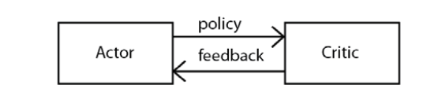

# Actor-Critic Methods — A2C and A3C

Table of Contents
- Overview of the actor-critic method
- Understanding the actor-critic method
- The actor-critic method algorithm
- Advantage actor-critic (A2C)
- Asynchronous advantage actor-critic (A3C)
- The architecture of asynchronous advantage actor-critic (A3C)
- Mountain car climbing using A3C

## Overview of the Actor-Critic Method

- Lies at the intersection of value-based and policy-based methods.
- Consists of two types of networks: the **actor network** and the **critic network**.
- The role of the actor network is to find the optimal policy.
- The critic network evaluates the policy produced by the actor network.
- We can think of the critic network as a feedback mechanism that guides the *actor* network toward the optimal policy.

- The actor network is also known as the **policy network**.
- The critic network is essentially the **value network** — it estimates the state value.
- The critic network helps reduce variance in the policy gradient updates and lets the policy be improved iteratively, in an **online** fashion (i.e., updated during the episode rather than only at its end).

## Understanding the Actor-Critic Method

- In REINFORCE with baseline, we update the network parameters at the **end of the episode**, whereas in the actor-critic method we update the parameters at **every step** of the episode.
- REINFORCE with baseline is very similar to the Monte Carlo (MC) method in this respect.
- The actor-critic method is similar to the TD learning method in this respect.
- **Recall:** when an episode is very long, the MC method takes a long time to compute the value of a state, since it must wait for the episode to finish. See [Monte Carlo Methods](./monte-carlo-methods.md).
- TD learning makes use of bootstrapping, so it doesn't need to wait until the end of the episode to compute the value of a state. See [Temporal Difference Learning](./temporal-difference-learning.md).
- In REINFORCE with baseline, we need to complete the full trajectory in order to compute the gradient, since we need the return of the trajectory. See [Policy Gradient Method](./policy-gradient-method.md).
- We can make use of bootstrapping in the actor-critic method to approximate the return as follows:

$$
R \approx r + \gamma V(s')
$$

- $r$ is the immediate reward, and $\gamma V(s')$ is the discounted value of the next state.
- The policy gradient becomes:

$$
\nabla_{\theta} J(\theta) \approx \frac{1}{N} \sum_{i=1}^{N} \sum_{t=0}^{T-1} \nabla_{\theta} \log \pi_{\theta}\!\left(a_t^{(i)} \mid s_t^{(i)}\right) \left( r^{(i)} + \gamma V_{\phi}\!\left(s_{t+1}^{(i)}\right) - V_{\phi}\!\left(s_{t}^{(i)}\right) \right)
$$

- **What each term means:**
  - $\nabla_\theta \log \pi_\theta(a_t^{(i)} \mid s_t^{(i)})$ is the gradient of the log-probability of the action actually taken at step $t$ in trajectory $i$ — same role as in ordinary REINFORCE.
  - $r^{(i)}$ is the immediate reward received at step $t$ of trajectory $i$.
  - $V_\phi(s_{t+1}^{(i)})$ is the critic's *current* estimate of the value of the next state — this is the bootstrapped part, replacing the need to know the true future return.
  - $V_\phi(s_t^{(i)})$ is the critic's estimate of the value of the current state.
  - The whole bracketed term $\left( r^{(i)} + \gamma V_\phi(s_{t+1}^{(i)}) - V_\phi(s_t^{(i)}) \right)$ is the **TD error**, $\delta_t$ — it plays the same role that the (reward-to-go minus baseline) advantage played in REINFORCE with baseline, but now computed with a single-step bootstrap instead of a full-episode return.
  - The outer sum over $i$ and inner sum over $t$ still represent, respectively, averaging over $N$ sampled trajectories and accumulating the contribution of every time step, exactly as in the REINFORCE formulas.
- Because this only requires $r$, $s_t$, and $s_{t+1}$ — not the full return of the trajectory — we no longer have to wait until the end of the episode to compute a gradient update. We bootstrap, compute the gradient, and update the network parameters at every single step of the episode.
- Just like the actor network, the critic network's parameters are also updated at every step of the episode.
- The critic network's loss is the **TD error** — the difference between the target value of the state and the value predicted by the network:

$$
\mathcal{L}(\phi) = r + \gamma V_{\phi}(s_{t+1}) - V_{\phi}(s_t)
$$

- $r + \gamma V_\phi(s_{t+1})$ is the **target** value of the state (using the current reward and bootstrapped next-state value), and $V_\phi(s_t)$ is the network's **predicted** value of the current state.

  *(In practice, this is usually framed as minimizing the **squared** TD error, $\mathcal{L}(\phi) = \frac{1}{2}\delta^2$ where $\delta = r + \gamma V_\phi(s_{t+1}) - V_\phi(s_t)$, since that gives a proper regression loss with a well-defined gradient. Its gradient, $-\delta \, \nabla_\phi V_\phi(s_t)$, points in the same direction as directly following $\delta$, so the two framings lead to the same update in practice — this is the standard **semi-gradient TD(0)** update.)*

- After computing the loss of the critic network, we compute the gradient $\nabla_\phi \mathcal{L}(\phi)$ and update the parameter $\phi$:

$$
\phi \leftarrow \phi - \alpha \, \nabla_{\phi} \mathcal{L}(\phi)
$$

- **A note on notation:** we use $\mathcal{L}(\phi)$ rather than $J(\phi)$ deliberately — $J(\theta)$ is reserved for the policy network's *objective function*, which we **maximize** via gradient **ascent**. The critic's quantity, $\mathcal{L}(\phi)$, is a **loss**, which we **minimize** via ordinary gradient **descent**. Using different letters (and different update directions — $+$ for the actor, $-$ for the critic) keeps it clear that the two networks are being optimized in fundamentally different ways, even though they share the same underlying TD error.

### The Actor-Critic Algorithm

1. Initialize the actor (policy) network parameters $\theta$ and the critic (value) network parameters $\phi$.
2. For each episode:
   1. Initialize the starting state $s$.
   2. For each step in the episode:
      1. Select an action $a \sim \pi_\theta(\cdot \mid s)$.
      2. Perform action $a$; observe reward $r$ and the next state $s'$.
      3. Compute the TD error: $\delta = r + \gamma V_\phi(s') - V_\phi(s)$ (using $\delta = r - V_\phi(s)$ if $s'$ is terminal, since there is no future value to bootstrap from).
      4. Update the critic parameters via gradient descent: $\phi \leftarrow \phi - \alpha_c \, \nabla_\phi \mathcal{L}(\phi)$, using $\delta$ (or $\frac{1}{2}\delta^2$) as the loss.
      5. Update the actor parameters via gradient ascent: $\theta \leftarrow \theta + \alpha_a \, \nabla_\theta \log \pi_\theta(a \mid s) \, \delta$.
      6. Set $s \leftarrow s'$.
      7. Repeat from step 2.2.1 if $s$ is not terminal.
3. Repeat for many episodes until both networks converge.

## Advantage Actor-Critic (A2C)

- **Recall:** the advantage function is the difference between the Q function and the value function. It tells us how good an action $a$ in state $s$ is compared to the *average* action available in that state.
- In A2C, we compute the policy gradient using the advantage function directly.
- We could use two separate function approximators (neural networks) — one for $Q(s,a)$ and one for $V(s)$ — and subtract the two to get the advantage value.
- However, computing the advantage function this way is computationally expensive, since it requires training and evaluating **two** networks.
- Instead, we can approximate the Q value using the same one-step bootstrap trick as above:

$$
Q(s, a) \approx r + \gamma V(s')
$$

  See [The Bellman Equation and Dynamic Programming](./bellman-equation-and-dynamic-programming.md).

- Substituting this approximation, the advantage function becomes:

$$
\mathcal{A}(s, a) \approx r + \gamma V(s') - V(s)
$$

  This requires only a *single* value network, $V_\phi$, rather than two separate networks — which is exactly the TD-error quantity we were already computing above.

- We can then compute the policy gradient using this advantage estimate:

$$
\nabla_{\theta} J(\theta) \approx \frac{1}{N} \sum_{i=1}^{N} \sum_{t=0}^{T-1} \nabla_{\theta} \log \pi_{\theta}\!\left(a_t^{(i)} \mid s_t^{(i)}\right) \mathcal{A}\!\left(s_t^{(i)}, a_t^{(i)}\right)
$$

## Asynchronous Advantage Actor-Critic (A3C)

- Uses several agents learning **in parallel** and aggregates their overall experience.
- There are two types of networks: the **global network** (global agent) and several **worker networks** (worker agents).
- Each worker agent uses a different **exploration** policy (e.g., a different degree of randomness in its action selection) and learns in its own independent copy of the environment, collecting its own experience.
- The experience (specifically, the gradients) obtained by the worker agents is aggregated and sent to the global agent, which aggregates the learning across all workers.
- Each worker follows the actor-critic architecture described above, maintaining its own local copy of the actor and critic parameters.

### The Three A's

- **Asynchronous** — multiple worker agents run in parallel, each interacting with its own copy of the environment, and each pushes gradient updates to the shared global network independently and without waiting for the other workers to finish (no locking or synchronization barrier between them).
- **Advantage** — like A2C, A3C computes policy gradients using the advantage function $\mathcal{A}(s,a) \approx r + \gamma V(s') - V(s)$ rather than the raw return, which reduces variance in the updates.
- **Actor-Critic** — each worker (and the global network) follows the actor-critic architecture: an actor network that selects actions, and a critic network that evaluates them.

### Adding an Entropy Term

- To further encourage exploration and prevent the policy from converging prematurely to a suboptimal, overly deterministic policy, A3C adds an **entropy bonus** to the actor's objective.
- The entropy of the policy's action distribution in state $s$ is:

$$
H\big(\pi_\theta(\cdot \mid s)\big) = -\sum_{a} \pi_\theta(a \mid s) \log \pi_\theta(a \mid s)
$$

  Entropy is highest when the policy is close to uniform (maximally uncertain / exploratory) and lowest when the policy is close to deterministic (always picking one action). Maximizing entropy alongside the return therefore pushes the policy to keep exploring, rather than collapsing onto a single action too early.

- The policy gradient with the entropy term added becomes:

$$
\nabla_{\theta} J(\theta) \approx \frac{1}{N} \sum_{i=1}^{N} \sum_{t=0}^{T-1} \nabla_{\theta} \log \pi_{\theta}\!\left(a_t^{(i)} \mid s_t^{(i)}\right) \mathcal{A}\!\left(s_t^{(i)}, a_t^{(i)}\right) + \beta \, \nabla_{\theta} H\big(\pi_\theta(\cdot \mid s_t^{(i)})\big)
$$

- **Significance of $\beta$:** $\beta$ is a coefficient that controls how much weight the entropy bonus carries relative to the advantage-driven policy gradient term.
  - A **larger** $\beta$ pushes the policy to stay closer to uniform for longer, favoring more exploration at the cost of slower convergence to a sharp, exploitative policy.
  - A **smaller** $\beta$ lets the advantage term dominate, favoring faster convergence but with a higher risk of getting stuck in a poor local optimum, since exploration is discouraged sooner.
  - $\beta$ is typically annealed (decreased) over the course of training — encouraging exploration early on, and letting the policy exploit what it's learned as training progresses.

### The A3C Algorithm

The global network maintains the shared actor parameters $\theta_{\text{global}}$ and critic parameters $\phi_{\text{global}}$. Each of $M$ worker agents maintains its own local copy, $\theta_i$ and $\phi_i$.

1. Initialize the global network parameters $\theta_{\text{global}}$ and $\phi_{\text{global}}$.
2. Launch $M$ worker agents in parallel, each with its own independent copy of the environment.
3. Each worker $i$ independently and asynchronously repeats the following loop:
   1. Synchronize the worker's local parameters with the global network: $\theta_i \leftarrow \theta_{\text{global}}$, $\phi_i \leftarrow \phi_{\text{global}}$.
   2. Using the local policy $\pi_{\theta_i}$, collect a short segment of experience from the environment — either a fixed number of steps $t_{\max}$, or until a terminal state is reached, whichever comes first.
   3. For each step $t$ in the collected segment, compute the advantage estimate $\mathcal{A}(s_t, a_t) \approx r_t + \gamma V_{\phi_i}(s_{t+1}) - V_{\phi_i}(s_t)$ using the local critic.
   4. Compute the local gradients for the actor (including the entropy bonus) and the critic:

$$
d\theta_i = \nabla_{\theta_i} \left[ \sum_{t} \log \pi_{\theta_i}(a_t \mid s_t)\, \mathcal{A}(s_t, a_t) + \beta \, H\big(\pi_{\theta_i}(\cdot \mid s_t)\big) \right]
$$

$$
d\phi_i = \nabla_{\phi_i} \left[ \sum_{t} \tfrac{1}{2}\big( r_t + \gamma V_{\phi_i}(s_{t+1}) - V_{\phi_i}(s_t) \big)^2 \right]
$$

   5. Asynchronously apply these local gradients directly to the **global** network's parameters (without locking, so multiple workers may update concurrently):

$$
\theta_{\text{global}} \leftarrow \theta_{\text{global}} + \alpha_a \, d\theta_i, \qquad \phi_{\text{global}} \leftarrow \phi_{\text{global}} - \alpha_c \, d\phi_i
$$

   6. Return to step 3.1 to re-synchronize with the (now updated) global network, and repeat.
4. Training continues across all workers until the global network converges.

- Note that because updates are applied **asynchronously** and without locking, a worker's local gradients may occasionally be computed from slightly outdated parameters relative to the very latest global update from another worker. In practice this mild staleness is not a major problem, and the parallelism more than makes up for it — it dramatically speeds up training (more experience collected per unit wall-clock time) and, since each worker explores independently, tends to produce more diverse, decorrelated experience than a single agent could collect alone — which itself helps stabilize training, similar in spirit to how a replay buffer decorrelates experience in DQN.