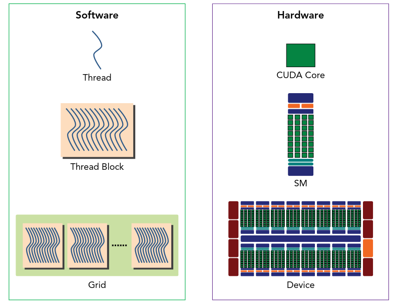
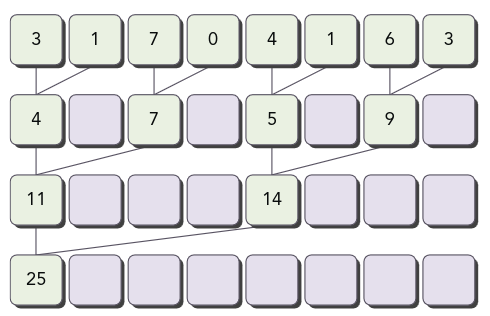
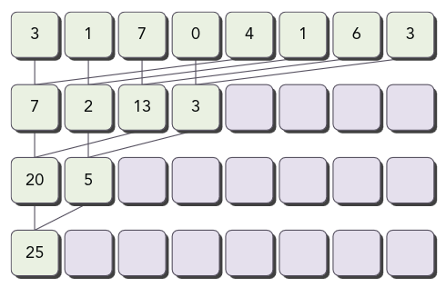
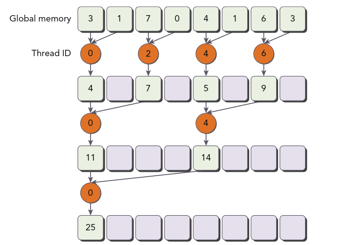
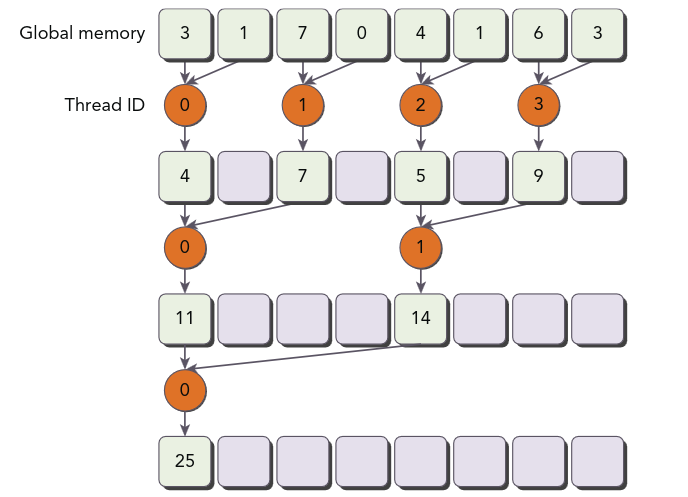

# CUDA Execution Model

## GPU Architecture Overview
- An execution model provides an operational view of how instructions are executed on a specific computing architecture.
- GPU architecture is built around a scalable array of **Streaming Multiprocessors (SMs)**; there are generally multiple SMs on a single GPU, and each is designed to support the concurrent execution of many threads.
- The key components of an SM are:
  - CUDA cores
  - Shared memory / L1 cache
  - Register file
  - Load/store units
  - Special function units
  - Warp scheduler
- When a kernel grid is launched, its thread blocks are distributed among the available SMs for execution. Multiple thread blocks can be assigned to the same SM at once, but a given thread block is scheduled onto exactly one SM and remains resident there — without migrating — until it completes.
- Shared memory and registers are precious, finite resources within an SM: shared memory is partitioned among the thread blocks resident on that SM, and registers are partitioned among its resident threads. It's through these same partitioned resources that threads within a block are able to cooperate and communicate.

### How software maps onto hardware
- A **thread** is executed on a **CUDA core** — the core is the hardware unit that carries out one thread's instruction stream.
- A **thread block** is scheduled onto one **SM**, which supplies it with a partition of that SM's registers and shared memory for as long as the block remains resident; several blocks can share one SM concurrently if enough resources are available.
- Across the whole grid, thread blocks are distributed among all the SMs on the device, and this distribution is done dynamically by the hardware scheduler — the same kernel can therefore run on a GPU with more or fewer SMs without any code changes, simply completing more or fewer blocks in parallel at once.



## SIMT Architecture and Warps
- CUDA uses the **Single Instruction, Multiple Thread (SIMT)** architecture to manage and execute threads in groups of 32 called **warps**.
- Characteristics of the SIMT model: each thread has its own instruction address counter and its own register state, and each thread can, in principle, follow an independent execution path.
- All threads in a warp execute the *same* instruction at the same time, each operating on its own data (its own registers/address).

### SIMT vs. SIMD
Both models apply one instruction to many data elements, but they differ in a key way:

| | SIMD | SIMT |
|---|---|---|
| Instruction stream visible to the programmer | A single instruction explicitly operates on a vector of data (e.g., one `add` instruction for 8 floats at once) | Each thread appears to the programmer as executing its own independent scalar instruction stream |
| Per-lane control flow | All lanes are forced through the same fixed vector width; there is no native per-lane branching | Each thread has its own program counter and register state, so threads *can* branch independently (though divergence within a warp is costly) |
| Programming model | The programmer must explicitly think and write in terms of vectors/lanes | The programmer writes ordinary scalar-looking code per thread; the hardware groups threads into warps and executes them SIMD-style under the hood |

In short: SIMD is fundamentally a hardware/instruction-level abstraction where the vector width is baked into the instruction, while SIMT is a software-facing abstraction (independent scalar threads) that the hardware happens to implement using SIMD-style execution underneath, in fixed groups of 32 (a warp).

### Warp scheduling
- Each SM partitions the thread blocks assigned to it into 32-thread warps, which it then schedules for execution; the number of warps that can be active at once is limited by the SM's resources.
- Switching between concurrent warps has essentially no overhead: hardware resources (registers, shared memory) are already partitioned among all resident threads/blocks on the SM, so every warp's execution state is kept on-chip the whole time — there's no state to save or restore when switching.
- Not all threads in a thread block execute physically at the same instant, and different threads may make progress at different paces. Sharing data among threads under these conditions can create a **race condition** — multiple threads accessing the same data with an undefined ordering. CUDA provides `__syncthreads()` to synchronize threads *within* a block so they all reach a given point before any proceeds further; no built-in primitive exists for synchronizing *across* different blocks.

## Understanding the Nature of Warp Execution
- Warps are the basic unit of execution on an SM. Thread blocks can be configured as one-, two-, or three-dimensional in software, but from the hardware's perspective, threads within a block are always laid out one-dimensionally.
- Each thread has a unique ID within its block. For a one-dimensional thread block, that ID is simply `threadIdx.x`, and consecutively numbered threads are grouped into warps. A one-dimensional block of 128 threads is grouped into 128/32 = 4 warps:

```text
Warp 0: thread  0, thread  1, thread  2, ... thread 31
Warp 1: thread 32, thread 33, thread 34, ... thread 63
Warp 2: thread 64, thread 65, thread 66, ... thread 95
Warp 3: thread 96, thread 97, thread 98, ... thread 127
```

### Linearizing 2D and 3D thread IDs
For a 2D or 3D block, the hardware still needs one linear (1D) thread ID to assign threads to warps and cores. This linear ID is computed the same way you'd flatten a row-major multi-dimensional array — `threadIdx.x` is the fastest-varying component, `threadIdx.y` next, then `threadIdx.z`:

- **2D block**: `threadId = threadIdx.y * blockDim.x + threadIdx.x`
  - This is exactly row-major flattening: each full "row" of `y` is `blockDim.x` threads wide, so to reach row `threadIdx.y`, you skip `threadIdx.y * blockDim.x` threads, then step `threadIdx.x` further into that row.
- **3D block**: `threadId = threadIdx.z * blockDim.y * blockDim.x + threadIdx.y * blockDim.x + threadIdx.x`
  - Same idea, one level deeper: each full "z-slice" contains `blockDim.y * blockDim.x` threads, so you skip `threadIdx.z` full slices, then apply the 2D formula above within that slice.

**Example 1 — 2D block, `blockDim = (4, 3)`** (`blockDim.x = 4`, `blockDim.y = 3`):

```text
threadId = threadIdx.y * 4 + threadIdx.x

           threadIdx.x=0  1   2   3
threadIdx.y=0:   0   1   2   3
threadIdx.y=1:   4   5   6   7
threadIdx.y=2:   8   9  10  11
```
So thread `(threadIdx.x=2, threadIdx.y=1)` → `1*4 + 2 = 6`.

**Example 2 — 3D block, `blockDim = (4, 3, 2)`** (`blockDim.x = 4`, `blockDim.y = 3`, `blockDim.z = 2`):
For thread `(threadIdx.x=1, threadIdx.y=2, threadIdx.z=1)`:
```text
threadId = 1 * (3 * 4) + 2 * 4 + 1
         = 1 * 12      + 8     + 1
         = 21
```
The `z = 1` slice starts right after the whole `z = 0` slice (which holds `3 * 4 = 12` threads), so this thread is thread 12 of that second slice, landing at overall ID 21.

### Warps per block and partial warps
The number of warps for a thread block is given by:

$$
    \text{WarpsPerBlock} = ceil \left[\frac{\text{ThreadsPerBlock}}{\text{warpSize}} \right]
$$

If the thread block size is not an even multiple of the warp size, the last warp is padded out with inactive threads — e.g., a 100-thread block still allocates `ceil(100/32) = 4` warps, but the 4th warp only has 4 real threads active out of its 32 lanes.

### Warp divergence
Threads in the same warp executing different instructions is called **warp divergence**: threads within a warp take different code paths.
- **What causes it**: since all 32 threads in a warp share one instruction stream, if a conditional (`if`/`else`, loops with data-dependent bounds, `switch`, etc.) evaluates differently across threads *in the same warp*, the hardware must execute each distinct path in turn, disabling the threads that don't take that path, then repeat for the other path(s). The warp only finishes once every path taken by any of its threads has run.
- **Control structures that trigger it**: any branch whose condition depends on `threadIdx` (or on data that varies per thread) in a way that doesn't line up with warp boundaries — e.g. `if (tid % 2 == 0)`, `if (data[tid] > threshold)`, a loop that runs a different number of iterations per thread.
- **Effects**: the warp's total execution time becomes the *sum* of the time for every distinct path taken, instead of the time for just one path — throughput drops because threads sit idle while other threads in the same warp finish their (different) path.
- **Practices that reduce it**:
  - Restructure branch conditions so they align with warp boundaries (e.g., branch on `tid / warpSize` instead of on arbitrary per-thread data), so an entire warp uniformly takes one path.
  - Rearrange data/thread-to-index mappings so that threads needing the same path end up in the same warp (this is exactly the fix used in the reduction example below).
  - Replace short, data-dependent branches with branch-free equivalents where possible (e.g., predication, `min`/`max`, arithmetic tricks) so there's no divergent path to serialize.
- **Example**: `if (threadIdx.x % 2 == 0) { a(); } else { b(); }` splits every warp roughly in half, forcing that warp to execute both `a()` and `b()` in sequence — this is a classic divergence-inducing pattern.
- **Branch efficiency** is a metric (reported by CUDA profilers) defined as:
$$
\text{Branch Efficiency} = \frac{\text{Branches} - \text{Divergent Branches}}{\text{Branches}} \times 100\%
$$
  A value below 100% means some branches caused divergence somewhere in the kernel.
- **Branch granularity** refers to how finely (per-thread) vs. how coarsely (per-warp/per-block) a branch condition varies. Avoiding divergence is fundamentally about increasing branch granularity — making sure the condition's value is constant across each warp (ideally constant across whole blocks) rather than varying thread-by-thread within a warp.
- **Why different warps can run different code at no penalty**: the divergence penalty specifically comes from *serializing paths within one warp*, because a single warp only has one active instruction stream at a time. Different warps, by contrast, are already independent instruction streams handled separately by the warp scheduler — one warp executing an `if` branch while another warp (elsewhere in the same block or a different block) executes the `else` branch is completely normal, concurrent SIMT execution, with no serialization between them at all.

## Resource Partitioning
- The local execution context of a warp mainly consists of:
  - Program counters
  - Registers
  - Shared memory
- The execution context of each warp processed by an SM is maintained on-chip during the entire lifetime of the warp, so switching from one execution context to another has no cost.
- Each SM has a set of 32-bit registers, stored in a register file, that are partitioned among its resident threads. The number of thread blocks and warps that can reside on an SM depends on how many registers and how much shared memory are available on that SM.
- A thread block is said to be **active** once resources such as registers and shared memory have been allocated to it, and the warps belonging to an active block are called **active warps**. Active warps are further classified as:
  - **Selected warp** — actively executing right now.
  - **Eligible warp** — ready for execution but not currently selected.
  - **Stalled warp** — not ready for execution.
- A warp scheduler on the SM selects an active warp every cycle and dispatches it to the execution units. A warp is eligible for execution when both of the following hold: the 32 CUDA cores it needs are available, and the arguments to its current instruction are ready.

## Latency Hiding
An SM hides instruction latency by relying on thread-level parallelism rather than trying to make any single instruction faster.
- **Instruction latency** is the number of clock cycles between an instruction being issued and its result being ready.
- Full compute-resource utilization happens when every warp scheduler has an eligible warp to issue on every clock cycle — that way, while one warp's instruction is still "in flight" (its latency hasn't elapsed), the scheduler simply issues an instruction from a *different* resident warp instead of sitting idle. This is what "GPU latency is hidden by computation from other warps" means in practice.
- Instructions fall into two basic types, by what kind of latency they incur:
  - **Arithmetic instructions**: latency is the time between an arithmetic operation starting and its output being produced.
  - **Memory instructions**: latency is the time between a load/store being issued and the data actually arriving at (or leaving for) its destination — this is typically far longer than arithmetic latency, especially for global memory.

### Estimating the warps needed to hide latency (Little's Law)
Queuing theory's **Little's Law** gives a simple way to estimate how much parallelism (how many warps in flight) is needed to fully hide a given latency:

$$
\text{Warps needed} = \text{Throughput (per cycle)} \times \text{Latency (cycles)}
$$

**Worked example** (illustrative numbers, in the spirit of the Fermi architecture): suppose an SM can issue 1 warp's worth of a given arithmetic instruction per clock, and that instruction's latency is about 18 cycles. Then, by Little's Law, roughly `1 × 18 = 18` warps need to be resident and eligible to keep that instruction pipeline fully busy every cycle — with fewer than 18 warps in flight, the scheduler will occasionally run out of other eligible work and the pipeline will stall waiting on the latency instead of hiding it. Memory instructions have much higher latency (often hundreds of cycles for global memory), so hiding memory latency generally requires many more resident warps than hiding arithmetic latency does.

### Throughput vs. bandwidth
- **Throughput** is the rate at which *operations* complete (e.g., instructions or FLOPs per cycle/second) — it describes how much compute work gets done.
- **Bandwidth** is the rate at which *data* moves (e.g., bytes per second) — it describes how much data transfer capacity exists, most relevantly between the GPU and memory.
They're related but distinct: a kernel can be throughput-bound (limited by how fast the compute units can issue/retire operations) or bandwidth-bound (limited by how fast data can be moved to feed those operations), and the two require different kinds of tuning to fix.

### Sizing warps per SM using warp size
Given a target instruction throughput and its latency, the required number of resident warps (from Little's Law above) can be translated into a thread-block/grid configuration using `warpSize` (32): if `W` warps are needed to hide the relevant latency, then at least `W * warpSize` threads should be resident and eligible on the SM at once — informing how large a block should be, and how many blocks should be co-resident, to reach that warp count without exceeding the SM's register/shared-memory budget.

### Two ways to increase parallelism: ILP and TLP
- **Instruction-Level Parallelism (ILP)**: increasing the number of *independent* instructions available within a single thread/warp's own instruction stream (e.g., by unrolling a loop so multiple independent additions are in flight at once), so the scheduler has more non-dependent work to interleave even with fewer resident warps.
- **Thread-Level Parallelism (TLP)**: increasing the number of concurrently resident warps/threads, so the scheduler has more *independent warps* to switch between when any one of them stalls — this is the mechanism Little's Law above is estimating.
Both increase the pool of "eligible work" the warp scheduler can draw from each cycle; in practice, well-tuned kernels often use a combination of both rather than relying on TLP (more warps) alone.

## Occupancy
- Instructions are executed sequentially within each CUDA core. When one warp stalls, the SM switches to executing other eligible warps instead. Ideally, you want enough resident warps to keep the SM's cores continuously occupied.
- Occupancy is given by:

$$
    \text{occupancy} = \frac{\text{active warps}}{\text{maximum warps}}
$$

- General guidelines for choosing grid and block size:
  - Keep the number of threads per block a multiple of warp size (32).
  - Avoid small block sizes: start with at least 128–256 threads/block.
  - Adjust block size up or down according to the kernel's resource requirements (registers, shared memory).
  - Keep the number of blocks much greater than the number of SMs, to expose enough parallelism to the device.
  - Conduct experiments to discover the best execution configuration and resource usage for a given kernel — no fixed formula replaces measurement.

## Synchronization
CUDA supports synchronization at two levels:
- **System-level**: wait for all work on both the host and device to complete.
- **Block-level**: wait for the threads within a thread block to reach the same point in execution.

When sharing data among threads, care must be taken to avoid race conditions.

## Scalability
CUDA's execution model is built to scale automatically across GPUs of different sizes without changing the kernel code: because thread blocks are distributed to SMs dynamically at runtime (rather than being pinned to specific hardware at compile time), the exact same kernel and grid/block configuration can run on a small GPU with few SMs (executing fewer blocks concurrently, taking longer overall) or a large GPU with many SMs (executing more blocks concurrently, finishing faster) — the program doesn't need to know how many SMs are actually present. This is also the reasoning behind the "many more blocks than SMs" occupancy guideline above: enough independent blocks need to exist for larger GPUs to actually have extra work to run in parallel.

## Metrics and Performance
- In most cases, no single metric can prescribe optimal performance — the right approach is to seek a good balance among several related metrics and events, checking a kernel from different angles to understand where the bottleneck actually is.
- Grid/block heuristics (like the occupancy guidelines above) provide a good starting point for performance tuning, but which metric or event most directly relates to overall performance depends on the specific nature of the kernel's code (compute-bound vs. memory-bound, divergence-prone vs. not, etc.).

## Avoiding Branch Divergence

### The parallel reduction problem
Consider summing an array of integers with N elements:

```c
int sum = 0;
for (int i = 0; i < N; i++)
    sum += numbers[i]
```
This sequential code becomes extremely slow as N gets large, since it does exactly N-1 additions one after another with no parallelism at all.

A common way to parallelize this is an **iterative pairwise implementation**: the N elements are split into chunks of two, each thread sums its pair to produce one partial result, and those partial results are stored in-place in the original input array. The number of remaining values halves on every iteration, and the final sum has been found once the array's effective length reaches one.

- **Total additions performed**: still exactly `N - 1`, the same as the sequential version — parallelizing the reduction doesn't change the total amount of arithmetic work, it changes how that work is scheduled.
- **Number of steps (rounds)**: `ceil(log2 N)` — since each round halves the number of remaining elements, e.g. 1024 elements take only 10 rounds (rather than 1023 sequential steps), because many additions run concurrently within each round.

Pairwise parallel sum implementations can be further classified as:
- **Neighbored pair**: elements are paired with their immediate neighbor.
  
- **Interleaved pair**: paired elements are separated by a given stride.
  

## Divergence in Parallel Reduction

Using the neighbored pair method:

```c
__global__ void reduceNeighbored (int *g_data, int *g_odata, unsigned int n) {
    unsigned int tid = threadIdx.x;
    unsigned int idx = blockIdx.x * blockDim.x + threadIdx.x;
    int *idata = g_idata + blockIdx.x * blockDim.x;

    // boundary check
    if (idx >= n) return;
    // stride is distance between two neighbors
    // after each iteration, the distance between two neighbors is multiplied by 2
    // only even threads to perform the following operation
    // in-place reduction
    for (int stride = 1; stride < blockDim.x; stride *= 2){
        if ((tid % (2 * stride )) == 0){
            idata[tid] += idata[tid + stride];
        }
        // synchronize within block
        __syncthreads();
    }

    // write result for this block to global mem
    // we only want this instruction to be performed by one thread
    if (tid == 0) g_odata[blockIdx.x] = idata[0];
}
```


The instruction `(tid % (2 * stride)) == 0` causes highly divergent warps: in the first iteration, only even threads execute the body of the conditional, but *all* threads in the warp still have to be scheduled through both the "do the add" and "skip the add" paths.

**Concretely, for a block of 512 threads (16 warps of 32 threads each):**

```text
stride    active tids (pattern)        within-warp mix                divergent warps
  1       tid % 2  == 0                every warp has 16 active,      all 16 warps
                                        16 inactive tids, interleaved
  2       tid % 4  == 0                every warp still has a mix     all 16 warps
  4       tid % 8  == 0                every warp still has a mix     all 16 warps
  8       tid % 16 == 0                every warp still has a mix     all 16 warps
 16       tid % 32 == 0                every warp still has a mix     all 16 warps
 32       tid % 64 == 0                active tids now 64 apart —     only half the warps contain
                                        more than one warp's width     the (single) active tid; the
                                                                        rest exit with nothing to do
 64       tid % 128== 0                active tids 128 apart           only 4 of 16 warps involved
128       tid % 256== 0                active tids 256 apart           only 2 of 16 warps involved
256       tid % 512== 0                a single active tid (tid 0)     only 1 warp involved
```
As long as `stride < warpSize` (32), the "every-other/every-Nth" pattern always lands both active and inactive `tid`s inside the *same* warp, so every one of the 16 warps sees divergence on every one of those early rounds. Once `stride >= warpSize`, the surviving active `tid`s are spaced 64 or more apart — more than one warp's width — so most warps in a round now contain either zero active threads (and simply skip the body uniformly, with no divergence penalty) or the lone active thread. This progressive shrinking of "how many warps still have mixed activity" is exactly the motivation for the warp-unrolling optimization further down.

Warp divergence can be reduced by rearranging the array index of each thread to force *neighboring* threads (not every-other thread) to perform the addition:

```c
__global__ void reduceNeighbored (int *g_data, int *g_odata, unsigned int n) {
    unsigned int tid = threadIdx.x;
    unsigned int idx = blockIdx.x * blockDim.x + threadIdx.x;
    int *idata = g_idata + blockIdx.x * blockDim.x;

    // boundary check
    if (idx >= n) return;
    // stride is distance between two neighbors
    // after each iteration, the distance between two neighbors is multiplied by 2
    // in-place reduction
    for (int stride = 1; stride < blockDim.x; stride *= 2){
        int index = 2 * stride * tid;
        // only use the first block to execute the addition
        if (index < blockDim.x){
            idata[index] += idata[index + stride];
        }
        // synchronize within block
        __syncthreads();
    }

    // write result for this block to global mem
    // we only want this instruction to be performed by one thread
    if (tid == 0) g_odata[blockIdx.x] = idata[0];
}
```


### The interleaved pair method
The **interleaved pair** approach goes further by starting the stride at half the block size and halving it each round, so the *active* threads are always a contiguous, low-numbered block (`tid < stride`) rather than an every-Nth pattern:

```c
__global__ void reduceInterleaved (int *g_idata, int *g_odata, unsigned int n) {
    unsigned int tid = threadIdx.x;
    unsigned int idx = blockIdx.x * blockDim.x + threadIdx.x;
    int *idata = g_idata + blockIdx.x * blockDim.x;

    if (idx >= n) return;

    // stride starts at half the block and shrinks each round
    for (int stride = blockDim.x / 2; stride > 0; stride >>= 1) {
        if (tid < stride) {
            idata[tid] += idata[tid + stride];
        }
        __syncthreads();
    }

    if (tid == 0) g_odata[blockIdx.x] = idata[0];
}
```
**Difference in warp divergence**: because `tid < stride` selects a contiguous run of low-numbered threads, an entire warp is now either *fully* inside that run (all 32 `tid`s satisfy `tid < stride`) or *fully* outside it (none do), for as long as `stride` stays a multiple of the warp size. That means whole warps uniformly take the same path — no internal split, no divergence — right up until the last few rounds (`stride < 32`), where a single warp's normal tail-end behavior takes over. This is strictly better than the neighbored method, which divides every warp internally on nearly every round.

## Unrolling Loops
In **loop unrolling**, instead of writing the body of a loop once and letting the loop mechanism (the condition check and jump) run it repeatedly, the body is written out multiple times in a row so each pass through the loop does several iterations' worth of work at once. This cuts down on loop-control overhead (fewer condition checks, fewer branches) and gives the compiler/hardware more independent, back-to-back instructions to work with (more ILP) — it's most effective for sequential array processing where the number of iterations is known ahead of time. The number of copies made of the loop body is called the **unrolling factor**, and the number of iterations in the enclosing loop is divided by that factor accordingly.

```c
for (int i = 0; i < 100; i++)
    a[i] = b[i] + c[i];
```

By replicating the body of the loop once (an unrolling factor of 2), the number of loop iterations is reduced to half the original:

```c
for (int i = 0; i < 100; i += 2){
    a[i] = b[i] + c[i];
    a[i+1] = b[i+1] + c[i+1];
}
```

## Reducing with Loop Unrolling
The same unrolling idea can be applied to the reduction kernel itself, at the level of *thread blocks* rather than array indices: have each block handle **two** data chunks instead of one, combining them with a single addition before the usual reduction loop even starts. This halves how many blocks are needed for a given input size, cutting block-launch and block-bookkeeping overhead roughly in half:

```c
__global__ void reduceUnrolling2 (int *g_idata, int *g_odata, unsigned int n) {
    unsigned int tid = threadIdx.x;
    // each block now covers 2 * blockDim.x elements
    unsigned int idx = blockIdx.x * blockDim.x * 2 + threadIdx.x;
    int *idata = g_idata + blockIdx.x * blockDim.x * 2;

    // unrolling 2 data blocks: fold the second block into the first
    if (idx + blockDim.x < n) {
        g_idata[idx] += g_idata[idx + blockDim.x];
    }
    __syncthreads();

    // ordinary in-place reduction, same as before
    for (int stride = blockDim.x / 2; stride > 0; stride >>= 1) {
        if (tid < stride) {
            idata[tid] += idata[tid + stride];
        }
        __syncthreads();
    }

    if (tid == 0) g_odata[blockIdx.x] = idata[0];
}
```
The only new step is the very first one: before the reduction loop begins, each thread adds the element from its own data block to the corresponding element from the *second* data block that this same thread block has now been assigned. From that point on, the kernel proceeds exactly like the interleaved-pair reduction above, just with half as many blocks needed in the launch configuration.

## Reducing with Unrolled Warps
Once a reduction round gets down to 32 or fewer active threads — a single warp — something special can be done, because a warp executes in lockstep (SIMT): all 32 threads execute the *same* instruction at the *same* clock cycle. That means the moment one thread in a warp writes a value, every other thread in that same warp is guaranteed to see it by the very next instruction, with no need for an explicit `__syncthreads()` barrier — the warp's own lockstep execution is already an implicit synchronization at the instruction level, as long as all 32 threads are still part of that single warp. This is exactly why `__syncthreads()` calls can safely be dropped once the reduction reaches its last warp.

Considering the case where there are 32 or fewer threads left, the last 6 iterations of the reduction loop can therefore be unrolled as follows:

```c
if (tid < 32){
    volatile int *vmem = idata;
    vmem[tid] += vmem[tid + 32];
    vmem[tid] += vmem[tid + 16];
    vmem[tid] += vmem[tid +  8];
    vmem[tid] += vmem[tid +  4];
    vmem[tid] += vmem[tid +  2];
    vmem[tid] += vmem[tid +  1];
}
```
**Why `volatile`**: without it, the compiler is free to treat `idata[tid]` as an ordinary variable it can cache in a register and reuse across these lines, since (from the compiler's point of view) nothing in this thread's own instruction stream appears to modify it in between. But the whole point of this code is that *other threads in the same warp* are concurrently modifying `idata[tid + …]` on each line — so each read genuinely needs to go back to (shared) memory to pick up the neighboring thread's latest write. `volatile` tells the compiler not to cache or reorder these reads/writes, forcing every access to actually hit memory in program order.

Put together with the block-level unrolling above, a full reduction kernel typically finishes the higher, multi-warp rounds with ordinary `__syncthreads()`-guarded steps, then switches to this branch for the final, single-warp tail:

```c
__global__ void reduceUnrollWarps (int *g_idata, int *g_odata, unsigned int n) {
    unsigned int tid = threadIdx.x;
    unsigned int idx = blockIdx.x * blockDim.x * 2 + threadIdx.x;
    int *idata = g_idata + blockIdx.x * blockDim.x * 2;

    if (idx + blockDim.x < n) g_idata[idx] += g_idata[idx + blockDim.x];
    __syncthreads();

    // multi-warp rounds still need explicit synchronization
    for (int stride = blockDim.x / 2; stride > 32; stride >>= 1) {
        if (tid < stride) idata[tid] += idata[tid + stride];
        __syncthreads();
    }

    // final warp: no __syncthreads() needed, only volatile
    if (tid < 32){
        volatile int *vmem = idata;
        vmem[tid] += vmem[tid + 32];
        vmem[tid] += vmem[tid + 16];
        vmem[tid] += vmem[tid +  8];
        vmem[tid] += vmem[tid +  4];
        vmem[tid] += vmem[tid +  2];
        vmem[tid] += vmem[tid +  1];
    }

    if (tid == 0) g_odata[blockIdx.x] = idata[0];
}
```

## Unrolling with Template Functions
C++ **templates** let the block size be baked in as a compile-time constant instead of a runtime variable, which lets the compiler go a step further than manual unrolling: comparisons like `if (blockSize >= 512)` become compile-time-decidable, so the compiler can throw away entire branches that could never be true for a given instantiation, rather than checking them at runtime for every thread.

```c
template <unsigned int iBlockSize>
__global__ void reduceCompleteUnroll(int *g_idata, int *g_odata, unsigned int n)
{
    unsigned int tid = threadIdx.x;
    unsigned int idx = blockIdx.x * blockDim.x * 2 + threadIdx.x;
    int *idata = g_idata + blockIdx.x * blockDim.x * 2;

    if (idx + blockDim.x < n) g_idata[idx] += g_idata[idx + blockDim.x];
    __syncthreads();

    // each of these conditions is resolved at COMPILE time per instantiation
    if (iBlockSize >= 1024 && tid < 512) idata[tid] += idata[tid + 512];
    __syncthreads();
    if (iBlockSize >= 512 && tid < 256) idata[tid] += idata[tid + 256];
    __syncthreads();
    if (iBlockSize >= 256 && tid < 128) idata[tid] += idata[tid + 128];
    __syncthreads();
    if (iBlockSize >= 128 && tid < 64) idata[tid] += idata[tid + 64];
    __syncthreads();

    if (tid < 32) {
        volatile int *vmem = idata;
        if (iBlockSize >= 64) vmem[tid] += vmem[tid + 32];
        vmem[tid] += vmem[tid + 16];
        vmem[tid] += vmem[tid +  8];
        vmem[tid] += vmem[tid +  4];
        vmem[tid] += vmem[tid +  2];
        vmem[tid] += vmem[tid +  1];
    }

    if (tid == 0) g_odata[blockIdx.x] = idata[0];
}
```
Since `iBlockSize` is a template parameter, `reduceCompleteUnroll<256>` and `reduceCompleteUnroll<1024>` are two entirely separate, specialized compiled functions — each with its unreachable branches (e.g., the `tid < 512` step, when `iBlockSize` is only 256) stripped out entirely, rather than left in as a runtime check every thread has to evaluate and skip. The host code typically launches the right instantiation with a small `switch` on the actual runtime block size.

## Dynamic Parallelism
So far, all kernels have been invoked from the host thread, with the GPU's workload completely under the control of the CPU. **Dynamic parallelism** lifts that restriction: CUDA allows new GPU kernels to be created and synchronized directly from code already running on the GPU, which means the number of blocks and grids to create can be decided (and postponed) until runtime, on the device itself, rather than being fixed in advance by the host.

### Nested Execution
Kernel executions in dynamic parallelism are classified into two types:
- **Parent** — the parent thread, parent thread block, and parent grid that issues a child kernel launch.
- **Child** — the child thread, child thread block, and child grid that gets launched.

A child grid must complete before the parent thread, parent thread block, or parent grid that launched it are considered complete — a parent is not considered complete until *all* of its child grids have completed. Parent and child grids share the same global and constant memory storage, but each has its own distinct local and shared memory (a child cannot directly read a parent's shared-memory tile, for instance, only global/constant memory).

- **Synchronization particularities**: a `cudaDeviceSynchronize()` call made by a device thread only waits on the child grids launched *by that same thread block* — not on child grids launched by other threads or other blocks. Device-side kernel launches are, by default, asynchronous/"fire-and-forget" with respect to the launching thread, just like host-side launches are with respect to the CPU, unless explicitly synchronized.
- **Concurrency**: multiple child grids can execute concurrently (subject to a hardware/driver limit on how many kernels can be in flight at once), and successive nesting levels can themselves launch further children, up to a maximum supported nesting depth.
- **Restrictions**: dynamic parallelism requires compute capability ≥ 3.5, and the program must be compiled with relocatable device code (`-rdc=true`) so device-side kernel launches can be resolved; nesting depth is limited (commonly up to 24 levels on supporting hardware); shared and local memory are private per grid and cannot be passed by pointer between parent and child; and streams/events created inside a grid are local to that grid.

**Minimal illustration** of nested execution:

```c
__global__ void childKernel()
{
    printf("Child: block %d, thread %d\n", blockIdx.x, threadIdx.x);
}

__global__ void parentKernel()
{
    printf("Parent: block %d, thread %d launching child\n", blockIdx.x, threadIdx.x);
    if (threadIdx.x == 0) {
        childKernel<<<1, 4>>>();
        cudaDeviceSynchronize(); // wait for this thread's own child grid
    }
}

// host side:  parentKernel<<<2, 1>>>();
```

**The reduction problem with nested execution**: rather than looping over halving strides within one kernel invocation, a nested version can recurse — each grid sums its own chunk down by one level and then launches a smaller child grid to continue reducing the result, until the remaining size is small enough to finish directly:

```c
__global__ void reduceNested(int *g_idata, int *g_odata, unsigned int n)
{
    unsigned int tid = threadIdx.x;
    int *idata = g_idata + blockIdx.x * blockDim.x;

    // base case: small enough to finish directly
    if (n == 2 && tid == 0) {
        g_odata[blockIdx.x] = idata[0] + idata[1];
        return;
    }

    // one halving step, done by this grid
    int stride = n / 2;
    if (stride > 1 && tid < stride) {
        idata[tid] += idata[tid + stride];
    }
    __syncthreads();

    // thread 0 launches a smaller child grid to continue the reduction
    if (tid == 0) {
        reduceNested<<<1, stride / 2>>>(idata, g_odata, stride);
        cudaDeviceSynchronize();
    }
}
```
This trades the explicit `for (stride ...)` loop for recursive kernel launches — conceptually simpler to reason about level-by-level, but with real launch overhead per nesting level, which is why the iterative, warp-unrolled versions above are generally preferred in practice for this particular problem; nested execution tends to pay off more for genuinely irregular or data-dependent recursive workloads (e.g., adaptive grids, tree/graph traversal).