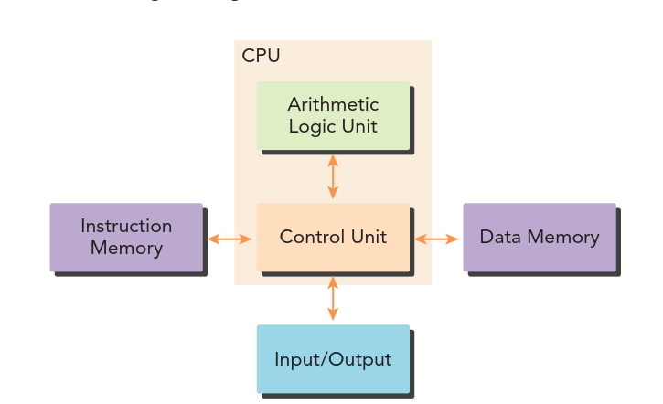

# Heterogeneous Parallel Computing with CUDA

## Parallel Computing Fundamentals
- The primary goal of parallel computing is to improve the speed of computation by performing many calculations simultaneously across multiple computing resources.
- It works on a divide-and-conquer principle: large problems are broken into smaller ones that can be solved concurrently.
- Parallel computing spans two distinct areas: **computer architecture** (the hardware that provides a platform for concurrent computation) and **parallel programming** (the software that expresses and exploits that concurrency).

### Computer architecture basics: the Harvard architecture
- Most modern processors implement the **Harvard architecture**, made up of three main components:
  - Memory
  - Central Processing Unit (control unit + arithmetic logic unit)
  - Input/output interfaces



### Tasks, instructions, and dependencies
- A program consists of instructions and data. Each piece of computation is referred to as a **task**; within a task, instructions consume input and apply a function to produce output.
- A **data dependency** occurs when an instruction consumes data produced by a preceding instruction — dependencies are one of the primary inhibitors of parallelism.
- Pieces of computation related by such a dependency (a precedence constraint) must be calculated sequentially; pieces with no such constraint can be calculated concurrently.

### Task parallelism vs. data parallelism
Parallelism in applications falls into two categories:
- **Task parallelism**: many tasks or functions can operate independently, so different functions are distributed across multiple cores.
- **Data parallelism**: many data items can be operated on at the same time, so data items (rather than functions) are distributed across multiple cores.

CUDA is especially well-suited to problems that can be expressed as data-parallel computations: data-parallel processing maps data elements onto parallel threads, and the first step in solving a data-parallel problem is partitioning the data across those threads so each thread works on a portion of it.

#### Partitioning strategies: block vs. cyclic
There are two main ways to divide data among threads:
- **Block partitioning**: the data is split into large, contiguous chunks, and each thread receives and processes one chunk in full. This is simple and works well when data access is regular and the work per element is roughly uniform.
- **Cyclic partitioning**: the data is split into many small chunks, which are handed out to threads round-robin, so each thread ends up owning several small, evenly-spaced chunks instead of one big contiguous one. This can improve load balancing when the amount of work varies across elements (it spreads "expensive" elements out across threads instead of letting them cluster onto just one or two), at the cost of each thread's elements no longer being contiguous in memory.

**Example** — 16 data elements split across 4 threads:

```text
Block partitioning (each thread gets one contiguous chunk of 4):

T0 -> elements  0  1  2  3
T1 -> elements  4  5  6  7
T2 -> elements  8  9 10 11
T3 -> elements 12 13 14 15
```

```text
Cyclic partitioning (each thread gets every 4th element, round-robin):

T0 -> elements  0  4  8 12
T1 -> elements  1  5  9 13
T2 -> elements  2  6 10 14
T3 -> elements  3  7 11 15
```

## Computer Architecture

According to Flynn's Taxonomy, there are four types of computer architecture, classified by how many instruction streams and data streams they operate on at once:

1. Single Instruction, Single Data (SISD)
2. Single Instruction, Multiple Data (SIMD)
3. Multiple Instruction, Single Data (MISD)
4. Multiple Instruction, Multiple Data (MIMD)

### Single Instruction, Single Data (SISD)
- The classic serial architecture: a computer with only one core.
- At any given time, only one instruction stream is executed, operating on one data stream.

### Single Instruction, Multiple Data (SIMD)
- A computer with multiple cores, where all cores execute the same instruction stream at any given time, each operating on a different data stream.

### Multiple Instruction, Single Data (MISD)
- An uncommon architecture, where each core operates on the *same* data stream but via separate, independent instruction streams.

### Multiple Instruction, Multiple Data (MIMD)
- Multiple cores operate on multiple data streams, each executing independent instructions. MIMD systems commonly include many SIMD units as sub-components.

## Metrics
- **Latency**: the time taken for a single operation to start and complete (measured in, e.g., microseconds).
- **Bandwidth**: the amount of data that can be moved or processed per unit of time (measured in, e.g., megabytes/second).
- **Throughput**: the amount of work (operations) that can be completed per unit of time (measured in, e.g., GFLOPS, FLOPS, MFLOPS).

### Memory system classification
- **Multi-node with distributed memory**: built from many processors, each with its own local (private) memory; processors communicate by explicitly passing messages over a network to share the contents of their local memory.
- **Multiprocessor with shared memory**: multiple processors share a single, common address space and can all directly access the same physical memory; instead of message passing, processors communicate implicitly through shared variables, with synchronization used to coordinate concurrent access.

### Multi-core vs. many-core
- **Multi-core** (the typical CPU design) uses a relatively small number of powerful, complex cores — each with sophisticated control logic, branch prediction, and a large cache — optimized to minimize the latency of any single thread.
- **Many-core** (the GPU design) uses a very large number of small, simpler cores with much less control logic and cache per core, optimized instead to maximize aggregate throughput across many threads running at once.
- This is the same latency-oriented vs. throughput-oriented trade-off described for CPUs and GPUs elsewhere in these notes — many-core designs trade single-thread speed for far greater parallel work capacity.

### GPUs and heterogeneous computing
- GPUs represent a many-core architecture and exhibit virtually every type of parallelism; NVIDIA coined the term **Single Instruction, Multiple Thread (SIMT)** to describe how GPU cores execute.
- GPUs and CPUs do not share a common ancestor: GPUs originated as graphics accelerators and have only recently evolved into general-purpose compute devices. As a result, a CPU core is relatively heavyweight compared to a GPU core.
- **Homogeneous computing** uses one or more processors of the same architecture; **heterogeneous computing** uses processors of different architectures together to execute a single application.
- A GPU is not currently a standalone computing platform — it acts as a co-processor to a CPU. In this relationship, the CPU is called the **host** and the GPU the **device**: host code runs on the CPU, device code runs on the GPU.
- GPU computing isn't meant to replace CPU computing — the two are complementary: CPUs are well suited to control-intensive tasks, while GPUs are well suited to data-parallel, computation-intensive tasks.