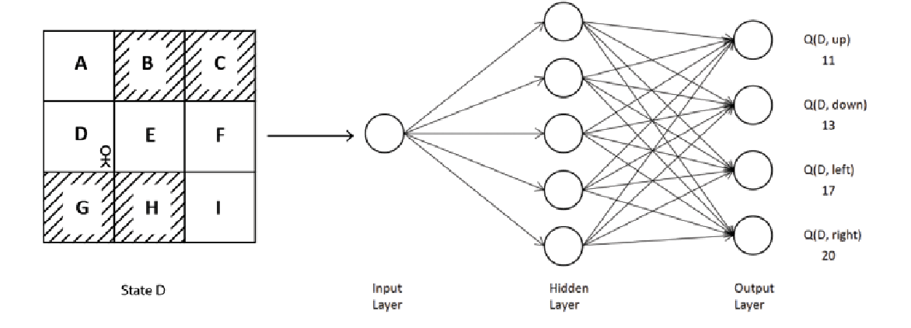
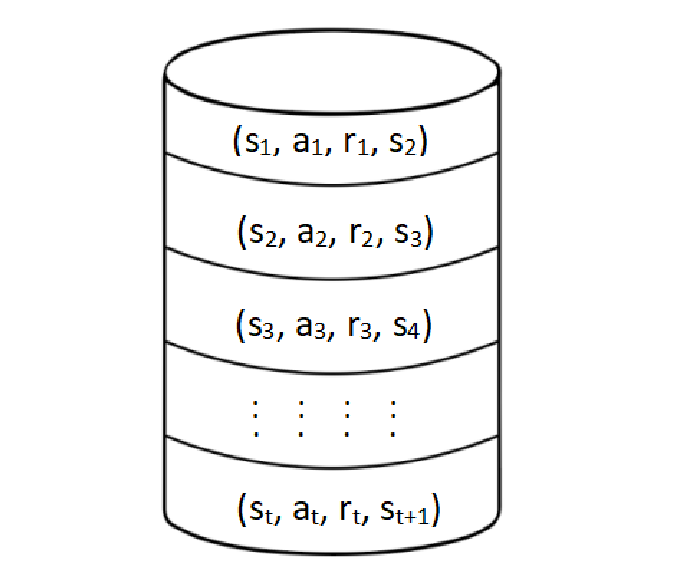

# Deep Q Network and Its Variants

- What is DQN
- The DQN algorithm
- Playing Atari games with DQN
- Double DQN
- DQN with prioritized experience replay
- The dueling DQN
- The deep recurrent Q network

## What is DQN?

### Recall

- The objective of reinforcement learning is to find the optimal policy — the policy that gives us the maximum return.
- To compute the policy, we first compute the Q function.
- Once we have the Q function, we extract the policy by selecting, in each state, the action with the maximum Q value.
- The policy is extracted from the optimal Q function.
- The size of the Q table matters a great deal.
- Say we have 1,000 states and 50 possible actions in each state — the Q table will consist of $1{,}000 \times 50 = 50{,}000$ Q values.
- Storing and updating 50,000 individual Q values this way quickly becomes expensive, and the problem only gets worse as the state space grows (for environments with continuous or image-based states, a Q *table* isn't even feasible).
- Instead of computing Q values this way, we approximate them using a function approximator — such as a neural network.
- We parameterize our Q function by a parameter $\theta$, the weights of the neural network.
- We feed the state of the environment into the neural network, and it returns the Q value of every possible action in that state.

- The network returns the Q value of all actions available in state $s$ as its output. We then select the action with the maximum Q value.
- This neural network is called the **Q network**.
- When we use a *deep* neural network to approximate the Q function, it's called a **deep Q network (DQN)**.
- We denote the Q function by $Q_{\theta}(s, a)$, where $\theta$ is the parameter (weights) of the neural network.
- We initialize the network parameter $\theta$ with random values and use it to approximate the Q function.
- The network is then trained to find the optimal setting of $\theta$.

## Understanding DQN

- We use DQN to approximate the Q value of every action available in a given input state.
- Since the Q value is a continuous number, this is fundamentally a **regression task**.

### Replay Buffer

- Recall that the agent transitions from state $s$ to the next state $s'$ by performing action $a$ and receiving reward $r$. We save this information, $(s, a, r, s')$, in a buffer called a **replay buffer**, or **experience replay**.
- The replay buffer is denoted $D$.
- Each stored transition is a piece of the agent's **experience**.
- The agent's experience across many episodes accumulates in the replay buffer.
- The DQN is trained using experience sampled from this buffer.

#### Storing Transition Information in a Replay Buffer

1. Initialize the replay buffer $D$.
2. For each episode, perform step 3.
3. For each step in the episode:
   1. Transition from $s$ to $s'$ by taking action $a$, and receive reward $r$.
   2. Store the transition $(s, a, r, s')$ in the replay buffer $D$.

- Transitions are stacked sequentially, one after another, in the replay buffer.
- The network is trained by sampling a **minibatch** of transitions from the replay buffer, rather than training on transitions in the order they occurred.
- We sample a minibatch (instead of training directly on the incoming stream of experience) because consecutive transitions are highly correlated — they come from the same trajectory — and training on them in sequence would cause the network to overfit to short-term patterns rather than generalizing.
- The replay buffer has a limited size.
- The replay buffer is usually implemented as a queue: once it's full, the oldest transitions are discarded to make room for new ones.

### Loss Function

- Since this is a regression task, we generally use **mean squared error (MSE)** as the loss function:

$$
MSE = \frac{1}{K} \sum_{i=1}^{K} \left( y_i - \hat{y}_i \right)^{2}
$$

- $K$ represents the number of training samples (i.e., the minibatch size).
- We train the network by minimizing the MSE between the **target** Q value and the **predicted** Q value.
- The target Q value should be the *optimal* Q value.
- The optimal Q value is given by the Bellman optimality equation:

$$
Q^{*}(s, a) = \mathbb{E}_{s' \sim p}\left[ R(s,a,s') + \gamma \max_{a'} Q^{*}(s', a') \right]
$$

- Computing this expectation exactly would require knowing the environment's full transition dynamics $p(s' \mid s, a)$ — but DQN is model-free, so we don't have access to $p$. Instead, we approximate the expectation using a single sampled transition $(s, a, r, s')$ drawn from the replay buffer (a Monte Carlo–style approximation of the expectation using one sample):

$$
Q^{*}(s, a) \approx r + \gamma \max_{a'} Q^{*}(s', a')
$$

- The loss is then given by the difference between this target and our current estimate:

$$
L(\theta) = Q^{*}(s, a) - Q_{\theta}(s, a)
$$

- Substituting the sampled target from above:

$$
L(\theta) = r + \gamma \max_{a'} Q(s', a') - Q_{\theta}(s, a)
$$

- How do we compute $Q(s', a')$? We use the same DQN, parameterized by $\theta$, to estimate it:

$$
L(\theta) = r + \gamma \max_{a'} Q_{\theta}(s', a') - Q_{\theta}(s, a)
$$

- Applying the MSE over a minibatch of $K$ sampled transitions, the full loss becomes:

$$
L(\theta) = \frac{1}{K} \sum_{i=1}^{K} \left( y_i - Q_{\theta}(s_i, a_i) \right)^{2}
$$

- We denote the target for the $i$-th sample as:

$$
y_i = r_i + \gamma \max_{a'} Q_{\theta}(s'_i, a')
$$

- If $s'$ is a **terminal** state, we cannot compute a Q value for it, since there's no action left to take from it — the episode has ended, so there's no future return to bootstrap from. This means the target simplifies to just the immediate reward. Formally:

$$
y_i =
\begin{cases}
r_i & \text{if } s'_i \text{ is terminal} \\[4pt]
r_i + \gamma \max_{a'} Q_{\theta}(s'_i, a') & \text{if } s'_i \text{ is non-terminal}
\end{cases}
$$

- We use gradient descent to optimize the parameter $\theta$. The update rule is:

$$
\theta \leftarrow \theta - \alpha \nabla_{\theta} L(\theta)
$$

### The Instability Problem and the Target Network

- There is a source of instability in this setup: we compute both the **predicted** Q value $Q_{\theta}(s,a)$ and the **target** Q value $r + \gamma \max_{a'} Q_{\theta}(s',a')$ using the *same* network parameters $\theta$.
- This means every gradient step that updates $\theta$ to reduce the loss for one transition simultaneously shifts the target values for other transitions too — because those targets also depend on $\theta$.
- **Example of the problem:** suppose $Q_{\theta}(s,a) = 5$ and, using the same network, the target works out to $y = 6$. A gradient step nudges $Q_{\theta}(s,a)$ up toward 6 — but that same weight update also changes $Q_{\theta}(s', a')$, which is part of how $y$ is computed. If $y$ moves up to, say, 6.4 as a result, the network is now chasing a target that keeps running away from it. This "moving target" problem causes oscillations and can make training diverge instead of converge.
- To fix this, we introduce a second network, the **target network**, used only for computing the Q value of the next state-action pair in the target. The target network has its own parameters $\theta'$, which are a periodic copy of $\theta$.
- **Freezing logic:** $\theta'$ is *frozen* — held fixed — for a number of training steps (say, every $C$ steps), while $\theta$ continues to be updated by gradient descent as usual. After every $C$ steps, we sync the target network by copying the latest weights: $\theta' \leftarrow \theta$.
- Because $\theta'$ stays fixed in between syncs, the targets $y_i$ stay stable for many training steps, giving the main network a stationary target to regress toward — avoiding the moving-target instability described above.

- The new loss function, using the target network, becomes:

$$
y_i =
\begin{cases}
r_i & \text{if } s'_i \text{ is terminal} \\[4pt]
r_i + \gamma \max_{a'} Q_{\theta'}(s'_i, a') & \text{if } s'_i \text{ is non-terminal}
\end{cases}
$$

$$
L(\theta) = \frac{1}{K} \sum_{i=1}^{K} \left( y_i - Q_{\theta}(s_i, a_i) \right)^{2}
$$

- Note that only $\theta$ (the main network) is updated by gradient descent; $\theta'$ (the target network) is updated only by periodic copying, never by gradient descent directly.

### The DQN Algorithm

1. Initialize the replay buffer $D$ with some fixed capacity.
2. Initialize the Q network with random weights $\theta$.
3. Initialize the target network with weights $\theta' = \theta$ (i.e., a copy of the Q network).
4. For each episode:
   1. Initialize the starting state $s$.
   2. For each step in the episode:
      1. Select an action $a$ using the epsilon-greedy policy with respect to $Q_{\theta}(s, \cdot)$.
      2. Perform action $a$; observe reward $r$, the next state $s'$, and whether $s'$ is terminal.
      3. Store the transition $(s, a, r, s', \text{terminal?})$ in the replay buffer $D$.
      4. Sample a random minibatch of $K$ transitions $(s_i, a_i, r_i, s'_i)$ from $D$.
      5. Compute the target for each sampled transition using the target network:

$$
y_i =
\begin{cases}
r_i & \text{if } s'_i \text{ is terminal} \\[4pt]
r_i + \gamma \max_{a'} Q_{\theta'}(s'_i, a') & \text{if } s'_i \text{ is non-terminal}
\end{cases}
$$

      6. Perform a gradient descent step on $L(\theta) = \frac{1}{K}\sum_{i=1}^{K} \left( y_i - Q_{\theta}(s_i, a_i) \right)^2$ with respect to $\theta$.
      7. Every $C$ steps, update the target network: $\theta' \leftarrow \theta$.
      8. Set $s \leftarrow s'$.
      9. Repeat from step 4.2.1 if $s$ is not terminal.
5. Repeat for many episodes until the Q network converges.

## Architecture of the DQN

- In the Atari environment, the image of the game screen is the state of the environment.
- We feed the image of the game screen as input to the DQN.
- Since we're working with images, we use a **CNN** (convolutional neural network).
- The DQN in this setting is, architecturally, a CNN.
- We do not perform pooling operations — the position of features on the screen matters for understanding the game state, and pooling would discard that spatial information.

## Double DQN

- Standard DQN tends to **overestimate** the Q value of the next state-action pair in the target, due to the presence of the $\max$ operator:

$$
y = r + \gamma \max_{a'} Q_{\theta'}(s', a')
$$

- This happens because the same values used to *select* the best next action are also used to *evaluate* it — any noise or error in the estimates tends to get picked out and amplified by the max, systematically biasing the target upward.
- Double DQN removes this overestimation by decoupling action selection from action evaluation, modifying the target computation to:

$$
y = r + \gamma \, Q_{\theta'}\!\left(s', \operatorname*{arg\,max}_{a'} Q_{\theta}(s', a')\right)
$$

- We now use two Q functions: the one parameterized by the main network parameter $\theta$ is used for **action selection**, and the target network parameterized by $\theta'$ is used for **Q value computation**.

### Action Selection
- Compute the Q values of all next state-action pairs using the **main** network, $Q_\theta(s', \cdot)$.
- Select the action with the maximum Q value: $a^{*} = \operatorname*{arg\,max}_{a'} Q_{\theta}(s', a')$.

### Q Value Computation
- Compute the Q value of that selected action using the **target** network: $Q_{\theta'}(s', a^{*})$.
- Because the network that *picks* the action ($\theta$) is different from the network that *scores* it ($\theta'$), an action only ends up overestimated if both networks happen to overestimate it together — which is far less likely than either network overestimating on its own, so the bias is greatly reduced.

### The Double DQN Algorithm

1. Initialize the replay buffer $D$ with some fixed capacity.
2. Initialize the main Q network with random weights $\theta$.
3. Initialize the target network with weights $\theta' = \theta$.
4. For each episode:
   1. Initialize the starting state $s$.
   2. For each step in the episode:
      1. Select an action $a$ using the epsilon-greedy policy with respect to $Q_{\theta}(s, \cdot)$.
      2. Perform action $a$; observe reward $r$, the next state $s'$, and whether $s'$ is terminal.
      3. Store the transition $(s, a, r, s')$ in the replay buffer $D$.
      4. Sample a random minibatch of $K$ transitions $(s_i, a_i, r_i, s'_i)$ from $D$.
      5. For each sampled transition, compute the target:
         - Select the best next action using the main network: $a^{*}_i = \operatorname*{arg\,max}_{a'} Q_{\theta}(s'_i, a')$.
         - Evaluate it using the target network:

$$
y_i =
\begin{cases}
r_i & \text{if } s'_i \text{ is terminal} \\[4pt]
r_i + \gamma \, Q_{\theta'}(s'_i, a^{*}_i) & \text{if } s'_i \text{ is non-terminal}
\end{cases}
$$

      6. Perform a gradient descent step on $L(\theta) = \frac{1}{K}\sum_{i=1}^{K} \left( y_i - Q_{\theta}(s_i, a_i) \right)^2$ with respect to $\theta$.
      7. Every $C$ steps, update the target network: $\theta' \leftarrow \theta$.
      8. Set $s \leftarrow s'$.
      9. Repeat from step 4.2.1 if $s$ is not terminal.
5. Repeat for many episodes until the Q network converges.

## DQN with Prioritized Experience Replay

- With standard DQN, we randomly sample a minibatch of $K$ transitions, uniformly, from the replay buffer and train the network.
- In this variant, we instead assign a **priority** to each transition in the replay buffer, so that more "useful" transitions are sampled more often.
- We define the **TD error** $\delta$ as:

$$
\delta = r + \gamma \max_{a'} Q_{\theta'}(s', a') - Q_{\theta}(s, a)
$$

- A transition with a high TD error implies the network's current prediction for it is far from the target — i.e., there's more to learn from that transition. We prioritize replaying it more often to reduce the error faster.
- The replay buffer's entries now look like $(s_1, a_1, r_1, s_2, p_1)$ — each transition is stored alongside its priority $p$.

### Proportional Prioritization

- The priority of a transition is based on the magnitude of its TD error:

$$
p_i = |\delta_i|
$$

- A priority of exactly 0 is undesirable, since that transition would then never be sampled again — so we add a small constant $\epsilon > 0$:

$$
p_i = |\delta_i| + \epsilon
$$

- We convert priorities into sampling probabilities:

$$
P(i) = \frac{p_i}{\sum_{k} p_k}
$$

- We can also control how strongly prioritization is applied (rather than sampling purely proportionally to $p_i$) using an exponent $\alpha$:

$$
P(i) = \frac{p_i^{\alpha}}{\sum_{k} p_k^{\alpha}}
$$

  ($\alpha = 0$ recovers uniform sampling; $\alpha = 1$ is full proportional prioritization.)

### Rank-Based Prioritization

- Here, priority is assigned based on the **rank** of a transition, rather than its raw TD error.
- The rank is the transition's position in the replay buffer once all transitions are sorted from highest TD error to lowest:

$$
p_i = \frac{1}{\text{Rank}(i)}
$$

- We convert priorities into probabilities the same way as before:

$$
P(i) = \frac{p_i}{\sum_{k} p_k}
$$

- And we can again apply the exponent $\alpha$ to control the strength of prioritization:

$$
P(i) = \frac{p_i^{\alpha}}{\sum_{k} p_k^{\alpha}}
$$

  Rank-based prioritization is more robust to outliers than proportional prioritization, since it depends only on relative ordering, not the raw magnitude of $\delta_i$.

### Correcting the Bias

- Prioritization introduces **sampling bias**: we end up training disproportionately on the subset of transitions with high priority, rather than seeing a representative sample of the replay buffer.
- This means the network's updates no longer reflect an unbiased estimate of the true gradient over the full data distribution.
- To correct for this, we introduce **importance-sampling weights**:

$$
w_i = \left( \frac{1}{N} \cdot \frac{1}{P(i)} \right)^{\beta}
$$

- **Meaning of the variables:**
  - $N$ is the size of the replay buffer.
  - $P(i)$ is the sampling probability of transition $i$, from the prioritization scheme above.
  - $\beta \in [0, 1]$ is an exponent controlling how much correction is applied. $\beta = 0$ applies no correction; $\beta = 1$ fully corrects for the bias. In practice, $\beta$ is typically **annealed** from a smaller value (e.g. 0.4) up to 1 over the course of training, since the bias matters less early in training and more as the policy approaches convergence.
  - Weights are usually normalized by the maximum weight in the minibatch, $w_i \leftarrow w_i / \max_j w_j$, for numerical stability.
- **What this helps us do:** instead of using the raw loss for each sampled transition, we scale each transition's contribution to the loss (and hence its gradient) by $w_i$. Transitions that were oversampled due to high priority get their updates down-weighted, and transitions that were undersampled get relatively more weight — so, on average, the gradient update remains an unbiased estimate of what we'd get from uniform sampling, while still benefiting from prioritized replay's faster learning on high-error transitions.

## The Advantage

- The **advantage** is the difference between the Q function and the value function:

$$
A(s,a) = Q(s,a) - V(s)
$$

- The Q function is the value of a specific state-action pair.
- The value function is the value of a state, irrespective of which action is taken.
- The advantage tells us how much better (or worse) a specific action is compared to the *average* action available in state $s$.

## The Dueling DQN

- From the advantage equation, we can rearrange to get:

$$
Q(s, a) = V(s) + A(s, a)
$$

- **Why this helps:** in a standard DQN, the network has to learn a separate, accurate Q value for every state-action pair from scratch. But in many states, the specific action taken barely matters — either every action leads to roughly the same outcome, or the state is simply a bad one no matter what the agent does. Decomposing $Q$ into $V(s)$ and $A(s,a)$ lets the network learn the overall value of a state, $V(s)$, independently of which action is taken, and learn only the *relative* differences between actions, $A(s,a)$, separately. This means the network doesn't need to relearn the state's value redundantly for every single action — it can generalize the state value across all actions and focus its capacity on the (often smaller) differences between them.

### Architecture of the Dueling DQN

- We split the final layer of the network into two separate streams:
  - The **value stream**, which outputs a single scalar $V(s)$.
  - The **advantage stream**, which outputs a vector $A(s,a)$, one value per action.
- Both streams share the same earlier (e.g. convolutional) layers of the network, and their outputs are then combined into a single set of Q values, one per action.
- **The identifiability problem:** given only the Q values, the decomposition $Q(s,a) = V(s) + A(s,a)$ is not unique. We could add any constant $c$ to $V(s)$ and subtract the same constant from every $A(s,a)$, and the resulting $Q(s,a)$ would be unchanged. This means $V$ and $A$ cannot be recovered uniquely from $Q$ alone — the model is **unidentifiable**, which makes training unstable, since the network can drift the value and advantage streams in opposite directions without affecting the loss.
- To resolve this, we force the advantage estimates to have zero mean across actions, by subtracting the average advantage before combining:

$$
Q(s,a) = V(s) + \left( A(s,a) - \frac{1}{|\mathcal{A}|}\sum_{a'} A(s,a') \right)
$$

  where $|\mathcal{A}|$ is the size of the action space. This anchors the decomposition: since the advantage terms are now forced to average to zero, $V(s)$ is pinned to represent the actual expected value of the state, and $A(s,a)$ represents genuine relative advantage — removing the extra degree of freedom that caused the identifiability problem.

- Written with explicit parameters:

$$
Q(s,a;\theta,\alpha,\beta) = V(s;\theta,\beta) + \left( A(s,a;\theta,\alpha) - \frac{1}{|\mathcal{A}|}\sum_{a'} A(s,a';\theta,\alpha) \right)
$$

- **Meaning of $\theta$, $\alpha$, $\beta$:**
  - $\theta$ are the parameters of the shared layers (e.g. the convolutional layers common to both streams).
  - $\alpha$ are the parameters specific to the advantage stream.
  - $\beta$ are the parameters specific to the value stream.

### DQN vs. Dueling DQN

| | DQN | Dueling DQN |
|---|---|---|
| Output | Q values computed directly by a single stream | Q values computed by combining separate value and advantage streams |
| What's learned | A single Q value per action, learned independently | A shared state value $V(s)$, plus per-action advantages $A(s,a)$ |
| Generalization across actions | Weak — each action's Q value is learned largely independently | Strong — $V(s)$ is shared and updated regardless of which action was taken, so it generalizes across all actions in that state |
| Behavior in states where actions barely matter | Still has to learn similar Q values for every action separately | Learns $V(s)$ once; advantages naturally stay small, reflecting that action choice doesn't matter much |
| Network structure | Single stream of fully connected layers after the shared trunk | Shared trunk, then split into two streams (value and advantage), recombined via the identifiability-corrected equation above |

## The Deep Recurrent Q Network (DRQN)

- Architecturally the same as DQN, but with a recurrent layer (typically an **LSTM** or **GRU**) added after the convolutional layers, in place of (or alongside) the fully connected layer.

### Partially Observable Markov Decision Process (POMDP)

- An environment is called a **POMDP** when only limited information about the true state is available to the agent.
- States only provide **partial** information about the full underlying situation — a single observation may be ambiguous on its own.
- Keeping information about past states in memory helps the agent disambiguate the current situation and better understand the environment.

### Other Important Details About DRQN

- In standard DQN, the common workaround for partial observability (e.g. in Atari) is to stack several consecutive frames together as the input state, giving the network some short-term temporal context (like inferring motion or velocity). DRQN instead handles this natively: it processes one frame at a time and carries a **hidden state** forward from one time step to the next via its recurrent layer, letting it retain relevant information over a longer history than a fixed stack of frames could.
- Because the recurrent layer depends on sequential context, DRQN can't be trained on independently shuffled single transitions the way DQN is. Instead, the replay buffer stores and samples whole **sequences (traces)** of consecutive transitions from an episode, and the hidden state is unrolled across that sequence during training.
- The hidden state is typically reset to zero at the start of each new episode (or sequence), since it shouldn't carry information across unrelated episodes.
- DRQN is particularly useful in environments where the true POMDP structure is significant — e.g. when key information is only briefly visible, or when the agent needs to infer something not observable from any single frame, such as an opponent's position after it briefly leaves the screen.