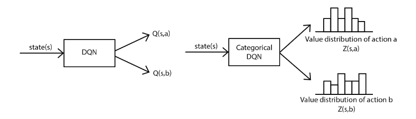
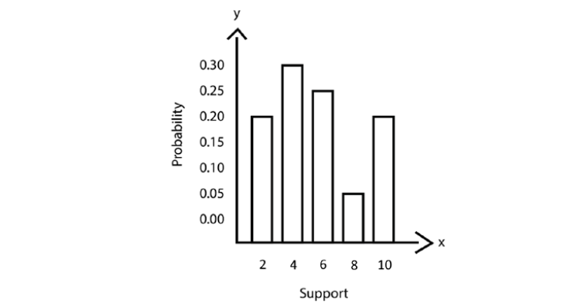
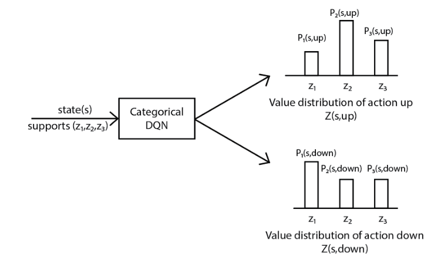
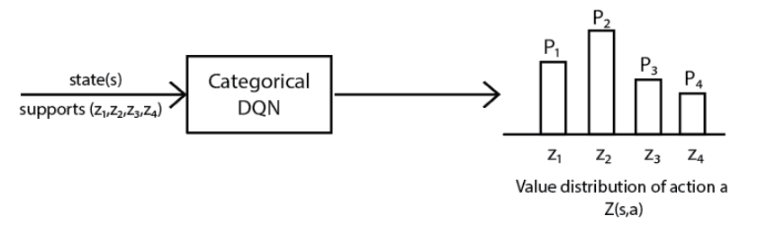
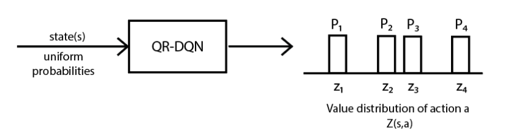

# Distributional Reinforcement Learning

- Why distributional reinforcement learning?
- Categorical DQN
- Quantile regression DQN
- Distributed distributional deep deterministic policy gradient

## Why Distributional Reinforcement Learning?

- **Recall:** the Q value is the *expected* return an agent would obtain starting from state $s$, performing action $a$, and following policy $\pi$ thereafter:

$$
Q^{\pi}(s, a) = \mathbb{E}_{\tau \sim \pi}[R(\tau) \mid s_0 = s, a_0 = a]
$$

  See [RL Foundations](./foundations.md).

- But the Q value is *just* an expectation of the return — a single number summarizing an entire distribution of possible outcomes.
- An expectation, by construction, discards the intrinsic randomness in that outcome — two very different situations can produce the exact same expected value.
- Suppose there are two routes to get home, $A$ and $B$. Route $A$ reliably takes 20 minutes every time. Route $B$ takes 10 minutes most of the time, but occasionally (due to traffic) takes 50 minutes — both average out to roughly the same expected travel time.
- When actions are chosen purely based on the maximum expected return (the maximum Q value), we miss this distinction entirely — routes $A$ and $B$ would look identical to a standard Q-learning agent, even though they have very different risk profiles.
- If we can instead observe the full *distribution* of returns for each action, we capture much more information about which action is genuinely preferable — including how spread out, skewed, or risky the outcomes are.
- So, distributional RL chooses actions based on the *distribution* of returns, rather than collapsing that information down to a single expected Q value.
- This is the basic idea behind distributional reinforcement learning algorithms.

## Categorical DQN (C51)

- An algorithm used to compute the distribution of returns.
- The distribution of returns is also called the **value distribution**, or **return distribution**.
- Let $Z$ be a random variable, and $Z(s,a)$ denote the value distribution for state $s$ and action $a$ (so that $Q(s,a) = \mathbb{E}[Z(s,a)]$).
- In DQN (see [DQN and Its Variants](./deep-q-networks-and-variants.md)), we use a neural network to approximate the Q function.
- In categorical DQN, we instead use a neural network to approximate the *value distribution* $Z(s,a)$ itself — denoted $Z_\theta(s,a)$.
- Given a state as input, the network returns the value distribution of every action available in that state, as output. We then select an action based on these distributions.

### Training the Categorical DQN Network

- In DQN, we train the network by minimizing the loss between the target Q value and the predicted Q value, where the target comes from the Bellman optimality equation. See [DQN and Its Variants](./deep-q-networks-and-variants.md) and [The Bellman Equation](./bellman-equation-and-dynamic-programming.md).
- Similarly, in categorical DQN, we train the network by minimizing the loss between the **target value distribution** and the value distribution **predicted** by the network.
- We obtain the target value distribution using the **distributional Bellman equation**.
- Recall the (ordinary) Bellman equation for the Q function:

$$
Q^{*}(s, a) = \mathbb{E}_{\tau \sim \pi}\left[R(s, a, s') + \gamma \max_{a'}Q^{*}(s', a') \right]
$$

- Similarly, the Bellman equation for the value distribution $Z(s,a)$ is:

$$
Z(s, a) \equiv R(s, a, s') + \gamma Z(s', a')
$$

  This says: the distribution of returns from $(s,a)$ is (in distribution) the same as the immediate reward, plus the discounted distribution of returns from the next state-action pair — the distributional analogue of ordinary bootstrapping.

- So, in categorical DQN, the target value distribution comes directly from this distributional Bellman equation.
- In DQN, the loss function used is **MSE**.
- We *cannot* use MSE in categorical DQN, since the network's output is now a full probability distribution, not a single number. We instead use **cross-entropy loss**.
- The network is trained by minimizing the cross-entropy loss between the target value distribution and the value distribution predicted by the network.

### Predicting the Value Distribution

The following diagram shows a simple value distribution:

- The values on the x-axis are called the **support**, or **atoms**.
- The y-axis values are **probabilities**.
- We denote the support $z$ and the probability $p$.
- The network takes the support of the distribution as input, and returns the probability of each value in the support as output.

#### Computing the Support of the Distribution

- Let $N$ be the number of values in the support, $V_{min}$ the minimum value of the support, and $V_{max}$ the maximum value of the support.
- The step size between adjacent atoms is:

$$
\Delta z = \frac{V_{max} - V_{min}}{N - 1}
$$

- The atom values are then given by:

$$
z_i = V_{min} + i\Delta z, \qquad 0 \leq i < N
$$

#### Computing Probabilities from Support Values

- The network receives the state we're in, and (implicitly) the fixed support values, and outputs a probability for each atom.

- The authors of categorical DQN recommend setting the number of atoms $N = 51$ — hence the algorithm's common name, **C51**.

### Selecting an Action Based on the Value Distribution

- We extract the Q value from the value distribution, and select the action with the maximum Q value.
- The Q value is the expectation of the output distribution:

$$
\mathbb{E}[Z] = \sum_{i} z_i p_i, \qquad \text{where } z_i \text{ is the support and } p_i \text{ is its probability}
$$

- So the Q value derived from the value distribution is:

$$
Q(s, a) = \sum_{i} z_i \, p_i(s, a)
$$

- The optimal action is then:

$$
a^{*} = \operatorname*{arg\,max}_{a} Q(s, a)
$$

**A simple worked example.** Suppose we use only $N=3$ atoms, with support values $z = (-1, 0, 1)$. For action "up" in state $s$, the network predicts probabilities $p_{\text{up}} = (0.2, 0.3, 0.5)$; for action "down", it predicts $p_{\text{down}} = (0.5, 0.4, 0.1)$. Then:

$$
Q(s,\text{up}) = (-1)(0.2) + (0)(0.3) + (1)(0.5) = 0.3
$$

$$
Q(s,\text{down}) = (-1)(0.5) + (0)(0.4) + (1)(0.1) = -0.4
$$

So $a^{*} = \operatorname*{arg\,max}(0.3, -0.4) = \text{up}$. Note that "up" is chosen not just because its expected value is higher, but the two distributions also tell us more: "down" is *more likely* to lose (50% chance of $-1$), while "up" is skewed toward winning (50% chance of $+1$) — information a plain scalar Q-value would have summarized away.

- So, in categorical DQN, we first learn the *distribution*, and only then take the expectation over it to get a Q value for action selection. In ordinary DQN, we select the action based on the Q value *directly* (there's no underlying distribution being learned at all).

### Training the Categorical DQN (continued)

- We compute the target distribution using the distributional Bellman equation:

$$
\mathcal{T}Z(s, a) \equiv R(s, a, s') + \gamma Z(s', a')
$$

  *(Note: here $\mathcal{T}$ denotes the **distributional Bellman operator** — a standard notation from the C51 paper — and should not be confused with a trajectory $\tau$, which is unrelated and denoted differently elsewhere in these notes.)*

- **Significance of each term:**
  - $\mathcal{T}Z(s,a)$ is the *target* distribution we want our network's prediction to match — i.e., what the return distribution "should" look like after one more step of bootstrapping.
  - $R(s,a,s')$ is the immediate reward, shifting the entire distribution.
  - $\gamma Z(s',a')$ is the discounted distribution of returns from the next state-action pair — scaling and shifting the *next* state's learned distribution.
  - Together, $\mathcal{T}$ takes the current estimate of the *next* state's distribution, and transforms it (via a reward shift and a $\gamma$-rescaling) into a target for the *current* state's distribution — exactly analogous to how the ordinary Bellman backup shifts and discounts a scalar Q value, just applied to a whole distribution at once.

- We compute the target value distribution using the target network, parameterized by $\theta'$ (exactly the same target-network idea as in ordinary DQN).
- We train the network by minimizing the cross-entropy loss between this target value distribution and the network's predicted distribution.

**NB:** we can only apply cross-entropy loss between two distributions that share the *same* support values.

- The problem: applying $\mathcal{T}$ to the target distribution's atoms (shifting by $R$ and scaling by $\gamma$) moves those atoms to *new* locations — no longer aligned with our network's fixed support $\{z_i\}$. So the target distribution's support and the predicted distribution's support are different, and cross-entropy can't be applied directly.
- To fix this mismatch, we pass the shifted target distribution through a **projection step**, which redistributes its probability mass back onto the original fixed support $\{z_i\}$.

#### The Projection Step ($\Phi$)

- For each atom $z_j$ of the target distribution (with probability $p_j(s', a^{*})$, where $a^{*}$ is the greedy action in the next state), the distributional Bellman operator moves it to a new location:

$$
\mathcal{T}z_j = \text{clip}\big(r + \gamma z_j,\; V_{min},\; V_{max}\big)
$$

  (clipped to stay within the fixed support's range, since the network can never represent atoms outside $[V_{min}, V_{max}]$).

- This shifted value $\mathcal{T}z_j$ generally falls *between* two of our fixed atoms, $z_l$ and $z_u$ (with $z_l \leq \mathcal{T}z_j \leq z_u$, and $u = l+1$ — its immediate neighbors on the fixed support). We distribute its probability mass $p_j$ between these two neighboring atoms, in proportion to how close $\mathcal{T}z_j$ is to each:

$$
b_j = \frac{\mathcal{T}z_j - V_{min}}{\Delta z} \qquad \text{(the atom's position, in continuous "index" units)}
$$

  with $l = \lfloor b_j \rfloor$ and $u = \lceil b_j \rceil$. The mass is then split as:

$$
\Delta p_l \mathrel{+}= p_j\,(u - b_j), \qquad \Delta p_u \mathrel{+}= p_j\,(b_j - l)
$$

  (the closer $\mathcal{T}z_j$ is to $z_u$, the more mass goes to $z_u$, and vice versa — this is simple linear interpolation of probability mass between neighboring atoms.)

- Repeating this for every atom $j$ of the target distribution and summing up the contributions gives the fully **projected target distribution** $\Phi \mathcal{T}Z(s,a)$, defined on the same fixed support $\{z_i\}$ as the network's prediction — which we can now compare via cross-entropy.

**A simple worked example.** Suppose our fixed support is $z = (0, 1, 2)$ (so $V_{min}=0$, $V_{max}=2$, $\Delta z = 1$), and the next state's predicted distribution puts all its probability on a single atom: $z_j = 2$ with $p_j = 1$. Say $r = 1$ and $\gamma = 0.5$. Then:

$$
\mathcal{T}z_j = \text{clip}(1 + 0.5 \times 2,\, 0,\, 2) = \text{clip}(2, 0, 2) = 2
$$

This happens to land exactly on an existing atom ($z=2$), so $b_j = (2-0)/1 = 2$, giving $l = u = 2$ — all the probability mass simply stays on atom $z=2$: $\Delta p_2 = 1$.

Now suppose instead $r = 0.5$ (everything else the same): $\mathcal{T}z_j = \text{clip}(0.5 + 1, 0, 2) = 1.5$. This falls *between* atoms $z_1=1$ and $z_2=2$, so $b_j = 1.5$, $l=1$, $u=2$. The mass is split: $\Delta p_1 \mathrel{+}= 1 \times (2 - 1.5) = 0.5$, and $\Delta p_2 \mathrel{+}= 1 \times (1.5 - 1) = 0.5$ — the projected target distribution now places $50\%$ probability on atom $z=1$ and $50\%$ on atom $z=2$, correctly representing that the "true" shifted value of $1.5$ lies halfway between them.

### The Categorical DQN (C51) Algorithm

1. Fix the support $\{z_0, \dots, z_{N-1}\}$ using $V_{min}$, $V_{max}$, and $N$ (typically $N=51$).
2. Initialize the main network $Z_\theta$ and target network $Z_{\theta'}$ (with $\theta' \leftarrow \theta$) with random weights, and an empty replay buffer $\mathcal{D}$.
3. For each episode:
   1. Initialize the starting state $s$.
   2. For each step in the episode:
      1. Compute $Q_\theta(s, a) = \sum_i z_i \, p_i^\theta(s,a)$ for every action, and select an action $a$ via the epsilon-greedy policy.
      2. Perform action $a$; observe reward $r$ and next state $s'$.
      3. Store the transition $(s, a, r, s')$ in $\mathcal{D}$.
      4. Sample a random minibatch of transitions from $\mathcal{D}$.
      5. For each sampled transition, using the *target* network:
         - Compute $Q_{\theta'}(s', a')$ for every next action, and select the greedy next action $a^{*} = \operatorname*{arg\,max}_{a'} Q_{\theta'}(s',a')$.
         - Apply the distributional Bellman operator to the target distribution $Z_{\theta'}(s', a^{*})$: shift each atom by $r$, scale by $\gamma$, and clip to $[V_{min}, V_{max}]$.
         - Apply the **projection step** $\Phi$ to redistribute this shifted distribution's mass back onto the fixed support $\{z_i\}$, giving the projected target distribution $\Phi\mathcal{T}Z(s,a)$.
      6. Update $\theta$ by minimizing the cross-entropy loss between the projected target distribution and the network's predicted distribution $Z_\theta(s,a)$, via gradient descent.
      7. Every $C$ steps, update the target network: $\theta' \leftarrow \theta$.
      8. Set $s \leftarrow s'$.
   3. Repeat until $s$ is terminal.
4. Repeat for many episodes until the network converges.

## Quantile Regression DQN (QR-DQN)

### Math Essentials

#### Quantile

- When we divide a probability distribution into regions of *equal* probability, the boundaries of those regions are called **quantiles**. (E.g. the median splits a distribution into two equal-probability halves; more generally, $N$ quantiles split it into $N$ equal-probability slices.)

#### Inverse CDF (Quantile Function)

- For a random variable $X$ with probability distribution $P(X)$, the **cumulative distribution function (CDF)** is:

$$
F(x) = P(X \leq x)
$$

- The CDF is computed by summing up all the probability mass at values less than or equal to $x$.
- Given a support value $x$, the CDF gives us the corresponding cumulative probability $\tau$.
- The **inverse CDF** (also called the **quantile function**) does the reverse: it gives us the support value $x$ corresponding to a given cumulative probability $\tau$:

$$
x = F^{-1}(\tau)
$$

### Understanding QR-DQN

- In categorical DQN, the support values $(z_1, \dots, z_N)$ are fixed and equally spaced; we feed them in and the network outputs *non-uniform* probabilities $(p_1, \dots, p_N)$ for them.

- QR-DQN can be viewed as the *opposite* of C51.
- We instead fix *uniform* probabilities $(p_1, \dots, p_N)$, and the network outputs the corresponding support values at variable (unequally spaced) locations $(z_1, \dots, z_N)$.

- In QR-DQN, these unequally spaced support values are what's used to estimate the value distribution.
- In other words, QR-DQN estimates the value distribution by estimating its **quantile function** directly.
- The quantile function is:

$$
z = F^{-1}(\tau)
$$

- **Significance of each term:** $F^{-1}$ is the quantile function (inverse CDF) of the return distribution; $\tau \in [0,1]$ is a chosen cumulative probability level (e.g. $\tau = 0.5$ asks "what return value is the median?"); and $z$ is the resulting support value — the return magnitude at which the CDF reaches $\tau$. So this equation says: "given that we want to know the return value at the $\tau$-th quantile, $z$ is what the network should output."
- We can obtain the support $z$ given $\tau$ directly from the network.
- Let $N$ be the number of quantiles. The probability *mass* assigned to each quantile is fixed and uniform:

$$
p_i = \frac{1}{N} \quad \text{for } i = 1, 2, \dots, N
$$

- Once we've decided on $N$, the cumulative probabilities $\tau$ (the quantile levels we ask the network about) are:

$$
\tau_i = \frac{i}{N} \quad \text{for } i = 1, 2, \dots, N
$$

- We feed these fixed, equally spaced cumulative probabilities (quantile levels) $\tau$ into the QR-DQN network, and it returns the corresponding support values.

**A simple worked example.** Suppose we're in state $s$ with two possible actions, "up" and "down," and we use $N=4$ quantiles, so $\tau = (0.25, 0.5, 0.75, 1.0)$. Feeding state $s$ and these $\tau$ values into the network for each action might return:

- Action "up": support values $z_{\text{up}} = (-2, 1, 3, 6)$ — a return distribution skewed toward larger positive outcomes.
- Action "down": support values $z_{\text{down}} = (0, 0.5, 1, 1.5)$ — a tighter, more consistent (lower-variance) distribution.

Each of the 4 support values for a given action carries equal probability mass $\frac{1}{4}$ — the network isn't predicting probabilities here at all, only *where* on the return axis each equal-probability slice of the distribution falls.

- The target value distribution can likewise be computed using this quantile function, applied to the (bootstrapped) next state — see the **Loss Function** section below for how this becomes a trainable target.

#### Advantages of QR-DQN over C51

- No need to choose (or tune) $V_{min}$ and $V_{max}$ ahead of time.
- We get rid of the projection step required in C51 entirely (since QR-DQN never needs to reconcile mismatched supports — the fixed quantities here are the probabilities, not the support locations).
- No limitations on the bounds of the support — the range of possible returns can vary freely across different states, rather than being clipped to a single fixed $[V_{min}, V_{max}]$ range for the whole environment.

### QR-DQN and the p-Wasserstein Distance

- QR-DQN minimizes the **p-Wasserstein distance** between the predicted and target distributions, rather than the cross-entropy loss used in C51.
- This tends to give better convergence behavior than minimizing cross-entropy.
- The p-Wasserstein distance is:

$$
W_p(U, V) = \left( \int_{0}^{1} \left| F_V^{-1}(\omega) - F_U^{-1}(\omega) \right|^{p} d\omega \right)^{\frac{1}{p}}
$$

- **Significance of each term:**
  - $U$ and $V$ are the two distributions being compared (e.g. the predicted and target return distributions).
  - $F_U^{-1}$ and $F_V^{-1}$ are their respective quantile functions (inverse CDFs).
  - $\omega \in [0,1]$ is integrated over every quantile level from $0$ to $1$ — so the distance considers *every* corresponding pair of quantiles between the two distributions, not just a single summary statistic.
  - $p$ controls the order of the norm: $p=1$ gives the total (unsigned) area between the two quantile functions; $p=2$ gives something like a Euclidean distance between them, penalizing large gaps more heavily.
  - Intuitively, $W_p$ measures how much "work" is required to reshape one distribution into the other, by comparing them quantile-by-quantile — this is the standard optimal-transport interpretation of the Wasserstein distance.

- The authors suggest using the **quantile midpoint** $\tilde{\tau}$, given by:

$$
\tilde{\tau}_{i} = \frac{\tau_{i-1} + \tau_{i}}{2}
$$

- The support is then given by:

$$
z = F^{-1}(\tilde{\tau})
$$

- **Why use the midpoint?** Each quantile $i$ is meant to represent an entire *interval* of cumulative probability, $[\tau_{i-1}, \tau_i]$, using just a single support value $z_i$ (this is the whole point of discretizing a continuous distribution into $N$ representative quantiles). It turns out that the specific value of $\tau$ within that interval which *minimizes* the 1-Wasserstein distance between the true distribution and this single-point approximation is exactly the **midpoint** of the interval, $\tilde\tau_i$ — not the interval's right edge $\tau_i$ (which is what you'd naively use, and what the earlier formulas used for convenience of indexing). Using the midpoint therefore gives the *statistically optimal* single-point representative for each quantile bin, minimizing the approximation error introduced by discretizing the distribution into only $N$ quantiles.

**A simple worked example.** Suppose $N=2$ quantiles, so $\tau = (0.5, 1.0)$. The midpoints are $\tilde\tau_1 = \frac{0 + 0.5}{2} = 0.25$ and $\tilde\tau_2 = \frac{0.5 + 1.0}{2} = 0.75$. Instead of asking the (approximating) quantile function for the values at $\tau = 0.5$ and $\tau=1.0$ (the interval edges), we instead ask for the values at $\tau = 0.25$ and $\tau = 0.75$ (the interval midpoints) — these are the values that best represent the "typical" outcome within each half of the distribution, minimizing the Wasserstein distance between the true continuous distribution and our 2-point discrete approximation of it.

### Action Selection

- Exactly as in categorical DQN: compute the Q value as the expectation of the predicted distribution, then select the action with the highest Q value. Since QR-DQN's quantiles are equally weighted (each carries probability $\frac{1}{N}$), this simplifies to a plain average of the predicted support values:

$$
Q(s,a) = \frac{1}{N}\sum_{i=1}^{N} z_i(s,a), \qquad a^{*} = \operatorname*{arg\,max}_{a} Q(s,a)
$$

### Loss Function

- We compute the target support value using the distributional Bellman equation:

$$
\mathcal{T}z_j \equiv r + \gamma \, z_j(s', a')
$$

- To compute $z_j$ for the next state $s'$, we also need to select a next action $a'$.
- We select this action exactly as in DQN: compute the return distribution (via the target network) for every next state-action pair, take its expected value (the Q value) for each action, and choose the greedy action $a^{*}$ with the maximum Q value:

$$
\mathcal{T}z_j \equiv r + \gamma \, z_j(s', a^{*})
$$

- Since QR-DQN's supports are unequally spaced (unlike C51's fixed atoms), there's no support-mismatch problem to project away — but there *is* a different problem: we don't know which of our $N$ predicted quantiles should be matched up against which of the $N$ target quantiles. QR-DQN solves this by comparing **every** predicted quantile against **every** target quantile, using the **quantile regression loss** (also known as the **pinball loss**).

#### The Quantile Regression (Pinball) Loss

- For a given quantile level $\tau$, and an error $u = (\text{target}) - (\text{prediction})$, the quantile regression loss is:

$$
\rho_\tau(u) = u \, \big(\tau - \mathbb{1}\{u < 0\}\big)
$$

- **What this does:** it adds an *asymmetric* penalty for over- and under-estimation, depending on $\tau$.
  - If the prediction underestimates the target ($u > 0$): the loss is $\tau \cdot u$.
  - If the prediction overestimates the target ($u < 0$): the loss is $(\tau - 1)\cdot u = (1-\tau)\cdot|u|$.
  - For a *high* $\tau$ (e.g. $\tau = 0.9$), underestimation is penalized much more heavily ($0.9 \times$) than overestimation ($0.1\times$) — pushing the prediction *upward*, which is exactly the behavior we want from a quantile estimating the *upper* part of the distribution.
  - For a *low* $\tau$ (e.g. $\tau = 0.1$), the reverse holds — overestimation is penalized much more heavily, pushing the prediction *downward*, appropriate for a *lower* quantile.
  - This asymmetric pressure is precisely what makes each of the $N$ output quantiles converge to represent a different, distinct part of the return distribution, rather than all collapsing toward the mean.
- **Behavior at $u=0$ and its effect on the gradient:** the pinball loss has a "kink" at $u=0$ — its gradient jumps abruptly from $-(1-\tau)$ (just below zero) to $\tau$ (just above zero), rather than smoothly approaching zero. This means that even when the prediction is *very close* to the target, the gradient's magnitude doesn't shrink — it stays at a constant size determined only by $\tau$, regardless of how small the actual error is. This can cause the optimization to oscillate around the true value rather than settling smoothly into it, especially as training approaches convergence.

#### The Quantile Huber Loss

- **Why move to the quantile Huber loss:** because the plain pinball loss's constant-magnitude gradient near $u=0$ causes unstable, oscillating updates once predictions are already close to their targets — we'd like a loss that behaves like the pinball loss for large errors (preserving the useful asymmetric quantile-driving behavior), but smooths out near $u=0$ so that small errors produce small, gently-shrinking gradients instead.
- We achieve this by combining the pinball loss with the (ordinary) **Huber loss**:

$$
\mathcal{L}_\kappa(u) =
\begin{cases}
\frac{1}{2}u^2 & \text{if } |u| \leq \kappa \\[4pt]
\kappa\left(|u| - \frac{1}{2}\kappa\right) & \text{if } |u| > \kappa
\end{cases}
$$

- The **quantile Huber loss** is then:

$$
\rho_\tau^{\kappa}(u) = \big|\tau - \mathbb{1}\{u<0\}\big| \, \mathcal{L}_\kappa(u)
$$

- **Behavior, by case:**
  - **When $|u| \leq \kappa$** (small errors, near the target): $\mathcal{L}_\kappa(u) = \frac{1}{2}u^2$, so the loss is *quadratic* in $u$ — its gradient is proportional to $u$ itself, meaning the gradient **shrinks smoothly to zero** as $u \to 0$. This is exactly the smoothness the plain pinball loss lacked, eliminating the oscillation problem near convergence.
  - **When $|u| > \kappa$** (large errors, far from the target): $\mathcal{L}_\kappa(u)$ becomes *linear* in $|u|$, matching the scaling behavior of the original pinball loss (up to the asymmetric weight $|\tau - \mathbb{1}\{u<0\}|$) — so for large errors, the loss still applies the strong, asymmetric, quantile-appropriate pressure described above, pushing high-$\tau$ quantiles up and low-$\tau$ quantiles down.
  - In short: quadratic (smooth) near zero, linear (asymmetric, pinball-like) far away — giving the best of both.

- Putting it together, the full QR-DQN loss compares **every** predicted quantile $i$ against **every** target quantile $j$ (an $N \times N$ set of pairwise errors), using the quantile *midpoints* $\tilde\tau_i$ from above as the asymmetry weight for each predicted quantile:

$$
\mathcal{L}(\theta) = \frac{1}{N} \sum_{i=1}^{N} \sum_{j=1}^{N} \rho_{\tilde\tau_i}^{\kappa}\big(u_{ij}\big), \qquad u_{ij} = \mathcal{T}z_j - z_{\theta,i}(s,a)
$$

  where $\mathcal{T}z_j$ is the $j$-th target quantile (from the distributional Bellman equation above) and $z_{\theta,i}(s,a)$ is the network's $i$-th predicted quantile.

### The QR-DQN Algorithm

1. Fix the number of quantiles $N$ and their levels $\tau_i = i/N$ (and midpoints $\tilde\tau_i$), and the Huber threshold $\kappa$.
2. Initialize the main network $Z_\theta$, target network $Z_{\theta'}$ (with $\theta' \leftarrow \theta$), and an empty replay buffer $\mathcal{D}$.
3. For each episode:
   1. Initialize the starting state $s$.
   2. For each step in the episode:
      1. Compute $Q_\theta(s,a) = \frac{1}{N}\sum_i z_{\theta,i}(s,a)$ for every action, and select an action $a$ via the epsilon-greedy policy.
      2. Perform action $a$; observe reward $r$ and next state $s'$.
      3. Store the transition $(s,a,r,s')$ in $\mathcal{D}$.
      4. Sample a random minibatch of transitions from $\mathcal{D}$.
      5. For each sampled transition, using the target network: compute $Q_{\theta'}(s',a')$ for every next action, select $a^{*} = \operatorname*{arg\,max}_{a'} Q_{\theta'}(s',a')$, and compute the target quantiles $\mathcal{T}z_j = r + \gamma\, z_{\theta',j}(s', a^{*})$ for $j=1,\dots,N$.
      6. Compute the pairwise quantile Huber loss $\mathcal{L}(\theta)$ between all $N$ predicted quantiles and all $N$ target quantiles, as above.
      7. Update $\theta$ via gradient descent: $\theta \leftarrow \theta - \alpha \nabla_\theta \mathcal{L}(\theta)$.
      8. Every $C$ steps, update the target network: $\theta' \leftarrow \theta$.
      9. Set $s \leftarrow s'$.
   3. Repeat until $s$ is terminal.
4. Repeat for many episodes until the network converges.

## Distributed Distributional DDPG (D4PG)

- Works just like DDPG (see [DDPG, TD3, and SAC](./learning-ddpg-td3-and-sac.md)), but in the critic network, instead of predicting a scalar Q value (as in ordinary DQN), we predict a full return **distribution** — exactly as in categorical DQN / C51.
- The name "D4PG" actually packs in *two* separate changes, both worth calling out explicitly:
  - **Distributional** — the critic outputs a value *distribution* $Z_w(s,a)$ instead of a scalar $Q_w(s,a)$.
  - **Distributed** — data collection is parallelized across many independent actor processes running simultaneously, all feeding a shared replay buffer, rather than a single agent collecting experience serially (similar in spirit to A3C's parallel workers).

### Changes to the Critic Network

- The critic, parameterized by $w$, now outputs a categorical value distribution $Z_w(s,a)$ over a fixed support — exactly as in C51 — rather than a single Q value.
- D4PG also uses **$n$-step returns** for the distributional Bellman target (rather than the plain 1-step target used in ordinary DDPG/C51), which speeds up learning by propagating reward information further back in fewer updates:

$$
(\mathcal{T}Z)(s,a) := \sum_{k=0}^{n-1} \gamma^{k} r_{t+k} + \gamma^{n} Z_{w'}\!\left(s_{t+n},\, \mu_{\phi'}(s_{t+n})\right)
$$

  where $\mu_{\phi'}$ is the **target actor** network (exactly as in DDPG) — used here to select the action fed into the target critic, since D4PG's action space is continuous (so there's no $\max_{a'}$ or $\operatorname*{arg\,max}_{a'}$ to compute, just like in ordinary DDPG).

- As in C51, since this shifted-and-scaled target distribution generally lands on support values that don't match the critic's fixed atoms, we apply the same **categorical projection step** $\Phi$ described earlier, before comparing it to the predicted distribution.
- The critic is trained by minimizing the **cross-entropy loss** between the projected target distribution $\Phi(\mathcal{T}Z)(s,a)$ and the predicted distribution $Z_w(s,a)$ — exactly the same loss used in C51, just now conditioned on continuous actions produced by the actor network:

$$
\mathcal{L}(w) = \mathbb{E}_{(s,a) \sim \mathcal{D}} \Big[ \, \text{CrossEntropy}\big(\Phi(\mathcal{T}Z)(s,a),\; Z_w(s,a)\big) \Big]
$$

### Changes to the Actor Network

- The actor, parameterized by $\phi$, is trained exactly as in DDPG — via the deterministic policy gradient — except the Q value it's trying to maximize is no longer a plain scalar critic output, but the **mean of the distributional critic's output**:

$$
Q_w(s,a) := \mathbb{E}\big[Z_w(s,a)\big] = \sum_i z_i \, p_i^{w}(s,a)
$$

- The actor's objective is then, exactly as in DDPG:

$$
J(\phi) = \mathbb{E}_{s \sim \mathcal{D}}\Big[ Q_w\big(s, \mu_\phi(s)\big) \Big]
$$

- And the deterministic policy gradient update is likewise unchanged in form from DDPG — we've simply substituted the distributional critic's derived mean $Q_w$ in place of DDPG's scalar critic:

$$
\nabla_{\phi} J(\phi) \approx \mathbb{E}_{s \sim \mathcal{D}} \Big[ \nabla_{a} Q_w(s,a) \big|_{a = \mu_\phi(s)} \; \nabla_{\phi}\mu_\phi(s) \Big]
$$

  Since the actor only ever needs $Q_w$ (a scalar, differentiable function of $a$), and not the full distribution $Z_w$ itself, essentially none of DDPG's actor-side machinery needs to change — the distributional aspect of D4PG is entirely a *critic*-side modification.

### The D4PG Algorithm

1. Fix the critic's support $\{z_0, \dots, z_{N-1}\}$ (as in C51), the $n$-step return length, and the number of parallel actor processes $M$.
2. Initialize the main critic $Z_w$ and main actor $\mu_\phi$ with random weights.
3. Initialize the target networks: $w' \leftarrow w$, $\phi' \leftarrow \phi$.
4. Initialize a shared replay buffer $\mathcal{D}$, accessible to all actor processes.
5. Launch $M$ parallel actor processes; each independently:
   1. Runs the current policy $\mu_\phi$ (with exploration noise) in its own copy of the environment.
   2. Collects $n$-step transitions $(s_t, a_t, r_t, \dots, r_{t+n-1}, s_{t+n})$ and pushes them into the shared replay buffer $\mathcal{D}$.
   3. Periodically syncs its local copy of $\phi$ with the latest learner parameters.
6. Meanwhile, a central learner repeatedly:
   1. Samples a random minibatch of $n$-step transitions from $\mathcal{D}$ (optionally using prioritized experience replay).
   2. Computes the $n$-step distributional Bellman target $(\mathcal{T}Z)(s,a)$ using the target critic $Z_{w'}$ and target actor $\mu_{\phi'}$, as above.
   3. Applies the categorical projection step $\Phi$ to align the target distribution with the critic's fixed support.
   4. Updates the critic parameters $w$ by minimizing the cross-entropy loss $\mathcal{L}(w)$ via gradient descent.
   5. Computes $Q_w(s, \mu_\phi(s)) = \mathbb{E}[Z_w(s,\mu_\phi(s))]$, and updates the actor parameters $\phi$ via the deterministic policy gradient, exactly as in DDPG.
   6. Softly updates both target networks: $w' \leftarrow \tau w + (1-\tau)w'$, $\phi' \leftarrow \tau \phi + (1-\tau)\phi'$.
7. The learner and all actor processes continue running concurrently until the policy converges.