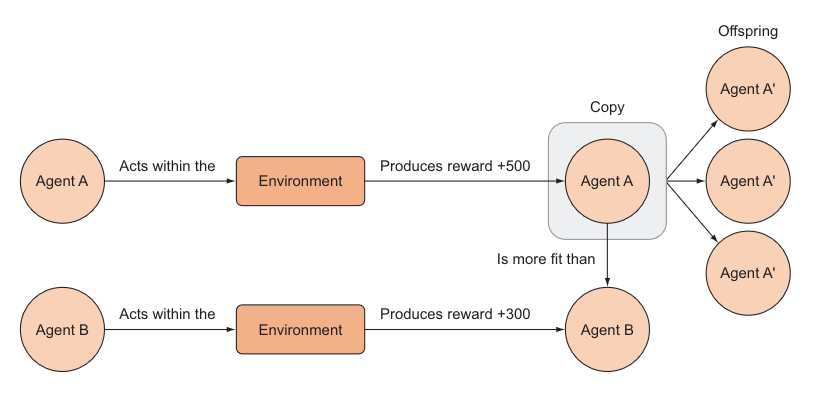
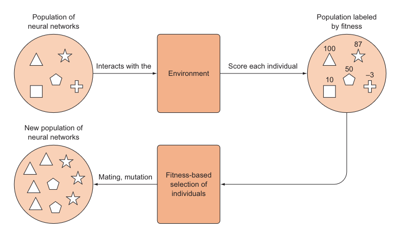

# Evolutionary Algorithms

## Evolution in Theory
- Natural selection favors the **"most fit"** individuals — those with the greatest reproductive success, who pass their genetic information on to the next generation.
- "Most fit" is always relative to an environment: a polar bear is well adapted to the polar ice caps but would be very unfit in the Amazon rainforest.
- In biology, each mutation subtly alters an organism's characteristics, making it hard to distinguish one generation from the next. Accumulated over many generations, however, these small changes become perceptible.
- Evolutionary reinforcement learning applies the same idea to model parameters: a genetic algorithm optimizes the "traits" (parameters) that maximize reward in a given environment. Here, **"more fit"** simply means generating more reward.
- The diagram below illustrates this approach: agents compete in an environment, and the fitter agents are preferentially copied to produce offspring for the next generation.

## Training a Neural Network Using a Genetic Algorithm
1. **Initialize** — generate an initial population of random parameter vectors, each called an "individual."
2. **Evaluate** — run each individual in the environment and observe the reward it generates (its fitness).
3. **Select** — sample pairs of individuals from the population, weighted by relative fitness.
4. **Breed** — mate selected pairs to produce offspring, forming a new, full-sized population. Mating combines a subset of one parent's parameter vector with a complementary subset from the other, producing a new vector of the same dimension.
5. **Mutate** — to avoid premature convergence on a local optimum, add random noise to some individuals. The mutation rate should be kept fairly low.
6. **Repeat** until convergence.

> **Note:** There's a trade-off between selecting only the best performers and preserving population diversity — similar to the exploration-versus-exploitation trade-off in reinforcement learning.

## Pros and Cons of Evolutionary Algorithms

**Pros**
- Gradient-free, so they tend to explore the parameter space more broadly than gradient-based counterparts.
- Simple to implement — no backpropagation or value-function approximation needed.
- Scale extremely well: individuals can be evaluated in parallel across many workers, giving large wall-clock speedups (e.g., OpenAI solved 3D humanoid walking in 10 minutes using 1,440 CPU cores).
- Robust to sparse or delayed rewards, and invariant to action frequency/temporal resolution (e.g., frame-skip) — both common pain points for gradient-based RL.
- Tolerant of long time horizons and don't require temporal discounting.

**Cons**
- Sample-intensive / data-inefficient: they typically need substantially more environment interactions than gradient-based methods to reach comparable performance (roughly 3–10x more in OpenAI's Atari experiments).
- Rely only on total episode reward rather than a per-step gradient signal, so they can be less precise per sample than backprop-based methods.

*Reference: Salimans et al., "Evolution Strategies as a Scalable Alternative to Reinforcement Learning" (OpenAI, 2017).*