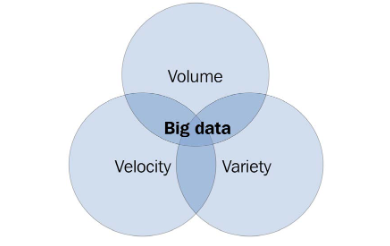
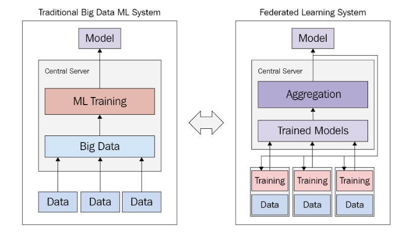

# Federated Learning — Conceptual Foundations

- Challenges in Big Data and Traditional AI
- What is Federated Learning?
- Workings of the Federated Learning System

## Challenges in Big Data and Traditional AI

### Understanding the Nature of Big Data
- Big data represents vast, fast-moving, and varied sets of information, commonly described by three "Vs":
  - **Volume** — the sheer amount of data generated from sources like IoT devices, business transactions, and social media.
  - **Velocity** — the speed at which data is produced and needs to be processed, often in real time or near real time.
  - **Variety** — the range of formats data comes in (numeric, text, images, video).

- **Data lakes** emerged as a way to manage data at this scale, but they encourage a "store now, sort out later" mentality. Raw data is only as valuable as the models and insights derived from it, and a centralized data lake can actually get in the way of that derivation.
- Federated learning flips this paradigm: instead of *collect → derive intelligence*, it works *derive intelligence → collect*, training models directly at the source of the data rather than centralizing the data first.

### The Triple-A Mindset for Big Data
It's not about how big the data sitting on a server is — it's about three qualities the data has relative to the population you care about.

#### Abundance of Observations
- Big data doesn't need to be "big" in rows and columns; what matters is that the number of observations ($n$) approaches the size of the entire population of interest (e.g., everyone interested in fitness in New York).
- Traditionally, researchers sampled from a population to compute statistics with a confidence level expressed as a p-value, but truly random sampling is often hard to achieve (e.g., surveying only gym-goers misses people who run in parks).
- Big data can instead access data from nearly the whole population of interest, reducing the need for sampling.

#### Acceptance of Messiness
- Big data tends to be messy, and traditional research avoids messy data because it can significantly distort inference.
- In big data studies, researchers are more willing to tolerate this messiness, since its effect diminishes as the number of observations approaches the size of the population itself.

#### Ambivalence of Causality
- Big data is typically better suited to studying correlation than causation — it tells you *what* is happening more than *why*.
- For many practical questions, correlation alone is a sufficient answer.

### Data Privacy as a Bottleneck
- FL is one of the most popular privacy-preserving AI technologies because private data never has to be collected or shared with third parties.
- **Data privacy** (information privacy) is about an individual's right to control how their personal information is used. This is distinct from **data security**, which is about reliably restricting data access to authorized users only.
  - Example: for a Google account, data privacy governs what the company is allowed to do with your information, while data security is about measures like password protection and 2-step verification that keep that information safe.
- Data security is a prerequisite for data privacy, and together they make up **data protection**. Failing at data protection is costly, and as technology advances, protecting customer data has become increasingly critical.

### Impacts of Training Data and Model Bias
- The messiness of big data is only acceptable if a model can learn from enough data, across a variety of sources and distributions, without introducing bias into its outcomes.
- Training on big data in one centralized location is computationally expensive.
- Because FL trains in a distributed, collaborative way, it plays a critical role in reducing model bias.

### FL as the Main Solution for Data Problems
- Traditional big data systems gather data into large central stores; the resulting models generalize well because of the sheer volume of data, but continuous data collection consumes large amounts of bandwidth and compute.
- In an FL system, model training happens directly at the location of the data. The resulting local models are then collected and aggregated into a single aggregated model.
- FL approaches often carry more setup overhead due to their distributed nature, but only model weights — not raw data — are transmitted between nodes, which keeps communication efficient overall.

## What is Federated Learning?

### Understanding the Current State of ML
- The earliest approach to building models is **rule-based** (white-box) modeling, which only works when detailed prior knowledge of the system is available. It becomes limiting for multi-dimensional problems, where many features interact.
- **Black-box modeling** (i.e., machine learning) emerged as an alternative that learns patterns directly from data instead of relying on hand-crafted rules.

### Distributed Learning Nature — Toward Scalable AI
- **Distributed computing** spreads the work of a computational task across many computational agents, each able to act near-autonomously. It offers three main benefits:
  - **Scalability** — capacity can be increased by adding more nodes to the system rather than replacing existing hardware, so the system can grow to meet demand.
  - **Throughput** — by splitting work across many nodes and running it in parallel, the system can process more tasks per unit of time than a single machine could.
  - **Resilience** — with work and data replicated across multiple nodes, the system has no single point of failure and can keep running even if individual nodes fail.
- Current ML workloads are increasingly adopting distributed computing to stay cutting-edge while still producing results in usable time.
- The move from big data to collective intelligence is grounded in **edge computing** — processing data at or near the location where it's generated. Extending this idea to ML gives us **edge AI**, where models are integrated directly into edge devices.

### Understanding FL
- FL is a method of synthesizing a **global model** from a set of **local models** trained on the edge.
- The model to be trained is distributed to the edge and trained there, using data collected at that edge location. The global model is then created by aggregating this set of local models.
- At a high level, the FL process runs in a repeating cycle:
  1. A central server initializes (or already holds) a global model and distributes it to the participating devices/agents.
  2. Each agent trains the model locally, using only its own on-device data — no raw data leaves the device.
  3. Agents send their updated local model parameters (not their data) back to the server.
  4. The server aggregates the received local models (e.g., via a weighted average) into a new, improved global model.
  5. The updated global model is redistributed to agents, and the cycle repeats until the model converges.
- FL is closely related to **transfer learning (TL)**: both start from an existing model and adapt it further, though TL typically adapts a single model to a new task or domain, while FL combines knowledge learned independently across many decentralized data sources.

#### Horizontal and Vertical FL
- **Horizontal FL** (homogeneous/sample-based FL): local datasets share the same features but contain different samples.
- **Vertical FL** (heterogeneous/feature-based FL): local datasets contain different features for the same samples.

## Workings of the Federated Learning System

### FL System Architecture

#### Cluster Aggregator (Aggregator)
- Collects and aggregates the ML models trained at multiple distributed agents, then creates a global model that is sent back to those agents.
- Made up of three parts:
  - **FL server module** — the aggregator's communication layer with agents and the database; handles agent registration and tracking.
  - **FL state manager** — tracks state information for the aggregator itself and for each connected agent.
  - **Model aggregation module** — a collection of aggregation algorithms (e.g., FedAvg) used to combine local models into a global one.

#### Distributed Agent (Agent)
- The FL client — an edge device, mobile application, or similar — where local ML models are actually trained before being sent to the aggregator. It typically consists of:
  - A **local dataset/data store**, holding the on-device data used for training (never shared externally).
  - A **local training module**, which runs the training loop on that data to produce an updated local model.
  - A **communication module**, which registers the agent with the aggregator and handles sending/receiving model updates.

#### Database Server (Database)
- Stores data related to the aggregators, agents, and both global and local ML models. Agents don't need to connect to the database directly — only the aggregator does. It typically consists of:
  - **Model storage**, holding versions of the global and local models.
  - **Metadata storage**, tracking records about registered agents, aggregators, and training rounds.
  - A **database interface/communication layer**, through which the aggregator reads and writes this data.

### Understanding the FL System Flow — From Initialization to Continuous Operation

#### Initialization
- Components are brought up in a fixed order: **database → aggregator → agents**.
  1. The database server starts first, so it's ready to store models and state as soon as it's needed.
  2. The aggregator starts next: it connects to the database and either loads an existing global model or prepares to receive one.
  3. Agents start last: each one registers itself with the aggregator (and, indirectly, with the database) so it can start participating in training rounds.

#### Initial Model Upload Process by Initial Agent
- When an FL system starts for the first time, there is no global model yet, so a designated **initial agent** uploads a reference base model (an initial, possibly untrained, model architecture) to the aggregator, which stores it in the database as the starting global model.
- **Example:** Suppose a single agent starts the system with a base convolutional neural network for image classification. It uploads this untrained model to the aggregator, which stores it as the first global model. As more agents subsequently join and train on their own local data, their updates are aggregated into this base model, gradually improving it over successive rounds.

### Synchronous and Asynchronous FL
- In **synchronous FL**, the aggregator selects a specific set of agents that must send their local models before aggregation can proceed. This is prone to long waiting times as the number of agents grows, since the aggregator waits on the slowest participant.
- In **asynchronous FL**, there is no upfront agent selection — any trusted agent can send its local model at any time, and the aggregator incorporates updates as they arrive.

### The Aggregator-Side FL Cycle and Process
1. **Accepting and caching local models** — as agents finish local training, the aggregator receives their model updates and temporarily caches them, tagged with which agent and training round they came from.
2. **Buffering** — the aggregator holds these cached models in a buffer until an aggregation criterion is met (e.g., a minimum number/fraction of agents have reported in, or a time window has elapsed), rather than acting on every single update immediately.
3. **Aggregation** — once the criterion is met, the aggregator runs its configured aggregation algorithm (e.g., FedAvg) over the buffered local models to synthesize a new global model.
4. **Sending global models** — the new global model is pushed back out to the participating agents (and stored in the database), the buffer is cleared, and the FL round counter is incremented before the cycle repeats.

### The Agent-Side Local Retraining Cycle and Process
Each agent moves through a small state machine on every round:
- **`waiting_gm`** — the agent is idle, waiting to receive the current global model from the aggregator.
- **`gm_ready`** — the global model has been received and the agent is ready to begin local training with it.
- **`training`** — the agent is actively retraining the model on its own local data.
- Once training finishes, the agent sends its updated local model back to the aggregator and returns to the `waiting_gm` state to await the next global model.

### Basics of Model Aggregation

#### FedAvg (Federated Averaging)
FedAvg combines a set of local models by taking a weighted average of their parameters, where each local model's weight is proportional to how much data it was trained on:

$$
    M_{avg} = \sum_{i=1}^{k} \frac{n_i}{N} M_i
$$

- $M_{avg}$ — the resulting aggregated (global) model.
- $k$ — the number of local models being aggregated in this round.
- $M_i$ — the local model (parameter vector) from agent $i$.
- $n_i$ — the number of local training samples held by agent $i$.
- $N$ — the total number of samples across all $k$ participating agents ($N = \sum_i n_i$).

Weighting by $n_i/N$ gives agents with more local data proportionally more influence over the resulting global model.

**Other aggregation techniques:**
- **FedAvgM** — FedAvg with server-side momentum added to the update, which helps on heterogeneous (non-IID) data.
- **FedProx** — adds a proximal term to each agent's local objective to limit how far its local model can drift from the current global model, improving stability under heterogeneous data.
- **SCAFFOLD** — uses control variates to correct for "client drift," accelerating convergence under heterogeneity.
- **Adaptive server optimizers (FedAdagrad, FedAdam, FedYogi)** — treat the aggregated client updates as a pseudo-gradient and apply Adagrad-, Adam-, or Yogi-style adaptive updates on the server side.
- **Robust aggregators**, used to guard against corrupted or malicious ("Byzantine") updates:
  - **Median** — computes the coordinate-wise median across local models instead of a mean.
  - **Trimmed mean** — for each parameter, discards the highest and lowest β values across agents, then averages what remains.
  - **Krum / Multi-Krum** — scores each local model by its distance to its nearest neighbors and keeps only the most "central" one(s).

### Furthering Scalability with Horizontal Design
- **Distributed datasets** — as the number of agents grows, a single aggregator becomes a communication and compute bottleneck. Horizontal scaling addresses this by partitioning agents across multiple cluster aggregators, each responsible for aggregating only its own subset of agents.
- **Asynchronous agent participation in a multiple-aggregator scenario** — agents can register with, and report to, whichever aggregator is available or least loaded, joining and leaving without blocking the rest of the system; aggregators periodically synchronize their models with one another.
- **Semi-global model synthesis** — each cluster aggregator first produces a "semi-global" model from its own subset of agents; these semi-global models are then periodically combined (e.g., via a higher-level aggregator) into a single true global model. This hierarchical approach reduces the communication load that would otherwise fall on one central aggregator.