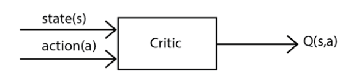
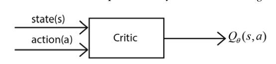
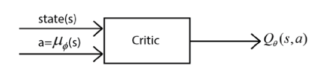
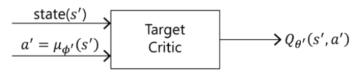

# Learning DDPG, TD3, and SAC

## Deep Deterministic Policy Gradient (DDPG)

- An **off-policy**, **model-free** algorithm designed for environments where the action space is **continuous**.
- DDPG is an actor-critic method: the actor estimates the policy using the policy gradient, and the critic evaluates the policy produced by the actor using the Q function.
- It uses a policy network as the actor and a deep Q network as the critic.
- DDPG learns a **deterministic** policy, instead of a stochastic one.
- A deterministic policy tells the agent to perform one particular action in a given state. See [RL Foundations](./foundations.md).

$$
a = \mu(s)
$$

- A stochastic policy, by contrast, maps the state to a probability distribution over the action space. See [RL Foundations](./foundations.md).

$$
a \sim \pi(s)
$$

### Actor

- The actor is, essentially, the policy network.
- It learns the mapping between states and actions.
- The actor learns the optimal policy — the one that gives the maximum return.
- The actor uses the policy gradient method to learn the optimal policy.

### Critic

- The critic is, essentially, the value network.
- It evaluates the action produced by the actor network.
- The action is evaluated using the Q function:
  - **High Q value:** the action performed is good — the expected return is high when action $a$ is performed in state $s$.
  - **Low Q value:** the action performed is bad — the expected return is low when action $a$ is performed in state $s$.
- Based on the critic's feedback, the actor adjusts to try to produce a different (better) action.
- To learn the Q function, the critic uses a deep Q network. See [DQN and Its Variants](./deep-q-networks-and-variants.md).

### The Critic Network in Detail

- The input to the critic network is the state, and the action performed in that state.
- The output is the Q value of performing action $a$ in state $s$.

- We can use any function approximator to estimate the Q value in the critic network — most commonly, a deep neural network.

- Since we're learning a *deterministic* policy in the actor network, we denote the policy $\mu$ instead of $\pi$.
- Since the policy is parameterized, we denote it $\mu_{\phi}$.
- We therefore feed the critic network the state $s$ and the action $\mu_{\phi}(s)$ produced by the actor.

- The network is trained by minimizing the loss between the **target** Q value and the Q value **predicted** by the network.
- The target Q value is the optimal Q value, obtained from the Bellman optimality equation. See [The Bellman Optimality Equation](./bellman-equation-and-dynamic-programming.md).

$$
Q^{*}(s,a) = \mathbb{E}_{s' \sim P(\cdot \mid s, a)} \left[ R(s,a,s') + \gamma \max_{a'} Q^{*}(s', a') \right]
$$

- As before (see [Deep Q Network and Its Variants](./deep-q-networks-and-variants.md)), we approximate this expectation using a single sampled transition $(s,a,r,s')$ from the replay buffer:

$$
Q^{*}(s,a) \approx r + \gamma \max_{a'} Q^{*}(s', a')
$$

- The loss is the difference between this target and the network's current prediction:

$$
\mathcal{L}(\theta) = \left( r + \gamma \max_{a'} Q_{\theta}(s', a') \right) - Q_{\theta}(s,a)
$$

- As usual, we don't train on a single transition — we use **mean squared error (MSE)** over a minibatch of $K$ sampled transitions:

$$
\mathcal{L}(\theta) = \frac{1}{K} \sum_{i=1}^{K} \left( y_i - Q_{\theta}(s_i, a_i) \right)^{2}, \qquad y_i = r_i + \gamma \max_{a'} Q_{\theta}(s'_i, a')
$$

- Since the target and predicted Q values both use the same parameter $\theta$, this causes the same instability problem seen in DQN. We therefore introduce a **target critic network** with parameter $\theta'$, and compute the target using it instead:

$$
y_i = r_i + \gamma \max_{a'} Q_{\theta'}(s'_i, a'), \qquad \mathcal{L}(\theta) = \frac{1}{K} \sum_{i=1}^{K} \left( y_i - Q_{\theta}(s_i, a_i) \right)^{2}
$$

- The $\max$ operator becomes computationally expensive — even intractable — for a **continuous** action space, since evaluating it would require computing the Q value for every possible action and picking the best one, which is no longer a finite search.
- To eliminate the $\max$ term, we introduce a **target actor network** with parameter $\phi'$, whose job is to generate the next action $a'$ directly:

$$
a' = \mu_{\phi'}(s')
$$

- Substituting the target actor's action in place of the $\max$ operator, the target becomes:

$$
y_i = r_i + \gamma \, Q_{\theta'}\!\left(s'_i, \mu_{\phi'}(s'_i)\right)
$$

- And the loss function becomes:

$$
\mathcal{L}(\theta) = \frac{1}{K} \sum_{i=1}^{K} \left( y_i - Q_{\theta}(s_i, a_i) \right)^{2}, \qquad y_i = r_i + \gamma \, Q_{\theta'}\!\left(s'_i, \mu_{\phi'}(s'_i)\right)
$$

- The update to the parameter $\theta$ is given by ordinary gradient descent:

$$
\theta \leftarrow \theta - \alpha \nabla_{\theta} \mathcal{L}(\theta)
$$

- For the parameter of the target critic network, we use **soft replacement** rather than a hard periodic copy:

$$
\theta' \leftarrow \tau \theta + (1 - \tau)\theta' \qquad (\tau = 0.001, \text{ typically})
$$

  Unlike DQN's target network (which is copied wholesale every $C$ steps), soft replacement nudges $\theta'$ gradually toward $\theta$ at every training step, using a small $\tau$ — this keeps the target smoother and more stable, avoiding the sudden jumps a hard copy would introduce.

## Actor Network

- The actor network is the policy network.
- It uses the policy gradient to compute the optimal policy.
- The parameter of the actor network is $\phi$.
- The action is given by:

$$
a = \mu_{\phi}(s)
$$

- Since we're using a **deterministic** policy, we need to explicitly handle the exploration-exploitation dilemma ourselves — a deterministic policy, by definition, doesn't naturally explore. Because we have a continuous action space, we can do this by simply adding noise to the chosen action.
- The noise is typically generated by a process called the **Ornstein-Uhlenbeck** random process (which produces temporally correlated noise, useful for physical control tasks with momentum):

$$
a = \mu_{\phi}(s) + \mathcal{N}
$$

- The critic gives good feedback when the action produced by the actor has a high (ideally maximum) Q value.
- So, the actor network's objective function is to generate an action that maximizes the Q value produced by the critic network:

$$
J(\phi) = Q_{\theta}(s, a)
$$

- We maximize this objective function by performing gradient ascent:

$$
\phi \leftarrow \phi + \alpha \nabla_{\phi} J(\phi)
$$

- Instead of updating the parameter $\phi$ using a single state $s$, we sample $K$ states from the replay buffer $\mathcal{D}$ and update the parameter using their average:

$$
J(\phi) = \frac{1}{K}\sum_{i=1}^{K} Q_{\theta}\!\left(s_i, \mu_{\phi}(s_i)\right)
$$

- The parameter of the target actor network is likewise updated by soft replacement:

$$
\phi' \leftarrow \tau\phi + (1 - \tau)\phi'
$$

### Notation

- The main critic network parameter is $\theta$.
- The target critic network parameter is $\theta'$.
- The main actor network parameter is $\phi$.
- The target actor network parameter is $\phi'$.

### The DDPG Algorithm

1. Initialize the main critic network $Q_\theta$ and main actor network $\mu_\phi$ with random weights.
2. Initialize the target networks with matching weights: $\theta' \leftarrow \theta$, $\phi' \leftarrow \phi$.
3. Initialize an empty replay buffer $\mathcal{D}$.
4. For each episode:
   1. Initialize a random process $\mathcal{N}$ for action exploration (e.g. Ornstein-Uhlenbeck), and observe the initial state $s$.
   2. For each step in the episode:
      1. Select an action with exploration noise: $a = \mu_\phi(s) + \mathcal{N}$.
      2. Perform action $a$; observe reward $r$ and next state $s'$.
      3. Store the transition $(s, a, r, s')$ in the replay buffer $\mathcal{D}$.
      4. Sample a random minibatch of $K$ transitions $(s_i, a_i, r_i, s'_i)$ from $\mathcal{D}$.
      5. Compute the target for each sample using the target networks: $y_i = r_i + \gamma \, Q_{\theta'}\!\left(s'_i, \mu_{\phi'}(s'_i)\right)$.
      6. Update the critic by minimizing the loss: $\mathcal{L}(\theta) = \frac{1}{K}\sum_{i=1}^{K} \left( y_i - Q_\theta(s_i,a_i) \right)^2$, via $\theta \leftarrow \theta - \alpha_c \nabla_\theta \mathcal{L}(\theta)$.
      7. Update the actor using the sampled policy gradient: $J(\phi) = \frac{1}{K}\sum_{i=1}^{K} Q_\theta(s_i, \mu_\phi(s_i))$, via $\phi \leftarrow \phi + \alpha_a \nabla_\phi J(\phi)$.
      8. Softly update both target networks: $\theta' \leftarrow \tau\theta + (1-\tau)\theta'$ and $\phi' \leftarrow \tau\phi + (1-\tau)\phi'$.
      9. Set $s \leftarrow s'$.
   3. Repeat until $s$ is terminal.
5. Repeat for many episodes until both networks converge.

## Twin Delayed DDPG (TD3)

- DDPG's critic network tends to **overestimate** the target Q value.
- This overestimation causes stability issues for the policy, which may prevent it from converging to a good (local) optimum.
- TD3 proposes three features to combat this:
  - Clipped double Q-learning
  - Delayed policy updates
  - Target policy smoothing

### Clipped Double Q-Learning

- We use **two** main critic networks to compute the Q value, and **two** target critic networks to compute the target value.
- We compute two target Q values using the two target critic networks, and use the **minimum** of the two when computing the loss — this prevents overestimating the target Q value.
- We define two main critic networks, computing $Q_{\theta_1}(s,a)$ and $Q_{\theta_2}(s,a)$.
- We also define two target critic networks, computing $Q_{\theta'_1}(s,a)$ and $Q_{\theta'_2}(s,a)$.

- **Recall:** the target value in DDPG is:

$$
y = r + \gamma \, Q_{\theta'}(s', \mu_{\phi'}(s'))
$$

- This creates an overestimation. **Why?** The same underlying issue seen in standard (non-double) DQN applies here: $Q_{\theta'}$ is only an *approximation* of the true Q function, and it inevitably carries some estimation noise — sometimes overestimating, sometimes underestimating a given state-action pair's true value. Because the actor $\mu_{\phi'}$ is trained specifically to produce the action that *maximizes* $Q_{\theta'}$, it will systematically be drawn toward whichever actions the critic happens to have overestimated (rather than the actions that are genuinely best) — and picking the "best according to a noisy estimate" action, on average, biases the resulting target upward, exactly as the $\max$ operator does in standard Q-learning.

- To counter this, we compute the target using **clipped double Q-learning**: taking the *minimum* of the two target critics' estimates.

$$
y = r + \gamma \, \min\!\left( Q_{\theta'_1}(s', \mu_{\phi'}(s')), \; Q_{\theta'_2}(s', \mu_{\phi'}(s')) \right)
$$

  Taking the minimum of two independent estimates is much less likely to land on an inflated value than taking either estimate alone, since both networks would have to overestimate the *same* action simultaneously for the bias to persist — which is far less likely than either network overestimating on its own.

- **Loss function for main network 1**, regressing toward the shared clipped target:

$$
\mathcal{L}(\theta_1) = \frac{1}{K}\sum_{i=1}^{K} \left( y_i - Q_{\theta_1}(s_i, a_i) \right)^2
$$

- **Loss function for main network 2**, regressing toward the *same* target:

$$
\mathcal{L}(\theta_2) = \frac{1}{K}\sum_{i=1}^{K} \left( y_i - Q_{\theta_2}(s_i, a_i) \right)^2
$$

- **Parameter updates for the main networks**, via ordinary gradient descent:

$$
\theta_1 \leftarrow \theta_1 - \alpha \nabla_{\theta_1} \mathcal{L}(\theta_1), \qquad \theta_2 \leftarrow \theta_2 - \alpha \nabla_{\theta_2} \mathcal{L}(\theta_2)
$$

- **Soft replacement updates for both target critic networks:**

$$
\theta'_1 \leftarrow \tau \theta_1 + (1-\tau)\theta'_1, \qquad \theta'_2 \leftarrow \tau \theta_2 + (1-\tau)\theta'_2
$$

### Delayed Policy Updates

- We delay updates to the actor network's parameters relative to the critic.
- The critic network's parameters are updated at every step of the episode.
- The actor network's parameters are updated only once every two (or more) critic updates.
- This ensures the critic network has settled on reasonably accurate Q value estimates before the actor starts chasing them — updating the actor against a still-noisy, rapidly-changing critic would make the policy update signal unreliable, compounding instability rather than reducing it.

### Target Policy Smoothing

- DDPG can produce noticeably different target values for essentially the same action, from one estimate to the next — i.e., there is high variance in the target for a given action. We add noise to smooth this out.
- The (clipped double-Q) target value is:

$$
y = r + \gamma \, \min\!\left( Q_{\theta'_1}(s', \mu_{\phi'}(s')), \; Q_{\theta'_2}(s', \mu_{\phi'}(s')) \right)
$$

- We add clipped noise to the target action, producing a smoothed action $\tilde{a}$:

$$
\tilde{a} = \mu_{\phi'}(s') + \epsilon, \qquad \epsilon \sim \text{clip}\!\left(\mathcal{N}(0, \sigma),\, -c,\, c\right)
$$

- The noise is **clipped** to the range $[-c, c]$ so that the smoothed action $\tilde{a}$ stays close to the actual target action $\mu_{\phi'}(s')$, rather than drifting arbitrarily far from it.
- Substituting $\tilde{a}$ into the target, the new target equation becomes:

$$
y = r + \gamma \, \min\!\left( Q_{\theta'_1}(s', \tilde{a}), \; Q_{\theta'_2}(s', \tilde{a}) \right), \qquad \tilde{a} = \mu_{\phi'}(s') + \text{clip}\!\left(\mathcal{N}(0, \sigma),\, -c,\, c\right)
$$

- This ensures that similar actions produce similar target values — smoothing out sharp, narrow peaks in the learned Q function that the policy could otherwise exploit (overfit to), which is a common failure mode in deterministic actor-critic methods.

### The TD3 Algorithm

1. Initialize two main critic networks $Q_{\theta_1}, Q_{\theta_2}$ and one main actor network $\mu_\phi$ with random weights.
2. Initialize the target networks with matching weights: $\theta'_1 \leftarrow \theta_1$, $\theta'_2 \leftarrow \theta_2$, $\phi' \leftarrow \phi$.
3. Initialize an empty replay buffer $\mathcal{D}$.
4. For each episode:
   1. Observe the initial state $s$.
   2. For each step $t$ in the episode:
      1. Select an action with exploration noise: $a = \mu_\phi(s) + \mathcal{N}$.
      2. Perform action $a$; observe reward $r$ and next state $s'$.
      3. Store the transition $(s,a,r,s')$ in $\mathcal{D}$.
      4. Sample a random minibatch of $K$ transitions from $\mathcal{D}$.
      5. Compute the smoothed target action: $\tilde{a}_i = \mu_{\phi'}(s'_i) + \text{clip}(\mathcal{N}(0,\sigma), -c, c)$.
      6. Compute the clipped double-Q target: $y_i = r_i + \gamma \, \min\left( Q_{\theta'_1}(s'_i, \tilde{a}_i),\, Q_{\theta'_2}(s'_i, \tilde{a}_i) \right)$.
      7. Update both main critics by gradient descent: $\theta_1 \leftarrow \theta_1 - \alpha \nabla_{\theta_1}\mathcal{L}(\theta_1)$, $\theta_2 \leftarrow \theta_2 - \alpha \nabla_{\theta_2}\mathcal{L}(\theta_2)$.
      8. **Every $d$ steps** (delayed policy update):
         - Update the actor via gradient ascent: $\phi \leftarrow \phi + \alpha \nabla_\phi \frac{1}{K}\sum_i Q_{\theta_1}(s_i, \mu_\phi(s_i))$.
         - Softly update all target networks: $\theta'_1 \leftarrow \tau\theta_1+(1-\tau)\theta'_1$, $\theta'_2 \leftarrow \tau\theta_2+(1-\tau)\theta'_2$, $\phi' \leftarrow \tau\phi+(1-\tau)\phi'$.
      9. Set $s \leftarrow s'$.
   3. Repeat until $s$ is terminal.
5. Repeat for many episodes until the networks converge.

## Soft Actor-Critic (SAC)

- Unlike TD3, SAC uses a **stochastic** policy.
- It is based on the concept of **entropy**.
- Entropy is a measure of the randomness of a variable.
- Entropy tells us the uncertainty or unpredictability of a random variable, and is denoted $\mathcal{H}$.
- If a random variable always produces the same value, it has **low** entropy, since there is no randomness.
- If a policy has **high** entropy, it means the policy performs different actions each time it's queried in a given state.
- Increasing the entropy of the policy promotes exploration.

- The standard reinforcement learning objective is:

$$
J(\phi) = \mathbb{E}_{\tau \sim \pi_{\phi}}\left[ R(\tau) \right]
$$

- The return is:

$$
R(\tau) = \sum_{t=0}^{T-1} r_t
$$

- So we have:

$$
J(\phi) = \mathbb{E}_{\tau \sim \pi_{\phi}}\left[ \sum_{t=0}^{T-1} r_t \right]
$$

- Approximating the expectation via $N$ sampled trajectories, as usual:

$$
J(\phi) \approx \frac{1}{N} \sum_{i=1}^{N} \sum_{t=0}^{T-1} r_t^{(i)}
$$

- The slightly modified objective function used in SAC is:

$$
J(\phi) = \mathbb{E}_{\tau \sim \pi_{\phi}}\left[ \sum_{t=0}^{T-1} r_t + \alpha \, \mathcal{H}\big(\pi(\cdot \mid s_t)\big) \right]
$$

- Again approximating the expectation via $N$ sampled trajectories:

$$
J(\phi) \approx \frac{1}{N} \sum_{i=1}^{N} \sum_{t=0}^{T-1} \left( r_t^{(i)} + \alpha \, \mathcal{H}\big(\pi(\cdot \mid s_t^{(i)})\big) \right)
$$

- Instead of maximizing only the reward, we now maximize the reward **and** the policy's entropy at every time step.
- Maximizing entropy encourages exploration — the policy is rewarded not just for high returns, but for remaining appropriately random/uncertain, rather than collapsing prematurely onto a single action.
- **Meaning of each term:**
  - $r_t$ is the ordinary reward received at time $t$, exactly as in any other RL objective.
  - $\mathcal{H}(\pi(\cdot \mid s_t))$ is the entropy of the policy's action distribution in state $s_t$ — higher when the policy spreads probability more evenly across actions.
  - $\alpha$ is the **temperature** parameter: it controls the trade-off between maximizing reward and maximizing entropy. A higher $\alpha$ places more weight on exploration (encouraging a more random policy); a lower $\alpha$ places more weight on exploiting known-good actions (behaving more like a standard reward-maximizing objective as $\alpha \to 0$). In many SAC implementations, $\alpha$ is itself learned automatically during training, rather than fixed as a hyperparameter.

- The actor uses the policy gradient to find the optimal policy.
- The critic uses both the value function and the Q function to evaluate the policy produced by the actor.
- We therefore have one actor network, and — in the original formulation — two critic-related networks: a **value network** and a **Q network**.

- The value function, with the entropy term included, becomes:

$$
V(s) = \mathbb{E}_{\tau \sim \pi_{\phi}}\left[ \sum_{t=0}^{T-1} r_t + \alpha \, \mathcal{H}\big(\pi(\cdot \mid s_t)\big) \;\middle|\; s_0 = s \right]
$$

- The Q function, with the entropy term included, becomes:

$$
Q(s, a) = \mathbb{E}_{\tau \sim \pi_{\phi}}\left[ \sum_{t=0}^{T-1} r_t + \alpha \, \mathcal{H}\big(\pi(\cdot \mid s_t)\big) \;\middle|\; s_0 = s, a_0 = a \right]
$$

- **Relationship between $V$ and $Q$:** note that $Q(s,a)$ conditions on a *specific* first action $a_0 = a$, so it does not include an entropy bonus for that first action's own distribution (the action is fixed, not sampled). $V(s)$, on the other hand, additionally accounts for the entropy of choosing $a_0$ itself, by averaging over $a \sim \pi(\cdot \mid s)$. Recalling that entropy can be written as an expectation, $\mathcal{H}(\pi(\cdot\mid s)) = \mathbb{E}_{a\sim\pi(\cdot\mid s)}\left[-\log \pi(a \mid s)\right]$, the two functions relate as:

$$
V(s) = \mathbb{E}_{a \sim \pi(\cdot \mid s)}\Big[ Q(s,a) - \alpha \log \pi(a \mid s) \Big]
$$

  In words: the value of a state is the expected Q value of the actions the policy would take there, plus a bonus for how much randomness (entropy) the policy exhibits when choosing among them.

### The SAC Algorithm

*(Following the notes' formulation above — one actor, one value network, and one Q network. Note: many modern SAC implementations instead use **two** Q networks with a clipped-double-Q target, borrowed from TD3, and drop the separate value network entirely; the version below matches the value-network formulation described in these notes.)*

1. Initialize the actor (policy) network $\pi_\phi$, the Q network $Q_\theta$, and the value network $V_\psi$, all with random weights.
2. Initialize the target value network with matching weights: $\psi' \leftarrow \psi$.
3. Initialize an empty replay buffer $\mathcal{D}$.
4. For each episode:
   1. Observe the initial state $s$.
   2. For each step in the episode:
      1. Sample an action from the current policy: $a \sim \pi_\phi(\cdot \mid s)$.
      2. Perform action $a$; observe reward $r$ and next state $s'$.
      3. Store the transition $(s, a, r, s')$ in $\mathcal{D}$.
      4. Sample a random minibatch of $K$ transitions from $\mathcal{D}$.
      5. For each sampled state $s_i$, sample a fresh action $\tilde{a}_i \sim \pi_\phi(\cdot \mid s_i)$ (using the **reparameterization trick**, so gradients can flow back through the sampling step into $\phi$).
      6. Update the value network by minimizing:

$$
\mathcal{L}(\psi) = \frac{1}{K}\sum_{i=1}^{K} \left( V_\psi(s_i) - \Big[ Q_\theta(s_i, \tilde{a}_i) - \alpha \log \pi_\phi(\tilde{a}_i \mid s_i) \Big] \right)^2, \qquad \psi \leftarrow \psi - \alpha_v \nabla_\psi \mathcal{L}(\psi)
$$

      7. Update the Q network by minimizing:

$$
\mathcal{L}(\theta) = \frac{1}{K}\sum_{i=1}^{K} \left( Q_\theta(s_i, a_i) - \big[ r_i + \gamma V_{\psi'}(s'_i) \big] \right)^2, \qquad \theta \leftarrow \theta - \alpha_c \nabla_\theta \mathcal{L}(\theta)
$$

      8. Update the actor (policy) network via gradient ascent on the entropy-augmented objective:

$$
J(\phi) = \frac{1}{K}\sum_{i=1}^{K} \Big[ Q_\theta(s_i, \tilde{a}_i) - \alpha \log \pi_\phi(\tilde{a}_i \mid s_i) \Big], \qquad \phi \leftarrow \phi + \alpha_a \nabla_\phi J(\phi)
$$

      9. Softly update the target value network: $\psi' \leftarrow \tau \psi + (1-\tau)\psi'$.
      10. Set $s \leftarrow s'$.
   3. Repeat until $s$ is terminal.
5. Repeat for many episodes until the networks converge.