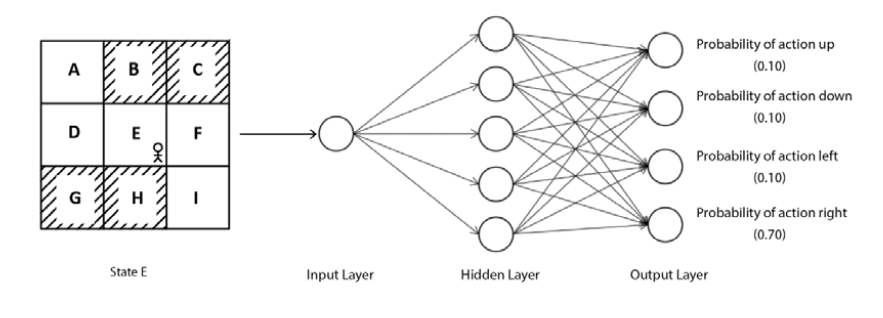

# Policy Gradient Method

- Why policy-based methods?
- Policy gradient intuition
- Deriving the policy gradient
- Algorithm of policy gradient
- Policy gradient with reward-to-go
- Policy gradient baseline
- Algorithm of policy gradient with baseline

## Why Policy-Based Methods

- With value-based methods, we extract the optimal policy from the optimal Q function (Q values).
- In value-based methods, the Q function is improved iteratively.
- Value-based methods are well suited to discrete action spaces.
- When the action is a continuous value, for instance, how do we compute the Q values for all possible state-action pairs? There are infinitely many of them, so an exhaustive Q table (or even a network with one output per action) isn't feasible.
- It is possible to discretize the continuous action space — e.g. splitting a steering angle into a fixed set of bins like $\{-30°, -15°, 0°, 15°, 30°\}$.
- **Problems with discretization:**
  - We lose the fine-grained control that a truly continuous action provides — the optimal action may lie *between* two bins, and discretization forces us to round to the nearest one.
  - Coarser discretization loses more precision, while finer discretization increases the number of discrete actions, which brings back the scaling problem value-based methods were trying to avoid.
  - The problem compounds badly in multi-dimensional action spaces: if we discretize each of $d$ action dimensions into $b$ bins, the total number of discrete actions grows as $b^d$ — an exponential blow-up known as the **curse of dimensionality**. A robot arm with 7 joints, each discretized into just 10 bins, would already need $10^7$ discrete actions.
  - Discretization can also introduce awkward, jerky behavior, since the agent is restricted to a fixed set of "snapped" actions rather than smooth continuous control.

- Policy-based methods don't need to compute the Q function (Q values) at all.
- Policy-based methods can handle both discrete and continuous action spaces naturally — for continuous spaces, the policy simply outputs the parameters of a continuous distribution (see the [Continuous Action Spaces](#continuous-action-spaces) section below), rather than needing a Q value per action.
- Most policy-based methods use a **stochastic** policy. Because the policy itself outputs a probability distribution over actions, sampling from it naturally alternates between trying different actions (exploration) and favoring actions known to work well (exploitation) — the exploration-exploitation trade-off is handled implicitly by the policy's own randomness, without needing a separate mechanism like epsilon-greedy.

## Policy Gradient Intuition

- Policy gradient methods find the optimal policy by directly parameterizing the policy using a parameter $\theta$.
- The parameterized policy is denoted $\pi_{\theta}(a \mid s)$.
- We can use any function approximator to represent the policy; a neural network is the most common choice, with $\theta$ as the network's weights.
- We feed the state of the environment as input to the network, and it outputs the probability of every action that can be performed in that state (for a discrete action space, this is typically a softmax layer).

- We play out a full episode using the current policy, and store the states, actions, and rewards encountered along the way. This trajectory becomes our training data.
- If the episode is a "win" — i.e., it yields a positive or high return — we increase the probability of every action that was taken over the course of the episode. If the return is negative, we decrease the probability of those actions instead.
- This adjustment is carried out through backpropagation, exactly as in supervised learning, except the training "label" here is derived from the return of the episode rather than a ground-truth output.
- Gradient updates via backpropagation are structured so that actions belonging to trajectories with high returns become more likely, and actions belonging to trajectories with low (or negative) returns become less likely.
- The neural network used this way is called the **policy network**.

## Understanding the Policy Gradient

- The objective of the policy network is to assign high probabilities to actions that maximize the *expected return* of the trajectories it generates:

$$
J(\theta) = \mathbb{E}_{\tau \sim \pi_{\theta}(\tau)}\left[ R(\tau) \right]
$$

- **Meaning of the terms:** $\tau$ denotes a full trajectory $(s_0, a_0, r_0, s_1, a_1, r_1, \dots, s_T)$; $\pi_\theta(\tau)$ is the probability of that entire trajectory occurring when the agent follows policy $\pi_\theta$; $R(\tau)$ is the total return accumulated over that trajectory; and the expectation is taken over all trajectories that could be generated by repeatedly running the policy $\pi_\theta$ in the environment. $J(\theta)$ is therefore the *average* return we'd expect to get if we ran the current policy indefinitely.
- Maximizing this objective function directly maximizes the expected return of trajectories generated by the policy — which is exactly the goal of reinforcement learning.
- **Gradient ascent vs. gradient descent:** in supervised learning, we're used to *minimizing* a loss function via gradient **descent** (moving parameters in the direction opposite the gradient, to reduce cost). Here, $J(\theta)$ is not a cost to minimize — it's a reward to *maximize*. So instead we perform gradient **ascent**, moving $\theta$ in the direction of the gradient, to increase $J(\theta)$. (Equivalently, one could define a loss $\mathcal{L}(\theta) = -J(\theta)$ and minimize that via descent — the two are mathematically the same operation, just framed with opposite signs. Policy gradient literature conventionally uses the ascent framing.)
- We therefore perform gradient ascent:

$$
\theta \leftarrow \theta + \alpha \nabla_{\theta} J(\theta)
$$

- This lets us iteratively find the optimal parameter $\theta$ of the policy network.
- As derived in the next section, the gradient works out to:

$$
\nabla_{\theta} J(\theta) = \mathbb{E}_{\tau \sim \pi_{\theta}(\tau)}\left[ \nabla_{\theta} \log \pi_{\theta}(a_t \mid s_t) \, R(\tau) \right]
$$

- Substituting this into the gradient ascent update gives us a concrete rule for updating $\theta$ — but note the expectation: computing it exactly would require averaging over *every possible trajectory* the policy could generate, which is intractable. Instead, we **approximate the expectation** using a Monte Carlo estimate: we sample $N$ trajectories by actually running the current policy in the environment, then simply average the bracketed quantity over those $N$ samples in place of the true expectation. This is the same "replace the expectation with a sample average" idea used throughout Monte Carlo methods (see [Monte Carlo Methods](./monte-carlo-methods.md)) — it gives an unbiased estimate of the true gradient, and the larger $N$ is, the lower the variance of that estimate. This is what lets us turn an *intractable* expectation into a *tractable*, sample-based gradient we can actually compute and use for stochastic gradient ascent.

### Case 1: Negative Return

- Substituting a trajectory with a negative return, $R(\tau) < 0$, into the update rule:

$$
\theta \leftarrow \theta + \alpha \, \nabla_{\theta} \log \pi_{\theta}(a_t \mid s_t) \, R(\tau)
$$

- Since $R(\tau)$ is negative, the term $\alpha \, \nabla_{\theta}\log \pi_{\theta}(a_t\mid s_t)\, R(\tau)$ points in the *opposite* direction to $\nabla_{\theta}\log \pi_{\theta}(a_t \mid s_t)$ — i.e., instead of moving $\theta$ to *increase* $\log \pi_\theta(a_t\mid s_t)$ (which is what a positive-coefficient gradient step would do), we move $\theta$ to *decrease* it.
- This is why we call it a **negative update**: the coefficient multiplying the gradient direction is negative, so the parameter update effectively subtracts (rather than adds) the log-probability gradient, pushing the probability of the action $a_t$ taken in state $s_t$ **down**.
- This update is applied for every time step $t = 0, 1, \dots, T-1$ in the trajectory — since the whole trajectory led to a bad (negative) outcome, every action taken along the way has its probability decreased, one gradient term per time step, all scaled by the same $R(\tau)$.

### Case 2: Positive Return

- The analysis is symmetric to Case 1: when $R(\tau) > 0$, the coefficient multiplying $\nabla_\theta \log \pi_\theta(a_t \mid s_t)$ is positive, so $\theta$ moves in the direction that *increases* $\log \pi_\theta(a_t \mid s_t)$ — the probability of every action taken in this (successful) trajectory goes **up**.
- Since a trajectory consists of $T$ sequential actions, and (as we'll show in the derivation below) $\log \pi_\theta(\tau)$ decomposes into a sum of per-time-step log-probabilities, the full gradient for a single trajectory is a **sum over time steps**:

$$
\theta \leftarrow \theta + \alpha \sum_{t=0}^{T-1} \nabla_{\theta} \log \pi_{\theta}(a_t \mid s_t) \, R(\tau)
$$

- This is exactly the same gradient ascent rule as before — just written out explicitly for a *single* sampled trajectory (i.e., this is what the earlier expectation-based formula reduces to once we replace the expectation with one sample, and expand $\nabla_\theta \log \pi_\theta(\tau)$ into its per-time-step sum).
- Accounting for the Monte Carlo approximation of the expectation over $N$ sampled trajectories (rather than just one), this becomes:

$$
\theta \leftarrow \theta + \alpha \, \frac{1}{N} \sum_{i=1}^{N} \sum_{t=0}^{T-1} \nabla_{\theta} \log \pi_{\theta}(a_t^{(i)} \mid s_t^{(i)}) \, R(\tau_i)
$$

- **What each part means:**
  - The **outer sum**, over $i = 1, \dots, N$, together with the $\frac{1}{N}$ factor, is the Monte Carlo average that approximates the expectation $\mathbb{E}_{\tau \sim \pi_\theta}[\cdot]$ — we're averaging the gradient contribution across $N$ independently sampled trajectories.
  - The **inner sum**, over $t = 0, \dots, T-1$, accumulates the gradient contribution from every time step *within* a single trajectory, since (per Case 1/2 above) each action taken during that trajectory gets nudged based on how the trajectory as a whole turned out.
  - $\nabla_\theta \log \pi_\theta(a_t^{(i)} \mid s_t^{(i)})$ is the gradient of the log-probability of the specific action $a_t^{(i)}$ actually taken at time $t$ in trajectory $i$.
  - $R(\tau_i)$ is the total return of trajectory $i$, which scales *every* time step's contribution within that trajectory equally.
- **In practice**, this means: run the current policy $\pi_\theta$ in the environment $N$ separate times, recording the full $(s_t, a_t, r_t)$ sequence each time; compute each trajectory's total return $R(\tau_i)$; then compute the double sum above, scale by $\frac{\alpha}{N}$, and add it to $\theta$ — one single parameter update per batch of $N$ trajectories.

**Worked example.** Suppose we collect $N=2$ trajectories, each with $T=2$ time steps:

- **Trajectory 1** ($\tau_1$): action "up" in $s_0$ (log-prob gradient $g_1$), then action "down" in $s_1$ (log-prob gradient $g_2$). Rewards received: $+1, +1$, so $R(\tau_1) = 2$.
- **Trajectory 2** ($\tau_2$): action "down" in $s_0$ (log-prob gradient $g_3$), then action "up" in $s_1$ (log-prob gradient $g_4$). Rewards received: $-1, -1$, so $R(\tau_2) = -2$.

Plugging into the update rule:

$$
\theta \leftarrow \theta + \alpha \cdot \frac{1}{2}\Big[ (g_1 + g_2)\cdot 2 \;+\; (g_3 + g_4)\cdot(-2) \Big] = \theta + \alpha \,(g_1 + g_2 - g_3 - g_4)
$$

The actions from the winning trajectory ($g_1, g_2$) contribute **positively** to the update, increasing their probability, while the actions from the losing trajectory ($g_3, g_4$) contribute **negatively**, decreasing theirs — exactly matching the intuition from Cases 1 and 2 above.

## Deriving the Policy Gradient

### Recall

- For a **discrete** random variable, the expectation is given by:

$$
\mathbb{E}_{x \sim p(x)}[f(x)] = \sum_{x} p(x) f(x)
$$

  (Recall the conditions for $p(x)$ to be a valid probability mass function: $p(x) \geq 0$ for every $x$, and $\sum_x p(x) = 1$.)

- For a **continuous** random variable, we have:

$$
\mathbb{E}_{x \sim p(x)}[f(x)] = \int_{x} p(x) f(x) \, dx
$$

- We also make use of the **log-derivative trick**:

$$
\nabla_{\theta} \log x = \frac{\nabla_{\theta} x}{x}
$$

### The Derivation

- We start from the objective function:

$$
J(\theta) = \mathbb{E}_{\tau \sim \pi_{\theta}(\tau)}[R(\tau)]
$$

- Expanding the expectation as an integral over all possible trajectories:

$$
J(\theta) = \int \pi_{\theta}(\tau) \, R(\tau) \, d\tau
$$

- Taking the gradient with respect to $\theta$:

$$
\nabla_{\theta} J(\theta) = \nabla_{\theta} \int \pi_{\theta}(\tau) R(\tau) \, d\tau = \int \nabla_{\theta} \pi_{\theta}(\tau) \, R(\tau) \, d\tau
$$

  We're allowed to swap the order of differentiation and integration here (moving $\nabla_\theta$ inside the integral) under mild regularity conditions — specifically, that $\pi_\theta(\tau)$ and its gradient are continuous and well-behaved functions of $\theta$. This is a standard result (the Leibniz integral rule), and it holds for essentially all policy parameterizations used in practice (e.g. neural networks with smooth activations). Note also that $R(\tau)$ does not depend on $\theta$ directly — it's a property of the environment's reward function, not of the policy — so the gradient only acts on $\pi_\theta(\tau)$.

- Multiplying and dividing by $\pi_\theta(\tau)$ (a standard trick to reintroduce the distribution we're sampling from) gives:

$$
\nabla_{\theta} J(\theta) = \int \pi_{\theta}(\tau) \, \frac{\nabla_{\theta} \pi_{\theta}(\tau)}{\pi_{\theta}(\tau)} \, R(\tau) \, d\tau
$$

- Applying the log-derivative trick, $\dfrac{\nabla_\theta \pi_\theta(\tau)}{\pi_\theta(\tau)} = \nabla_\theta \log \pi_\theta(\tau)$:

$$
\nabla_{\theta} J(\theta) = \int \pi_{\theta}(\tau) \, \nabla_{\theta} \log \pi_{\theta}(\tau) \, R(\tau) \, d\tau
$$

- Recognizing this integral as an expectation again (it's back in the form $\int \pi_\theta(\tau) \cdot [\dots] \, d\tau$), we get:

$$
\nabla_{\theta} J(\theta) = \mathbb{E}_{\tau \sim \pi_{\theta}(\tau)}\left[ \nabla_{\theta} \log \pi_{\theta}(\tau) \, R(\tau) \right]
$$

- **How do we evaluate $\nabla_\theta \log \pi_\theta(\tau)$?** For this, we need the probability distribution of a full trajectory. Recall it is given by:

$$
\pi_{\theta}(\tau) = p(s_0) \prod_{t=0}^{T-1} \pi_{\theta}(a_t \mid s_t) \, p(s_{t+1} \mid s_t, a_t)
$$

  **Where this comes from:** a trajectory is a specific sequence $(s_0, a_0, s_1, a_1, \dots, s_T)$, and its probability is the *joint* probability of that whole sequence occurring. By the **chain rule of probability**, any joint distribution can be decomposed into a product of conditional distributions — here, the probability of starting in $s_0$, times the probability of each subsequent action given the current state ($\pi_\theta(a_t \mid s_t)$, from the policy), times the probability of each subsequent state transition given the current state and action ($p(s_{t+1}\mid s_t, a_t)$, from the environment's dynamics). The steps are **not** independent of one another — each state depends on the one before it — but thanks to the **Markov property**, each transition depends *only* on the immediately preceding state and action, not on the full earlier history. This is precisely what allows the joint probability to factor cleanly into this product of one-step conditionals, rather than requiring a much more complex expression conditioned on the entire history at every step.

- Taking the log of both sides, and using $\log(ab) = \log a + \log b$ (which turns the product into a sum):

$$
\log \pi_{\theta}(\tau) = \log p(s_0) + \sum_{t=0}^{T-1} \Big[ \log \pi_{\theta}(a_t \mid s_t) + \log p(s_{t+1} \mid s_t, a_t) \Big]
$$

- Now take the gradient with respect to $\theta$. Since $p(s_0)$ (the initial state distribution) and $p(s_{t+1}\mid s_t, a_t)$ (the environment's transition dynamics) do **not** depend on $\theta$ — $\theta$ only parameterizes the *policy*, not the environment — their gradients are zero, and they drop out entirely:

$$
\nabla_{\theta} \log \pi_{\theta}(\tau) = \sum_{t=0}^{T-1} \nabla_{\theta} \log \pi_{\theta}(a_t \mid s_t)
$$

  This is exactly the expression we were looking for — and notice that it depends *only* on the policy network, not on the environment's (unknown) transition dynamics $p(s' \mid s,a)$ at all. This is precisely what makes policy gradient a **model-free** method.

- Substituting this back into the gradient of the objective function:

$$
\nabla_{\theta} J(\theta) = \mathbb{E}_{\tau \sim \pi_{\theta}(\tau)} \left[ \left( \sum_{t=0}^{T-1} \nabla_{\theta} \log \pi_{\theta}(a_t \mid s_t) \right) R(\tau) \right]
$$

- Finally, approximating the expectation using $N$ sampled trajectories (as discussed above):

$$
\nabla_{\theta} J(\theta) \approx \frac{1}{N} \sum_{i=1}^{N} \sum_{t=0}^{T-1} \nabla_{\theta} \log \pi_{\theta}\!\left(a_t^{(i)} \mid s_t^{(i)}\right) R(\tau_i)
$$

### The REINFORCE (Monte Carlo Policy Gradient) Algorithm

1. Initialize the policy network parameters $\theta$ randomly.
2. For each training iteration:
   1. Collect $N$ trajectories $\{\tau_1, \dots, \tau_N\}$ by running the current policy $\pi_\theta$ in the environment.
   2. Compute the total return $R(\tau_i)$ for each trajectory.
   3. Compute the policy gradient estimate:

$$
\nabla_{\theta} J(\theta) \approx \frac{1}{N} \sum_{i=1}^{N} \sum_{t=0}^{T-1} \nabla_{\theta} \log \pi_{\theta}\!\left(a_t^{(i)} \mid s_t^{(i)}\right) R(\tau_i)
$$

   4. Update the parameters via gradient ascent: $\theta \leftarrow \theta + \alpha \, \nabla_{\theta} J(\theta)$.
3. Repeat until the policy converges.

### Continuous Action Spaces

- Everything so far has assumed a **discrete** action space, where the policy network outputs a probability for each of a finite set of actions (typically via a softmax output layer).
- For a **continuous** action space, the network instead outputs the *parameters* of a continuous probability distribution over actions — most commonly a **Gaussian (normal) distribution**. The network outputs a mean $\mu(s)$ (and either a fixed or state-dependent standard deviation $\sigma(s)$) for each action dimension, rather than a probability per discrete action.
- We then sample an action from that distribution: $a \sim \mathcal{N}(\mu(s), \sigma(s)^2)$.
- The log-probability term $\log \pi_\theta(a_t \mid s_t)$ used throughout the gradient derivation above still applies unchanged — we simply use the log-density of the Gaussian (evaluated at the sampled action $a_t$) in place of the log of a discrete softmax probability. Everything else in the derivation and the REINFORCE algorithm carries over directly.

## Variance Reduction Methods

- The gradient estimator derived above has a significant practical problem: it's a **high-variance** estimator.
- **Why:** policy gradient is an **on-policy** method — every update requires fresh trajectories sampled from the *current* policy, since old trajectories were generated by an outdated policy and no longer accurately reflect it. We can't reuse a large stored dataset the way off-policy methods can, which limits how much data we can cheaply average over.
- On top of that, the **return** $R(\tau)$ of a trajectory can vary enormously from one sampled episode to the next — even under the same policy — because both the policy itself (stochastic action selection) and often the environment (stochastic transitions/rewards) introduce randomness. Two trajectories starting from similar states can end up with wildly different total returns simply due to chance.
- Since $R(\tau)$ directly scales the gradient term for *every* action in the trajectory, this trajectory-to-trajectory variability translates directly into **high variance in the gradient estimate** itself.
- **Effect on convergence:** high-variance gradients make training noisy and unstable — updates can point in inconsistent directions from batch to batch, requiring far more samples to average out the noise, slowing convergence, and sometimes preventing the policy from converging reliably at all.

### Policy Gradient with Reward-to-Go

- Recall the policy gradient:

$$
\nabla_{\theta} J(\theta) = \frac{1}{N} \sum_{i=1}^{N} \sum_{t=0}^{T-1} \nabla_{\theta} \log \pi_{\theta}(a_t \mid s_t) \, R(\tau)
$$

- where the return over $T$ steps in an episode is:

$$
R(\tau) = \sum_{t=0}^{T-1} r_t
$$

- Instead of using the return of the *entire* trajectory to weight every single time step, we can instead use the **reward-to-go**: the return accumulated only from time step $t$ onward.

**Why this matters.** Take $N=1$ (a single sampled trajectory), and consider a simple two-step episode: the agent takes action "up," receiving reward $+1$, then takes action "down," receiving reward $-1$. The total trajectory return is $R(\tau) = 1 + (-1) = 0$. Substituting into the gradient formula, *both* actions get weighted by $R(\tau) = 0$ — meaning neither action's probability is adjusted at all, even though the first action ("up") plausibly deserved to be reinforced on its own merits, regardless of what happened afterward. Using the full-trajectory return like this violates **causality**: an action taken at time $t$ cannot possibly have influenced rewards received *before* time $t$, so it shouldn't be credited or blamed for them. Weighting every action by the same whole-trajectory return mixes in this irrelevant, unrelated information, adding noise (and hence variance) to the gradient estimate without adding any useful signal.

- **Reward-to-go** for time step $t$ is defined as the return accumulated from $t$ onward:

$$
\hat{R}_t = \sum_{t'=t}^{T-1} r_{t'}
$$

- Substituting reward-to-go in place of the full trajectory return, the gradient becomes:

$$
\nabla_{\theta} J(\theta) \approx \frac{1}{N} \sum_{i=1}^{N} \sum_{t=0}^{T-1} \nabla_{\theta} \log \pi_{\theta}\!\left(a_t^{(i)} \mid s_t^{(i)}\right) \hat{R}_t^{(i)}
$$

- This isolates each action's credit to only the rewards that came *after* it — respecting causality — and removes the irrelevant, unrelated variance introduced by rewards that occurred *before* the action was even taken. This gives a strictly lower-variance (but still unbiased) estimate of the same gradient.

### The Reward-to-Go Policy Gradient Algorithm

1. Initialize the policy network parameters $\theta$ randomly.
2. For each training iteration:
   1. Collect $N$ trajectories using the current policy $\pi_\theta$.
   2. For each trajectory, compute the reward-to-go $\hat{R}_t = \sum_{t'=t}^{T-1} r_{t'}$ at every time step $t$.
   3. Compute the gradient estimate using reward-to-go weighting:

$$
\nabla_{\theta} J(\theta) \approx \frac{1}{N} \sum_{i=1}^{N} \sum_{t=0}^{T-1} \nabla_{\theta} \log \pi_{\theta}\!\left(a_t^{(i)} \mid s_t^{(i)}\right) \hat{R}_t^{(i)}
$$

   4. Update the parameters via gradient ascent: $\theta \leftarrow \theta + \alpha \, \nabla_{\theta} J(\theta)$.
3. Repeat until convergence.

### Policy Gradient with Baseline

- It's helpful to recall that we're always working with an *approximation* of the true policy gradient, obtained by averaging over $N$ sampled trajectories — anything that reduces the variance of that approximation, without introducing bias, is valuable, since it means fewer samples are needed to get a reliable gradient estimate.
- We can reduce variance further by subtracting a **baseline** $b$ from the reward-to-go:

$$
\nabla_{\theta} J(\theta) \approx \frac{1}{N} \sum_{i=1}^{N} \sum_{t=0}^{T-1} \nabla_{\theta} \log \pi_{\theta}\!\left(a_t^{(i)} \mid s_t^{(i)}\right) \left( \hat{R}_t^{(i)} - b \right)
$$

- **What is the baseline function?** It's a reference value we compare each action's reward-to-go against, so that what actually drives the update is whether an action did *better or worse than expected*, rather than the raw (and possibly always-positive, or always-large) magnitude of the reward-to-go itself.
- **Why does subtracting a baseline reduce variance?** "Variance in the return" here means how much the reward-to-go values $\hat{R}_t$ vary from one sampled trajectory (or time step) to another — if all returns are large and positive but noisy, the raw values still swing the gradient around a lot even though the *relative* quality of each action might be much more consistent. By subtracting a well-chosen baseline, we re-center these values around zero, so an action that's about average gets a near-zero update (rather than a large but uninformative positive one), while genuinely above- or below-average actions stand out more clearly — reducing the noise in the gradient without changing what it's converging to on average.
- **A simple baseline choice** is the average return across the $N$ sampled trajectories:

$$
b = \frac{1}{N} \sum_{i=1}^{N} R(\tau_i)
$$

  This means: essentially, compare each trajectory's return to the *population average* return across the current batch — above-average trajectories get reinforced, below-average ones get discouraged, rather than everything being reinforced just because all the returns happened to be positive.
- **Why must the baseline not depend on $\theta$ (or more precisely, not depend on the action $a$)?** Subtracting a baseline only leaves the gradient estimate *unbiased* if $b$ doesn't depend on the action being evaluated. This is because $\mathbb{E}_{a \sim \pi_\theta}\left[ \nabla_\theta \log \pi_\theta(a\mid s) \right] = 0$ for any fixed $s$ (a standard identity: the average gradient of a log-probability, weighted by that same probability, is always zero) — so as long as $b$ is constant with respect to $a$ (it may still depend on $s$ or $t$), the extra term it introduces into the expectation, $\mathbb{E}[\nabla_\theta \log \pi_\theta(a\mid s)] \cdot b$, vanishes to zero, and the expected gradient is unchanged. If $b$ depended on the action, this cancellation wouldn't hold, and we'd introduce bias into the gradient estimate.

- **Choosing the value function as the baseline.** A particularly good choice is $b(s_t) = V^{\pi}(s_t)$ — the value function under the current policy, representing the *expected* return from state $s_t$. With this choice:

$$
\hat{R}_t - V^{\pi}(s_t) \approx A^{\pi}(s_t, a_t)
$$

  i.e., the term becomes an approximation of the **advantage function** $A(s,a) = Q(s,a) - V(s)$ (see [Deep Q Network and Its Variants](./dqn-and-variants.md)) — it directly measures how much better (or worse) the actual outcome of taking action $a_t$ turned out to be, compared to what's *typically* expected from state $s_t$. This is exactly the signal we want to reinforce or discourage: not "was the return positive," but "was this action better than average for this state."
- **Why not the Q function as the baseline?** The baseline must not depend on the specific action being evaluated (as established above), but $Q(s,a)$ is defined *per action* — using it as the baseline would cancel out the very credit-assignment signal we're trying to compute, since we're literally trying to measure how the chosen action's outcome compares to $Q(s,a)$ in the first place. $V(s)$ works precisely because it only depends on the state, not the action.
- **Can we learn the baseline?** Yes — since we don't know $V^\pi(s)$ exactly, we can *learn* it using a separate neural network (often called a **value network** or **critic**), parameterized by, say, $\phi$, which takes a state $s$ as input and predicts $V_\phi(s)$, an estimate of the expected return from that state.
- **Training the value network:** since the reward-to-go $\hat{R}_t$ is itself a Monte Carlo estimate of $V^\pi(s_t)$, we can train $V_\phi$ by regression, minimizing the mean squared error between its predictions and the observed reward-to-go values:

$$
\mathcal{L}(\phi) = \frac{1}{N T} \sum_{i=1}^{N} \sum_{t=0}^{T-1} \left( V_{\phi}\!\left(s_t^{(i)}\right) - \hat{R}_t^{(i)} \right)^2
$$

  and update $\phi$ via ordinary gradient descent:

$$
\phi \leftarrow \phi - \alpha_v \, \nabla_{\phi} \mathcal{L}(\phi)
$$

  where $\alpha_v$ is the learning rate for the value network (which may differ from the policy network's learning rate $\alpha$).

### The REINFORCE with Baseline Algorithm

1. Initialize the policy network parameters $\theta$ and the value network parameters $\phi$.
2. For each training iteration:
   1. Collect $N$ trajectories using the current policy $\pi_\theta$.
   2. For each trajectory, compute the reward-to-go $\hat{R}_t$ at every time step.
   3. Compute the value estimate $V_\phi(s_t)$ for every visited state.
   4. Compute the advantage estimate at every time step: $A_t = \hat{R}_t - V_\phi(s_t)$.
   5. Update the policy parameters via gradient ascent:

$$
\theta \leftarrow \theta + \alpha \, \frac{1}{N} \sum_{i=1}^{N} \sum_{t=0}^{T-1} \nabla_{\theta} \log \pi_{\theta}\!\left(a_t^{(i)} \mid s_t^{(i)}\right) A_t^{(i)}
$$

   6. Update the value network parameters via gradient descent on the MSE loss:

$$
\mathcal{L}(\phi) = \frac{1}{N T} \sum_{i=1}^{N} \sum_{t=0}^{T-1} \left( V_{\phi}\!\left(s_t^{(i)}\right) - \hat{R}_t^{(i)} \right)^2, \qquad \phi \leftarrow \phi - \alpha_v \, \nabla_{\phi} \mathcal{L}(\phi)
$$

3. Repeat until both networks converge.