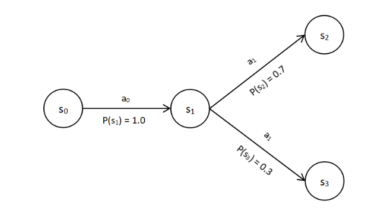
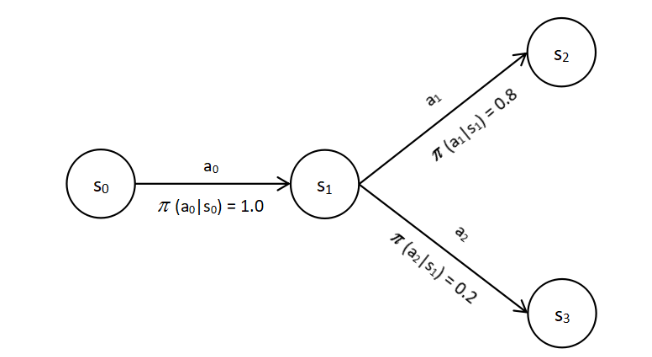

# The Bellman Equation

- The Bellman equation
- The Bellman optimality equation
- The relationship between the value and Q functions
- Dynamic programming — value and policy iteration methods
- Solving the frozen lake problem using value and policy iteration

## The Bellman Equation

- Helps solve the Markov decision process (MDP) — i.e., find the optimal policy.

## The Bellman Equation of the Value Function

- For a deterministic environment, the Bellman equation of the value function is:

$$
V^{\pi}(s) = R(s, a, s') + \gamma V^{\pi}(s')
$$

- $R(s, a, s')$ is the immediate reward obtained by performing action $a$ in state $s$ and moving to the next state $s'$.
- $\gamma$ is the discount factor.
- $V^{\pi}(s')$ is the value of the next state.
- The right-hand side, $R(s, a, s') + \gamma V^{\pi}(s')$, is called the **Bellman backup**.

- For a stochastic environment, the Bellman equation of the value function is:

$$
V^{\pi}(s) = \sum_{s'} P(s' \mid s, a) \left[ R(s, a, s') + \gamma V^{\pi}(s') \right]
$$

- Consider the following stochastic environment:

  

- Starting at $s_1$, the Bellman equation of the value function becomes:

$$
V^{\pi}(s) = 0.7 \left[ R(s_1, a_1, s_2) + \gamma V^{\pi}(s_2) \right] + 0.3 \left[ R(s_1, a_1, s_3) + \gamma V^{\pi}(s_3) \right]
$$

- For a stochastic policy, where actions are selected according to a probability distribution over the action space, as shown below:

  

- The Bellman equation of the value function becomes:

$$
V^{\pi}(s) = \sum_{a} \pi(a \mid s) \sum_{s'} P(s' \mid s, a) \left[ R(s, a, s') + \gamma V^{\pi}(s') \right]
$$

- In expectation form, this is:

$$
V^{\pi}(s) = \mathbb{E}_{a \sim \pi(\cdot \mid s),\; s' \sim P(\cdot \mid s, a)} \left[ R(s,a,s') + \gamma V^{\pi}(s') \right]
$$

## The Bellman Equation of the Q Function

- For a deterministic environment, the Bellman equation of the Q function is:

$$
Q^{\pi}(s, a) = R(s, a, s') + \gamma Q^{\pi}(s', a')
$$

- $R(s, a, s')$ is the immediate reward obtained by performing action $a$ in state $s$ and moving to the next state $s'$.
- $\gamma$ is the discount factor.
- $Q^{\pi}(s', a')$ is the Q value of the next state-action pair.
- The right-hand side, $R(s, a, s') + \gamma Q^{\pi}(s', a')$, is called the **Bellman backup**.

- Note that the action $a$ is already given as an input to $Q^{\pi}(s,a)$, so — unlike the value function — we do **not** sum over $a$ using the policy. The next action $a'$, however, is *not* given, so it is sampled according to the policy. For a stochastic environment and a stochastic policy, the Bellman equation becomes:

$$
Q^{\pi}(s,a) = \sum_{s'} P(s' \mid s, a) \left[ R(s, a, s') + \gamma \sum_{a'} \pi(a' \mid s') \, Q^{\pi}(s', a') \right]
$$

- In expectation form, this is:

$$
Q^{\pi}(s,a) = \mathbb{E}_{s' \sim P(\cdot \mid s, a)} \left[ R(s,a,s') + \gamma \, \mathbb{E}_{a' \sim \pi(\cdot \mid s')} \left[ Q^{\pi}(s', a') \right] \right]
$$

## The Bellman Optimality Equation

- Gives the optimal Bellman value and Q functions.
- There can be many different value functions, one for each possible policy.
- The **optimal** value function is the one with the maximum value.
- We compute the value of a state under every possible action and select the maximum:

$$
V^{*}(s) = \max_{a} \; \mathbb{E}_{s' \sim P(\cdot \mid s, a)} \left[ R(s,a,s') + \gamma V^{*}(s') \right]
$$

- For a state with two possible actions, 0 and 1, the equation becomes:

$$
V^{*}(s) = \max \left(
\mathbb{E}_{s' \sim P(\cdot \mid s, 0)} \left[ R(s,0,s') + \gamma V^{*}(s') \right],\;
\mathbb{E}_{s' \sim P(\cdot \mid s, 1)} \left[ R(s,1,s') + \gamma V^{*}(s') \right]
\right)
$$

- The optimal Bellman Q-value equation is:

$$
Q^{*}(s,a) = \mathbb{E}_{s' \sim P(\cdot \mid s, a)} \left[ R(s,a,s') + \gamma \max_{a'} Q^{*}(s', a') \right]
$$

- For a state with two possible next actions, this becomes:

$$
Q^{*}(s,a) = \mathbb{E}_{s' \sim P(\cdot \mid s, a)} \left[ R(s,a,s') + \gamma \max\left( Q^{*}(s', 0),\, Q^{*}(s', 1) \right) \right]
$$

## The Relationship Between the Value and Q Functions

### Recall

- The value of a state is given by:

$$
V^{\pi}(s) = \mathbb{E}_{\tau \sim \pi} \left[ R(\tau) \mid s_0 = s \right]
$$

- The Q value of a state-action pair is given by:

$$
Q^{\pi}(s, a) = \mathbb{E}_{\tau \sim \pi} \left[ R(\tau) \mid s_0 = s, a_0 = a \right]
$$

- The optimal value function is given by:

$$
V^{*}(s) = \max_{\pi} V^{\pi}(s)
$$

- The optimal Q function is given by:

$$
Q^{*}(s, a) = \max_{\pi} Q^{\pi}(s, a)
$$

- From these, we can deduce that the optimal value of a state equals the maximum, over all actions, of the optimal Q value at that state:

$$
V^{*}(s) = \max_{a} Q^{*}(s, a)
$$

### Derive the Relationship Between the Optimal Bellman Q-Value Function and the Optimal Bellman Value Function

Starting from the Bellman optimality equation for $Q^{*}$:

$$
Q^{*}(s,a) = \mathbb{E}_{s' \sim P(\cdot \mid s, a)} \left[ R(s,a,s') + \gamma \max_{a'} Q^{*}(s', a') \right]
$$

and substituting $\max_{a'} Q^{*}(s', a') = V^{*}(s')$, we get the relationship between the two optimal functions:

$$
Q^{*}(s,a) = \mathbb{E}_{s' \sim P(\cdot \mid s, a)} \left[ R(s,a,s') + \gamma V^{*}(s') \right]
$$