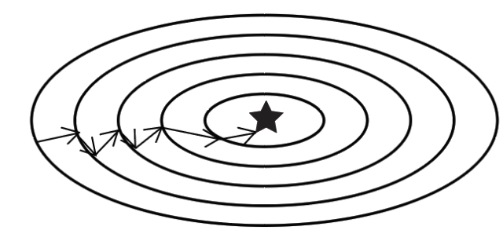
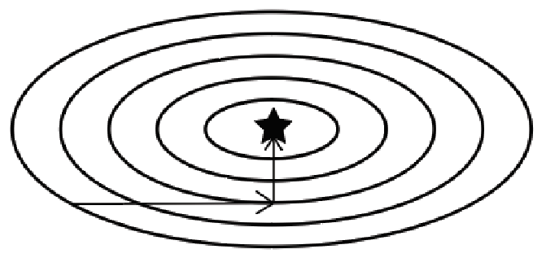

# TRPO, PPO and ACKTR Methods

Table of Contents

1. Trust region policy optimization
2. Designing the TRPO objective function
3. Solving the TRPO objective function
4. Proximal policy optimization
5. The PPO algorithm
6. Actor-critic using Kronecker-factored trust region

## Math Essentials

### The Taylor Series

- A series of infinite polynomial terms used to approximate a function, centered at some value $x = a$:

$$
f(x) = f(a) + \frac{f'(a)}{1!}(x - a) + \frac{f''(a)}{2!}(x - a)^2 + \dots = \sum_{n=0}^{\infty} \frac{f^{(n)}(a)}{n!}(x-a)^n
$$

- The Taylor polynomial truncated to the first degree is called the **linear approximation**:

$$
f(x) \approx f(a) + \frac{f'(a)}{1!}(x - a) = f(a) + \nabla f(a)(x-a)
$$

- The Taylor polynomial truncated to the second degree is called the **quadratic approximation**:

$$
f(x) \approx f(a) + \nabla f(a)(x-a) + \frac{1}{2!} (x - a)^T \nabla^{2}f(a)(x-a)
$$

- The quantity $\nabla^{2}f(a)$ is called the **Hessian**, denoted $\mathcal{H}(a)$:

$$
f(x) \approx f(a) + \nabla f(a)(x-a) + \frac{1}{2!} (x - a)^T \mathcal{H}(a)(x-a)
$$

### The Trust Region Method

- Suppose we want to find the minimum of a function $f(x)$, but doing so directly is difficult.
- We use the Taylor series to approximate the function with $\tilde{f}(x)$.
- Say $\tilde{f}(x)$ is the quadratic approximation, that is:

$$
\tilde{f}(x) = f(a) + \nabla f(a)(x-a) + \frac{1}{2!} (x - a)^T \mathcal{H}(a)(x-a)
$$

- It's possible that this approximation is inaccurate at some particular point $a^{*}$ — and if $a^{*}$ happens to be the true optimum, we'd miss it entirely by trusting the approximation there.
- To guard against this, we introduce the **trust region constraint**.
- The trust region is the region within which the actual function and its approximation stay close together.
- The approximation is only trustworthy (accurate enough to act on) *inside* this region.

### The Conjugate Gradient Method

- An iterative method used to solve a system of linear equations.
- It applies to systems of the form $Ax = b$, where $A$ is a positive-definite, square, symmetric matrix, $x$ is the unknown vector, and $b$ is the known vector.
- Consider the quadratic function:

$$
f(x) = \frac{1}{2} x^{T}Ax - b^{T}x + c
$$

- **Why minimizing this is equivalent to solving $Ax=b$:** taking the gradient of $f(x)$ with respect to $x$ (using the fact that $A$ is symmetric) gives:

$$
\nabla f(x) = Ax - b
$$

  Setting the gradient to zero — the standard condition for a stationary point — gives exactly $Ax = b$. Since $A$ is positive semi-definite, $f(x)$ is convex, so this stationary point is guaranteed to be a **global minimum**, not just a local one or a saddle point. This is why finding the minimum of $f(x)$ and solving the linear system $Ax=b$ are the same problem. *(For a deeper treatment, Jonathan Shewchuk's "An Introduction to the Conjugate Gradient Method Without the Agonizing Pain" is a widely recommended reference.)*
- Just like gradient descent, conjugate gradient descent also tries to find the minimum of a function.
- The **search direction** used by conjugate gradient descent differs from that of plain gradient descent — instead of always moving along the local gradient (which can zig-zag badly on ill-conditioned problems), it chooses a sequence of directions that are mutually "conjugate" with respect to $A$, meaning progress made along one direction is never undone by a later step along another.
- Because of this, conjugate gradient descent is guaranteed to converge in at most $N$ iterations, where $N$ is the dimensionality of $x$ (for an exact, noise-free quadratic problem).

- The contour plot of gradient descent:

- The contour plot of conjugate gradient descent:

  Notice how gradient descent tends to zig-zag toward the minimum, especially on elongated (ill-conditioned) contours, while conjugate gradient descent takes a much more direct path — this is a direct visual consequence of its conjugate search directions.

- Using conjugate gradient descent, we can efficiently solve systems of the form $Ax = b$ — which is exactly the kind of system that shows up when solving the TRPO update (see [Solving the TRPO Objective Function](#solving-the-trpo-objective-function), to be added).

### Lagrange Multipliers

- Given the constrained optimization problem:

$$
\min_x f(x) = 2x^2 + 1 \qquad \text{subject to} \quad g(x) = 1
$$

- We find the minimum when the gradient of the objective function and the gradient of the constraint point in the *same* direction:

$$
\nabla f(x) = \lambda \nabla g(x)
$$

- $\lambda$ is known as the **Lagrange multiplier**.
- The equation can be rewritten as:

$$
\nabla f(x) - \lambda \nabla g(x) = 0
$$

- We can express this as a single combined objective, the **Lagrangian**:

$$
\mathcal{L}(x, \lambda) = f(x) - \lambda g(x)
$$

- Its gradient is:

$$
\nabla \mathcal{L}(x, \lambda) = \nabla f(x) - \lambda \nabla g(x)
$$

- We find the constrained minimum when $\nabla \mathcal{L}(x, \lambda) = 0$ — solving this jointly for $x$ and $\lambda$ recovers the solution to the original constrained problem.

### Importance Sampling

- The expectation can be approximated as follows, using importance sampling:

$$
\mathbb{E}\left[f(x)\right] \approx \int_{x} f(x) \frac{p(x)}{q(x)} \, q(x) \, dx
$$

$$
\mathbb{E}\left[f(x)\right] \approx \frac{1}{N} \sum_{i=1}^{N} f(x_i) \frac{p(x_i)}{q(x_i)}, \qquad x_i \sim q(x)
$$

  See [Monte Carlo Methods](./monte-carlo-methods.md).

## Trust Region Policy Optimization

- A **policy gradient** algorithm.
- Acts as an improvement over the policy gradient with baseline method.
- Policy gradient is an **on-policy** method — we improve the very same policy we're using to generate trajectories. See [Policy Gradient Method](./policy-gradient-method.md).
- The parameter update equation is:

$$
\theta \leftarrow \theta + \alpha \nabla_{\theta}J(\theta)
$$

- If the learning rate $\alpha$ is large, the update itself is large.
- We usually choose a small learning rate so that each iteration makes only a small improvement to the policy. Otherwise, an overly large update risks a problem called **model collapse** — the policy is updated so aggressively that it becomes much worse (sometimes catastrophically) rather than better, since a large step in parameter space can correspond to an enormous, uncontrolled change in the policy's actual behavior.
- It's possible to take a *larger* step in parameter space while still keeping the resulting policy's *behavior* close to the old one — this is exactly what **TRPO** achieves.
- TRPO imposes a constraint requiring that the old policy and new policy don't vary too much from one another (in terms of behavior, not just raw parameter distance).
- To measure how much the old and new policies differ, we use the **Kullback-Leibler (KL) divergence**.
- The KL divergence tells us how different two probability distributions are from one another.
- TRPO adds the constraint that the KL divergence between the old and new policies must be less than or equal to some constant $\delta$.
- This constant $\delta$ defines the **trust region**.
- TRPO **guarantees monotonic policy improvement** — that is, under its theoretical guarantees, every iteration is guaranteed to improve (or at worst maintain) the policy's true performance, never make it worse.

### Designing the TRPO Objective Function

- Given a policy $\pi$, we can express the expected discounted return $\eta$ obtained by following $\pi$ as:

$$
\eta(\pi) = \mathbb{E}_{\tau \sim \pi} \left[ \sum_{t=0}^{\infty} \gamma^{t} r_t \right]
$$

- Say we update our old policy $\pi$ to get a new policy $\tilde{\pi}$. Then we have the identity:

$$
\eta(\tilde{\pi}) = \eta(\pi) + \mathbb{E}_{\tau \sim \tilde{\pi}} \left[ \sum_{t=0}^{\infty} \gamma^{t} \mathcal{A}_{\pi}(s_t, a_t) \right]
$$

- We use the advantage function of the **old** policy $\pi$, because we're measuring how much better (or worse) the new policy's actions are relative to what the old policy would typically achieve, on average, from those same states.

**Where this identity comes from (the Performance Difference Lemma).** This result — due to Kakade and Langford (2002) — looks like it comes out of nowhere, so it's worth deriving. Start from the definition of the advantage function, $\mathcal{A}_\pi(s_t,a_t) = r_t + \gamma V_\pi(s_{t+1}) - V_\pi(s_t)$, and take its expectation over trajectories generated by the *new* policy $\tilde\pi$:

$$
\mathbb{E}_{\tau \sim \tilde{\pi}} \left[ \sum_{t=0}^{\infty} \gamma^{t} \mathcal{A}_{\pi}(s_t, a_t) \right]
= \mathbb{E}_{\tau \sim \tilde{\pi}} \left[ \sum_{t=0}^{\infty} \gamma^{t} \big( r_t + \gamma V_\pi(s_{t+1}) - V_\pi(s_t) \big) \right]
$$

Splitting this into the reward sum and the $V_\pi$ terms, the $V_\pi$ part telescopes: $\sum_{t=0}^{\infty} \left( \gamma^{t+1} V_\pi(s_{t+1}) - \gamma^{t} V_\pi(s_t) \right) = -V_\pi(s_0)$ (every term cancels against the next, leaving only the very first, negated — assuming $\gamma^t V_\pi(s_t) \to 0$ as $t \to \infty$). So the whole expression reduces to:

$$
\mathbb{E}_{\tau \sim \tilde{\pi}} \left[ \sum_{t=0}^{\infty} \gamma^{t} r_t \right] - \mathbb{E}_{s_0}\left[V_\pi(s_0)\right] = \eta(\tilde\pi) - \eta(\pi)
$$

(using $\eta(\pi) = \mathbb{E}_{s_0}[V_\pi(s_0)]$, since the expected return from the start is exactly the expected value of the initial state). Rearranging gives exactly the identity above.

**A simple example.** Suppose a one-step episode: under the old policy $\pi$, the value of the start state is $V_\pi(s_0) = 5$ (so $\eta(\pi) = 5$). Under the new policy $\tilde\pi$, the agent takes an action leading to a reward of $r = 6$ and then the episode ends (terminal value $0$), with $\gamma = 1$. The advantage of that action, judged by the *old* policy's value function, is $\mathcal{A}_\pi(s_0, a) = r + \gamma \cdot 0 - V_\pi(s_0) = 6 - 5 = 1$. Plugging into the identity: $\eta(\tilde\pi) = \eta(\pi) + \mathbb{E}[\mathcal{A}_\pi] = 5 + 1 = 6$ — which indeed matches the new policy's actual return of $6$. The formula is simply saying: *the new policy's performance equals the old policy's average performance, plus however much extra advantage the new policy's actions accumulate, as judged against the old policy's own value function.*

- If we condition on the state, the equation becomes:

$$
\eta(\tilde{\pi}) = \eta(\pi) + \sum_{s} \rho_{\tilde{\pi}}(s)\sum_{a}\tilde{\pi}(a\mid s) \, \mathcal{A}_{\pi}(s,a)
$$

  **Where this comes from:** starting from $\mathbb{E}_{\tau\sim\tilde\pi}\left[\sum_t \gamma^t \mathcal{A}_\pi(s_t,a_t)\right]$, we can swap the order of summation — instead of summing over time steps $t$ (with an expectation over which state/action occurs at each $t$), we group all the terms by *which state* they refer to. This gives $\sum_t \gamma^t \mathbb{E}_{s_t,a_t \sim \tilde\pi}[\mathcal{A}_\pi(s_t,a_t)] = \sum_s \left(\sum_t \gamma^t P(s_t = s \mid \tilde\pi)\right) \sum_a \tilde\pi(a\mid s)\,\mathcal{A}_\pi(s,a)$. Defining $\rho_{\tilde\pi}(s) := \sum_{t=0}^{\infty} \gamma^t P(s_t = s \mid \tilde\pi)$ — the (unnormalized) **discounted visitation frequency** of state $s$ under $\tilde\pi$ — recovers exactly the equation above.
- $\rho_{\tilde{\pi}}(s)$ is the discounted visitation frequency of the new policy: intuitively, how often (weighted by $\gamma^t$, so earlier visits count more) the agent following $\tilde\pi$ finds itself in state $s$.

- The equation above is difficult to optimize directly — it requires trajectories generated by $\tilde\pi$, but $\tilde\pi$ is exactly the policy we're trying to find, so we can't sample from it yet.
- We instead approximate it with a **local approximation**:

$$
L_{\pi}(\tilde{\pi}) = \eta(\pi) + \sum_{s} \rho_{\pi}(s)\sum_{a}\tilde{\pi}(a\mid s) \, \mathcal{A}_{\pi}(s,a)
$$

- Here we use the discounted visitation frequency of the **old** policy, $\rho_\pi(s)$, since we already have sampled trajectories from $\pi$ (the policy we're currently running), whereas we have no trajectories from $\tilde\pi$ yet.

- A **surrogate function** is a function that stands in as a tractable approximation of the true objective — so $L_\pi(\tilde\pi)$ above is a surrogate function for the true objective $\eta(\tilde\pi)$.

**Why is this a *local* approximation, and not a global one?** The substitution of $\rho_\pi(s)$ (old policy's visitation frequencies) in place of $\rho_{\tilde\pi}(s)$ (new policy's, which we don't have) is only accurate when $\tilde\pi$ is *close* to $\pi$ — in that case, the states $\tilde\pi$ tends to visit are approximately the same ones $\pi$ visits, so substituting one distribution for the other introduces only a small error. But if $\tilde\pi$ were to diverge substantially from $\pi$ (e.g., a very different policy), the states it actually visits could be completely different from what $\rho_\pi(s)$ describes, and the approximation $L_\pi(\tilde\pi) \approx \eta(\tilde\pi)$ would break down. This is precisely *why* $L_\pi(\tilde\pi)$ is only trustworthy "locally," in a neighborhood around $\pi$ — and it's exactly why we need the trust region constraint from the earlier section: it keeps $\tilde\pi$ close enough to $\pi$ for this local approximation to remain valid.

- To make sure our local approximation stays accurate, we use the trust region method.
- While optimizing $L_{\pi}(\tilde{\pi})$, we make sure it stays within the trust region.
- When updating the old policy to a new policy, we need to ensure the new policy stays within this trust region.
- The KL divergence measure we use is:

$$
D_{KL}\big(\pi(\cdot\mid s) \,\|\, \tilde{\pi}(\cdot\mid s)\big)
$$

- The **Kakade and Langford** updating scheme is given by:

$$
\eta(\tilde{\pi}) \geq L_{\pi}(\tilde{\pi}) - C \, D_{KL}^{max}(\pi, \tilde{\pi}), \qquad C = \frac{4 \epsilon \gamma}{(1 - \gamma)^2}
$$

- Here, the KL divergence term is a **penalty term**, and $C$ is the **penalty coefficient**. *(For the full derivation and proof of this bound, see Kakade & Langford, "Approximately Optimal Approximate Reinforcement Learning" (2002), and Schulman et al., "Trust Region Policy Optimization" (2015), which builds directly on it and is the primary reference for this whole section.)*
- Maximizing $L_{\pi}(\tilde{\pi}) - C D_{KL}^{max}(\pi, \tilde{\pi})$ improves the *true* objective function $\eta(\tilde\pi)$ and guarantees monotonic policy improvement, since the inequality above means the true performance is always at least as large as this lower bound — so improving the bound can never make the true objective worse:

$$
\max_{\tilde{\pi}} \left[ L_{\pi}(\tilde{\pi}) - C D_{KL}^{max}(\pi, \tilde{\pi}) \right]
$$

- The above objective function is known as the **KL-penalized objective**.

### Parameterizing the Policies

- We parameterize the old policy with parameter $\theta_{old}$ and the new policy with parameter $\theta$.
- The KL-penalized objective becomes:

$$
\max_{\theta} \left[ L(\pi_{\theta}) - C D_{KL}^{max}(\pi_{old}, \pi_{\theta}) \right]
$$

- The **maximum** KL divergence (over all states) is difficult to optimize in practice — computing it exactly would require checking the divergence at every possible state, which is generally intractable — so we take the **average** KL divergence instead:

$$
\max_{\theta} \left[ L(\pi_{\theta}) - C \bar{D}_{KL}(\pi_{old}, \pi_{\theta}) \right]
$$

**On substituting the max with something more tractable:** this is a pattern that shows up again and again in RL and applied optimization more broadly — whenever an exact quantity is either information we don't have direct access to, or computationally intractable to evaluate exactly, it gets replaced with a more tractable *proxy*: a sampled estimate, an average, a bound, etc. You've seen this before: replacing the $\max_{a'}$ over a continuous action space with a target actor's chosen action in DDPG, or replacing an exact expectation over all trajectories with a Monte Carlo average over $N$ sampled ones throughout the policy gradient derivations. The same thing happens here: swapping the intractable worst-case ($\max_s$) KL divergence for the tractable average ($\bar{D}_{KL}$, estimated from sampled states) buys computational feasibility, at the cost of losing the strict worst-case guarantee — the average constraint bounds the *typical* divergence, but no longer guarantees the divergence is small at *every single* state. This trade-off between theoretical rigor and practical tractability recurs throughout applied RL.

- Substituting a fixed value for $C$ in practice tends to result in very small update steps, since $C$ is often large — and so, it takes a very long time to converge this way.

- So instead, we reformulate this as a **constrained** optimization problem — the surrogate objective function:

$$
\max_{\theta} L(\pi_{\theta}) \qquad \text{subject to} \quad \bar{D}_{KL}(\pi_{old}, \pi_{\theta}) \leq \delta
$$

- This is known as the **KL-constrained objective**.

### Sample-Based Estimation

- We have the constrained objective:

$$
\max_{\theta} \sum_{s} \rho_{\pi_{old}}(s)\sum_{a}{\pi_{\theta}}(a\mid s) \, \mathcal{A}_{\pi_{old}}(s,a) \qquad \text{subject to} \quad \bar{D}_{KL}(\pi_{old}, \pi_{\theta}) \leq \delta
$$

- The term $\sum_{s} \rho_{\pi_{old}}(s)$, which sums over the (unnormalized) discounted state-visitation frequency, can be treated — once normalized by its total mass $\sum_s \rho_{\pi_{old}}(s) = \frac{1}{1-\gamma}$ — as a proper probability distribution over states. This lets us rewrite the sum-over-states weighted by $\rho_{\pi_{old}}(s)$ as an **expectation** over $s$ sampled from that distribution instead (up to the constant normalizing factor, which doesn't affect which $\theta$ maximizes the objective, and so is typically dropped):

$$
\sum_{s} \rho_{\pi_{old}}(s) \, f(s) \;\;\propto\;\; \mathbb{E}_{s \sim \rho(\pi_{\theta_{old}})}\big[f(s)\big]
$$

- Applying this, the equation becomes:

$$
\mathbb{E}_{s \sim \rho(\pi_{\theta_{old}})} \left[ \sum_{a}{\pi_{\theta}}(a\mid s) \, \mathcal{A}_{\pi_{old}}(s,a) \right]
$$

- With importance sampling, and treating $a$ as sampled from some distribution $q$ instead of enumerated directly, we get:

$$
\mathbb{E}_{s \sim \rho(\pi_{\theta_{old}}),\ a \sim q} \left[ \frac{{\pi_{\theta}}(a\mid s)}{q(a\mid s)} \, \mathcal{A}_{\pi_{old}}(s,a) \right]
$$

- The full objective function now becomes:

$$
\max_{\theta} \; \mathbb{E}_{s \sim \rho(\pi_{\theta_{old}}),\ a \sim q} \left[ \frac{{\pi_{\theta}}(a\mid s)}{q(a\mid s)} \, \mathcal{A}_{\pi_{old}}(s,a) \right] \qquad \text{subject to} \quad \mathbb{E}_{s \sim \pi_{\theta_{old}}} \Big[ D_{KL}\big(\pi_{\theta_{old}}(\cdot \mid s) \,\|\, \pi_{\theta}(\cdot \mid s)\big) \Big] \leq \delta
$$

- **Significance of each term:**
  - $\dfrac{\pi_{\theta}(a\mid s)}{q(a\mid s)}$ is the **importance sampling ratio**: it reweights samples that were actually drawn from the behavior distribution $q$, so that their weighted average still correctly approximates the expectation under the *new* policy $\pi_\theta$ we're optimizing — exactly as in the [importance sampling](#importance-sampling) recap above.
  - $\mathcal{A}_{\pi_{old}}(s,a)$ is the advantage of action $a$ in state $s$, judged under the **old** policy — this is the quantity we're trying to increase: we want to reshape $\pi_\theta$ to put more probability mass on actions the old policy's advantage function says are good.
  - $s \sim \rho(\pi_{\theta_{old}})$ means states are drawn from the old policy's (discounted) visitation distribution — these are the only states we actually have data for, since they come from rollouts of the policy we were already running.
  - $a \sim q$ is the distribution actions were actually sampled from when collecting data. In practice, $q$ is usually taken to be $\pi_{\theta_{old}}$ itself, in which case the importance ratio simplifies to $\dfrac{\pi_\theta(a\mid s)}{\pi_{\theta_{old}}(a\mid s)}$ — directly comparing how much more (or less) likely the new policy is to take the same action the old policy actually took.
  - The constraint $\mathbb{E}_{s\sim\pi_{\theta_{old}}}\big[D_{KL}(\pi_{\theta_{old}}(\cdot\mid s)\,\|\,\pi_\theta(\cdot\mid s))\big] \leq \delta$ is the sample-based version of the trust region constraint: the *average* (over visited states) KL divergence between old and new policy must stay within $\delta$, keeping $\pi_\theta$ close enough to $\pi_{\theta_{old}}$ for the surrogate objective to remain a valid local approximation of the true objective, as discussed above.

## Solving the TRPO Objective Function

- We have:

$$
\max_{\theta} \; \mathbb{E}_{s \sim \rho(\pi_{\theta_{old}}),\ a \sim q} \left[ \frac{{\pi_{\theta}}(a\mid s)}{q(a\mid s)} \, \mathcal{A}_{\pi_{old}}(s,a) \right] \qquad \text{subject to} \quad \mathbb{E}_{s \sim \pi_{\theta_{old}}} \Big[ D_{KL}\big(\pi_{\theta_{old}}(\cdot \mid s) \,\|\, \pi_{\theta}(\cdot \mid s)\big) \Big] \leq \delta
$$

- For notation brevity, we write this as:

$$
\max_{\theta} L(\theta) \qquad \text{subject to} \quad D(\theta) \leq \delta
$$

- We perform gradient ascent and update the parameter as follows:

$$
\theta \leftarrow \theta + \alpha \, \Delta\theta
$$

- $\Delta\theta$ is the search direction, and $\alpha$ is the backtracking coefficient.
- $\Delta\theta$ is computed using a Taylor series approximation.
- We find the value of $\alpha$ using the **backtracking line search** method.
- Together, this lets us satisfy the KL constraint on every update while also guaranteeing (approximate) monotonic improvement.

### Computing the Search Direction

- Optimizing the objective function directly is difficult, since both $L(\theta)$ and the KL constraint $D(\theta)$ are complicated, nonlinear functions of $\theta$.
- We approximate $L(\theta)$ using a **linear** approximation, and the constraint $D(\theta)$ using a **quadratic** approximation — this mirrors the trust region method introduced in the Math Essentials section, just applied here to two different functions at once.
- We approximate the objective function around a point $\theta_k$ (our current parameters):

$$
L(\theta) \approx L(\theta_{k}) + \nabla_{\theta}L(\theta_k)^{T}(\theta - \theta_{k})
$$

- Denoting $\nabla_\theta L(\theta_k)$ by $g$:

$$
L(\theta) \approx L(\theta_{k}) + g^{T}(\theta - \theta_{k})
$$

- **Why $L(\theta_k)$ drops out:** we're not interested in the *value* of $L(\theta)$ here, only in *which $\theta$ maximizes it* — that is, we care about $\arg\max_\theta L(\theta)$, not $\max_\theta L(\theta)$ itself. Since $L(\theta_k)$ doesn't depend on $\theta$ at all (it's just a fixed number, evaluated at our current parameters $\theta_k$), adding or removing it doesn't shift *where* the maximum occurs — a constant offset never changes the argmax of a function. So for the purposes of solving the optimization problem, we can safely drop it and work with just the $\theta$-dependent part:

$$
L(\theta) \approx g^{T}(\theta - \theta_{k})
$$

- The quadratic approximation of our constraint at point $\theta_k$ is given by:

$$
D_{KL}(\theta_{k} \,\|\, \theta) \approx D_{KL}(\theta_{k} \,\|\, \theta_{k}) + \nabla_{\theta}D_{KL}(\theta_{k} \,\|\, \theta_k)^{T}(\theta - \theta_{k}) + \frac{1}{2}(\theta - \theta_{k})^{T} \mathcal{H}(\theta - \theta_{k}), \qquad \text{where} \quad \mathcal{H} = \nabla_{\theta}^{2}D_{KL}(\theta_{k} \,\|\, \theta)\Big|_{\theta=\theta_k}
$$

- $D_{KL}(\theta_k \,\|\, \theta_k) = 0$, since the KL divergence between any distribution and itself is always zero.
- The linear term $\nabla_\theta D_{KL}(\theta_k \,\|\, \theta_k)^{T}(\theta - \theta_k)$ also vanishes at $\theta = \theta_k$ — this is a standard property of the KL divergence: $D_{KL}(p \,\|\, q)$ is minimized (at value $0$) exactly when $q = p$, so its gradient with respect to $q$ at $q=p$ is zero (it's sitting at a minimum). Both facts together leave only the quadratic term:

$$
D_{KL}(\theta_{k} \,\|\, \theta) \approx \frac{1}{2}(\theta - \theta_{k})^{T} \mathcal{H}(\theta - \theta_{k})
$$

- Substituting both approximations back in, our new (approximated) optimization problem becomes:

$$
\max_{\theta} \; g^{T}(\theta - \theta_{k}) \qquad \text{subject to} \quad \frac{1}{2}(\theta - \theta_{k})^{T} \mathcal{H} (\theta - \theta_{k}) \leq \delta
$$

- This is now a much simpler problem — a linear objective with a quadratic constraint — which we can solve using the method of Lagrange multipliers:

$$
\mathcal{L}(\theta, \lambda) = g^{T}(\theta - \theta_{k}) - \lambda \left[ \frac{1}{2}(\theta - \theta_{k})^T\mathcal{H}(\theta - \theta_{k}) - \delta \right]
$$

- For notation brevity, let $s$ represent $(\theta - \theta_{k})$:

$$
\mathcal{L}(\theta, \lambda) = g^{T}s - \lambda \left[ \frac{1}{2}s^T\mathcal{H}s - \delta \right]
$$

- We update the parameter as:

$$
\theta = \theta_{k} + \beta s
$$

- Calculating the gradient of $\mathcal{L}$ with respect to $\theta$ (equivalently, with respect to $s$) and setting it to zero gives:

$$
g = \lambda \mathcal{H} s
$$

- **Why $\lambda$ doesn't affect the search direction:** from $g = \lambda \mathcal{H} s$, we get $s = \frac{1}{\lambda}\mathcal{H}^{-1}g$ — meaning $s$ is always *proportional* to $\mathcal{H}^{-1}g$, no matter what positive value $\lambda$ takes; $\lambda$ only rescales the *magnitude* of $s$, never its *direction*. Since we're going to determine the correct step magnitude separately anyway — by explicitly enforcing the KL constraint via $\beta$ below — the exact value of $\lambda$ is irrelevant to finding the search *direction*. We can therefore simply solve the unscaled version:

$$
g = \mathcal{H}s
$$

- Therefore, $s$ is given by $s = \mathcal{H}^{-1}g$ — but computing $\mathcal{H}^{-1}$ directly is an expensive operation (the Hessian of a neural network policy can be enormous).
- Since this equation is of the form $Ax = b$ (with $A = \mathcal{H}$, $x = s$, $b = g$), we can use the **conjugate gradient method** (introduced in the Math Essentials section) to solve for $s$ efficiently — critically, conjugate gradient only requires computing Hessian-*vector* products, $\mathcal{H}v$ for various vectors $v$, rather than ever forming or inverting the full Hessian matrix $\mathcal{H}$ itself.
- We therefore approximate the value of $s$ as:

$$
s \approx \mathcal{H}^{-1}g
$$

- Our update equation becomes:

$$
\theta = \theta_{k} + \beta s
$$

- Rearranging:

$$
\theta - \theta_{k} = \beta s
$$

- **Deriving $\beta$ from the KL constraint:** we want our step to land exactly on the boundary of the trust region (using the maximum step size the constraint allows), so we set the quadratic KL approximation to equality: $\frac{1}{2}(\theta - \theta_k)^T \mathcal{H} (\theta - \theta_k) = \delta$. Substituting $\theta - \theta_k = \beta s$:

$$
\frac{1}{2}(\beta s)^{T} \mathcal{H} (\beta s) = \delta \quad\Longrightarrow\quad \frac{\beta^2}{2} \, s^{T}\mathcal{H}s = \delta \quad\Longrightarrow\quad \beta^2 = \frac{2\delta}{s^{T}\mathcal{H}s}
$$

  which gives:

$$
\beta = \sqrt{\frac{2\delta}{s^{T}\mathcal{H}s}}
$$

- **The full update equation** — substituting this $\beta$ back into $\theta = \theta_k + \beta s$ — becomes:

$$
\theta = \theta_{k} + \sqrt{\frac{2\delta}{s^{T}\mathcal{H}s}} \; s, \qquad \text{where } s \approx \mathcal{H}^{-1}g
$$

- We have now computed the search direction $s$ *and* the step size $\beta$ that (approximately) lands the update exactly on the boundary of the trust region.

### Performing the Line Search

- The step $\theta_k + \beta s$ above was derived entirely from **approximations**: $L(\theta)$ was linearized, and the KL constraint was approximated quadratically. These approximations are only accurate *near* $\theta_k$, so taking the full computed step is not actually guaranteed to (a) satisfy the *true* (non-approximated) KL constraint, or (b) actually improve the *true* surrogate objective $L(\theta)$ — it might overshoot the trust region, or even make things worse.
- To guard against this, TRPO performs a **backtracking line search**:
  1. Start with the full computed step: $\theta_{\text{new}} = \theta_k + \beta s$.
  2. Check two conditions, using the *exact* (not approximated) quantities:
     - Does the true KL divergence satisfy $D_{KL}(\pi_{\theta_k} \,\|\, \pi_{\theta_{\text{new}}}) \leq \delta$?
     - Does the true surrogate objective actually improve: $L(\theta_{\text{new}}) \geq L(\theta_k)$ (or increase by a sufficient amount)?
  3. If both conditions hold, accept $\theta_{\text{new}}$ as the update.
  4. If not, shrink the step by a fixed backtracking coefficient (commonly $\alpha = 0.5$, i.e., halve it): $\theta_{\text{new}} = \theta_k + \alpha^j \beta s$, trying successively smaller $j = 0, 1, 2, \dots$
  5. Repeat until both conditions are satisfied, or a maximum number of backtracking attempts is reached — in which case, no update is made this iteration ($\theta_{k+1} = \theta_k$), and the algorithm simply proceeds to collect a new batch of trajectories.
- This line search is what actually gives TRPO its practical monotonic improvement guarantee: the theoretical bound from the Kakade-Langford scheme only holds when the constraint is truly satisfied and the surrogate objective truly improves — the backtracking search enforces both of these using the real, unapproximated quantities, correcting for whatever error the linear/quadratic approximations introduced.

### The TRPO Algorithm

1. Initialize the policy network parameters $\theta_0$.
2. For each iteration $k = 0, 1, 2, \dots$:
   1. Collect a batch of trajectories by running the current policy $\pi_{\theta_k}$ in the environment.
   2. Estimate the advantage $\mathcal{A}_{\pi_{\theta_k}}(s,a)$ for every sampled state-action pair (e.g. using a learned value/critic network, as in the actor-critic methods).
   3. Compute the policy gradient $g = \nabla_\theta L(\theta) \big|_{\theta = \theta_k}$ of the surrogate objective.
   4. Use the **conjugate gradient method** to approximately solve $\mathcal{H}s = g$ for the search direction $s \approx \mathcal{H}^{-1}g$, using Hessian-vector products rather than forming $\mathcal{H}$ explicitly.
   5. Compute the maximal step size $\beta = \sqrt{\dfrac{2\delta}{s^{T}\mathcal{H}s}}$.
   6. Perform a **backtracking line search** starting from $\theta_k + \beta s$, shrinking the step until both the true KL constraint is satisfied and the true surrogate objective improves (or the backtracking budget is exhausted, in which case skip the update).
   7. Set $\theta_{k+1}$ to the accepted step from the line search.
3. Repeat until the policy converges.

## Proximal Policy Optimization

- The problem with TRPO is that it's difficult to implement and computationally expensive — it requires computing Hessian-vector products, running conjugate gradient, and performing a backtracking line search on every update.
- **PPO** is simpler to implement.
- PPO also ensures that policy updates stay within the trust region — but it achieves this *without* explicitly solving a constrained optimization problem.
- PPO does not use any hard constraint in its objective function at all; instead, it achieves the same effect through either **clipping** or a **penalty** term, described in the two variants below.

### PPO-Clipped

- To ensure that policy updates stay within the trust region, PPO adds a new mechanism called the **clipping function**.
- Recall the sample-based TRPO objective, now written explicitly with a time index $t$ (rather than a generic state $s$ and action $a$), and with $q(a\mid s)$ taken to be $\pi_{\theta_{old}}(a_t \mid s_t)$ — i.e., actions are assumed to be sampled directly from the old policy itself, which is the standard choice in practice:

$$
\max_{\theta} \; \mathbb{E}_{t} \left[ \frac{\pi_{\theta}(a_t\mid s_t)}{\pi_{\theta_{old}}(a_t \mid s_t)} \, \mathcal{A}_{t} \right] \qquad \text{subject to} \quad \mathbb{E}_{t} \Big[ D_{KL}\big(\pi_{\theta_{old}}(\cdot \mid s_t) \,\|\, \pi_{\theta}(\cdot \mid s_t)\big) \Big] \leq \delta
$$

- Taking just the objective (unconstrained) part:

$$
L(\theta) = \mathbb{E}_{t} \left[ \frac{\pi_{\theta}(a_t\mid s_t)}{\pi_{\theta_{old}}(a_t \mid s_t)} \, \mathcal{A}_{t} \right]
$$

- We denote $r_t(\theta) = \dfrac{\pi_{\theta}(a_t\mid s_t)}{\pi_{\theta_{old}}(a_t \mid s_t)}$ — the ratio of the new policy's probability to the old policy's probability, for the action actually taken at time $t$.
- We write the PPO objective function as:

$$
L(\theta) = \mathbb{E}_{t}\big[r_t(\theta)\,A_t\big]
$$

- To ensure policy updates stay within the trust region, we add the **clipping** function:

$$
L(\theta) = \mathbb{E}_{t}\Big[ \min\big( r_t(\theta)\,A_t,\; \text{clip}(r_t(\theta),\, 1-\epsilon,\, 1+\epsilon)\,A_t \big) \Big]
$$

- We take the **minimum** of the unclipped term $r_t(\theta)A_t$ and the clipped term $\text{clip}(r_t(\theta), 1-\epsilon, 1+\epsilon)\,A_t$.
- $r_t(\theta)A_t$ is the ordinary (unclipped) policy gradient objective; the second term is the **clipped objective**.
- In the clipped term, we restrict the probability ratio $r_t(\theta)$ to the range $[1-\epsilon, 1+\epsilon]$ before multiplying by $A_t$.

#### Positive Advantage

- When $A_t > 0$, the action taken was better than average — the policy should be adjusted to make that action *more* likely, i.e. we want to *increase* $r_t(\theta)$.
- But we should make sure $r_t(\theta)$ doesn't increase so much that the new policy strays far from the old one.
- So we **clip $r_t(\theta)$ at $1+\epsilon$**: once $r_t(\theta)$ exceeds $1+\epsilon$, the clipped term $(1+\epsilon)A_t$ becomes *smaller* than the unclipped term $r_t(\theta)A_t$ (since $A_t > 0$ and $r_t(\theta) > 1+\epsilon$). Because we take the **minimum** of the two, the clipped (capped) value is what gets used — removing any further incentive for $\theta$ to push $r_t(\theta)$ beyond $1+\epsilon$.

#### Negative Advantage

- When $A_t < 0$, the action taken was worse than average — the policy should be adjusted to make that action *less* likely, i.e. we want to *decrease* $r_t(\theta)$.
- Symmetrically, we don't want $r_t(\theta)$ to decrease so much that the new policy strays far from the old one in the opposite direction.
- So we **clip $r_t(\theta)$ at $1-\epsilon$**: once $r_t(\theta)$ drops below $1-\epsilon$, the clipped term $(1-\epsilon)A_t$ becomes *larger* than the unclipped term $r_t(\theta)A_t$ (since $A_t < 0$, multiplying by a smaller $r_t(\theta)$ makes the unclipped product *more* negative — smaller). Taking the **minimum**, the (less favorable) clipped value is again what gets used, removing the incentive to push $r_t(\theta)$ below $1-\epsilon$.

- **Why the minimum, specifically:** taking the minimum in both cases makes the objective a *pessimistic* (lower) bound on the true unclipped objective — it never rewards the policy for moving further away from the old policy than $[1-\epsilon, 1+\epsilon]$ allows, but it also never penalizes a change that moves $r_t(\theta)$ *back toward* $1$ (i.e., closer to the old policy). This is what actually keeps the update conservative: it flattens the gradient exactly when the policy would otherwise be pushed too far, in either direction, without needing to solve any constrained optimization problem at all.

### The PPO-Clipped Algorithm

1. Initialize the policy network parameters $\theta_0$ (and a value/critic network's parameters $\phi_0$, if used for computing advantages).
2. For each iteration:
   1. Run the current policy $\pi_{\theta_{old}}$ in the environment (often using several parallel actors) to collect a batch of trajectories.
   2. Compute the advantage estimates $A_t$ for every collected time step (e.g. via the bootstrapped advantage from the actor-critic notes, or a more refined estimator such as Generalized Advantage Estimation).
   3. For several epochs, run minibatch stochastic gradient ascent over the collected batch, optimizing the clipped surrogate objective:

$$
\theta \leftarrow \theta + \alpha \nabla_\theta \; \frac{1}{|\text{batch}|}\sum_{t} \min\big( r_t(\theta)A_t,\; \text{clip}(r_t(\theta), 1-\epsilon, 1+\epsilon)A_t \big)
$$

   4. If using a learned value/critic network, update its parameters $\phi$ by regression toward the observed returns, exactly as in the actor-critic algorithms.
   5. Set $\theta_{old} \leftarrow \theta$ (the just-updated policy becomes the "old" policy for the next iteration's data collection).
3. Repeat until the policy converges.

### PPO with Penalized Objective

- Instead of clipping, this variant converts the KL **constraint** directly into a **penalty** term added to the objective — the same idea used for the KL-penalized objective back in the TRPO derivation.
- **Recall** the (unconstrained) policy objective:

$$
L(\theta) = \mathbb{E}_{t}\left[ \frac{\pi_{\theta}(a_t \mid s_t)}{\pi_{\theta_{old}}(a_t \mid s_t)} \mathcal{A}_t \right]
$$

  subject to $\mathbb{E}_t\big[D_{KL}(\pi_{\theta_{old}}(\cdot\mid s_t) \,\|\, \pi_\theta(\cdot \mid s_t))\big] \leq \delta$.

- Converting the constraint into a penalty term (exactly as we did for TRPO's KL-penalized objective) yields:

$$
L(\theta) = \mathbb{E}_t \left[ \frac{\pi_{\theta}(a_t \mid s_t)}{\pi_{\theta_{old}}(a_t \mid s_t)} \mathcal{A}_t - \beta \, KL\big[\pi_{\theta_{old}}(\cdot\mid s_t),\, \pi_{\theta}(\cdot \mid s_t)\big] \right]
$$

- **Significance of each term:**
  - $\dfrac{\pi_{\theta}(a_t \mid s_t)}{\pi_{\theta_{old}}(a_t \mid s_t)} = r_t(\theta)$ is the same probability ratio as in PPO-clipped — how much more (or less) likely the new policy is to take the action that was actually taken, compared to the old policy.
  - $\mathcal{A}_t$ is the advantage of that action, exactly as before — the quantity we want the ratio to track (increasing $r_t$ where $\mathcal{A}_t>0$, decreasing it where $\mathcal{A}_t<0$).
  - $KL\big[\pi_{\theta_{old}}(\cdot\mid s_t), \pi_{\theta}(\cdot\mid s_t)\big]$ measures how much the new policy's *entire* action distribution at $s_t$ has diverged from the old policy's — not just for the action taken, but across all actions. This is the same trust-region-motivated quantity as in TRPO.
  - $\beta$ is the **penalty coefficient**, playing the same role as $C$ did in TRPO's KL-penalized objective: it controls how strongly divergence from the old policy is discouraged. Unlike TRPO's $C$ (derived from a fixed theoretical bound), PPO typically treats $\beta$ as an **adaptive** hyperparameter — adjusted dynamically during training based on how much the KL divergence is actually turning out to be, rather than fixed in advance.
- **Adapting $\beta$ in practice:** after each policy update, compute the *observed* average KL divergence $d = \mathbb{E}_t\big[KL[\pi_{\theta_{old}}, \pi_\theta]\big]$, and compare it to a target value $d_{targ}$ chosen in advance:
  - If $d < d_{targ} / 1.5$: the policy is changing too little compared to what's allowed, so decrease the penalty — $\beta \leftarrow \beta / 2$.
  - If $d > d_{targ} \times 1.5$: the policy is changing too much, so increase the penalty — $\beta \leftarrow \beta \times 2$.
  - Otherwise, leave $\beta$ unchanged.

  This lets $\beta$ self-correct over the course of training, rather than needing to be hand-tuned to the right fixed value from the start.

### The PPO-Penalty Algorithm

1. Initialize the policy network parameters $\theta_0$ (and critic parameters $\phi_0$, if used), the penalty coefficient $\beta$, and the target KL divergence $d_{targ}$.
2. For each iteration:
   1. Run the current policy $\pi_{\theta_{old}}$ in the environment to collect a batch of trajectories.
   2. Compute the advantage estimates $A_t$ for every collected time step.
   3. For several epochs, run minibatch stochastic gradient ascent over the collected batch, optimizing the penalized objective:

$$
\theta \leftarrow \theta + \alpha \nabla_\theta \; \frac{1}{|\text{batch}|}\sum_{t} \left[ r_t(\theta) A_t - \beta \, KL\big[\pi_{\theta_{old}}(\cdot\mid s_t), \pi_{\theta}(\cdot \mid s_t)\big] \right]
$$

   4. If using a learned value/critic network, update its parameters $\phi$ by regression toward the observed returns.
   5. Compute the observed average KL divergence $d = \mathbb{E}_t\big[KL[\pi_{\theta_{old}}, \pi_\theta]\big]$ over the batch, and adapt $\beta$ using the rule above.
   6. Set $\theta_{old} \leftarrow \theta$.
3. Repeat until the policy converges.

- **PPO-clipped vs. PPO-penalty:** in practice, PPO-clipped tends to perform at least as well and is somewhat simpler (no need to tune or adapt a penalty coefficient $\beta$), which is why it's the more commonly used variant of the two — but both achieve the same underlying goal of keeping policy updates within an implicit trust region, without TRPO's expensive conjugate-gradient and line-search machinery.

## Actor-Critic Using Kronecker-Factored Trust Region (ACKTR)

### Essential Mathematics

- A **block matrix** is a matrix that can be broken down into submatrices called **blocks**:

$$
A = \begin{bmatrix}
1 & 2 & 4 & 5 \\
3 & 4 & 6 & 7 \\
1 & 1 & 1 & 1 \\
1 & 2 & 2 & 1
\end{bmatrix}
$$

  The matrix $A$ can be broken down into four $2\times 2$ submatrices, as shown here:

$$
A_1 = \begin{bmatrix} 1 & 2 \\ 3 & 4 \end{bmatrix}, \quad
A_2 = \begin{bmatrix} 4 & 5 \\ 6 & 7 \end{bmatrix}, \quad
A_3 = \begin{bmatrix} 1 & 1 \\ 1 & 2 \end{bmatrix}, \quad
A_4 = \begin{bmatrix} 1 & 1 \\ 2 & 1 \end{bmatrix}
$$

- The block matrix can therefore be written as:

$$
A = \begin{bmatrix} A_1 & A_2 \\ A_3 & A_4 \end{bmatrix}
$$

- A **block diagonal matrix** consists of square matrices sitting only along the diagonal, with zeros everywhere else:

$$
A = \text{diag}(A_1, A_2, A_3, \dots, A_n)
$$

#### The Kronecker Product

- An operation performed between two matrices.
- Performing the Kronecker product between two matrices produces a block matrix.
- The Kronecker product is denoted $\otimes$.
- Say we have a matrix $A$ of order $m \times n$ and a matrix $B$ of order $p \times q$. The Kronecker product of $A$ and $B$ is:

$$
A \otimes B = \begin{bmatrix}
a_{11}B & a_{12}B & \cdots & a_{1n}B \\
a_{21}B & a_{22}B & \cdots & a_{2n}B \\
\vdots  & \vdots  & \ddots & \vdots \\
a_{m1}B & a_{m2}B & \cdots & a_{mn}B \\
\end{bmatrix}
$$

  The result is an $(mp) \times (nq)$ matrix — each entry $a_{ij}$ of $A$ is expanded into an entire (scaled) copy of $B$.

#### The vec Operator

- Creates a column vector by stacking all the columns of a matrix, one below another.

$$
M = \begin{bmatrix} 1 & 2 \\ 3 & 4 \end{bmatrix}, \qquad \text{vec}(M) = \begin{bmatrix} 1 \\ 3 \\ 2 \\ 4 \end{bmatrix}
$$

#### Properties of the Kronecker Product

$$
A \otimes (B \otimes C) = (A \otimes B) \otimes C
$$

$$
(A \otimes B)^{-1} = A^{-1} \otimes B^{-1}
$$

$$
(A \otimes B)\, \text{vec}(C) = \text{vec}\!\left(B\,C\,A^{T}\right)
$$

  This last identity is the crucial one for K-FAC below: it lets us convert a single, enormous matrix-vector product involving a Kronecker product into two small, ordinary matrix multiplications instead.

### K-FAC and Approximating the Fisher Information Matrix

**Why we need this.** Recall that in TRPO, computing the search direction required solving $\mathcal{H}s = g$, where $\mathcal{H}$ is the Hessian of the KL divergence — which is mathematically equivalent to the **Fisher information matrix** $F$ of the policy distribution. TRPO solved this iteratively using conjugate gradient, requiring roughly a dozen Hessian-vector products (each a full forward-and-backward pass through the network) *per parameter update* — this is the main reason TRPO is so computationally expensive. **K-FAC (Kronecker-Factored Approximate Curvature)** avoids this iterative solve entirely, by directly approximating $F^{-1}$ in a form that's cheap to compute outright.

**The key structural idea.** For a neural network, the full Fisher matrix $F$ couples *every* pair of parameters in the network — including parameters belonging to entirely different layers. K-FAC makes two simplifying approximations:

1. **Block-diagonal across layers:** interactions between parameters in *different* layers are assumed to be negligible, so $F$ is approximated as block-diagonal, with one block $F_l$ per layer $l$. This alone is already a huge simplification, since it means we never need to consider cross-layer parameter interactions at all.
2. **Kronecker-factored within each layer:** for a fully-connected layer with input activations $a_{l-1}$ and backpropagated gradient $g_l$ (with respect to that layer's pre-activation output), the gradient of the loss with respect to that layer's weight matrix $W_l$ is the outer product $\nabla_{W_l} L = a_{l-1}\, g_l^{T}$. Using this structure (and assuming, as an approximation, that $a_{l-1}$ and $g_l$ are statistically independent), the Fisher block for that layer factors neatly as a Kronecker product of two much smaller matrices:

$$
F_l \approx A_{l-1} \otimes G_l, \qquad A_{l-1} = \mathbb{E}\left[a_{l-1}a_{l-1}^{T}\right], \quad G_l = \mathbb{E}\left[g_l g_l^{T}\right]
$$

  where $A_{l-1}$ is the covariance of the layer's input activations, and $G_l$ is the covariance of the backpropagated gradients at that layer.

**Why this is so much cheaper.** If layer $l$ has $m$ inputs and $n$ outputs, its exact Fisher block $F_l$ is an $(mn) \times (mn)$ matrix — inverting it directly is prohibitively expensive for any reasonably sized layer. But by the Kronecker product's inverse property from above, $(A_{l-1} \otimes G_l)^{-1} = A_{l-1}^{-1} \otimes G_l^{-1}$ — so we only ever need to invert the two much smaller matrices $A_{l-1}$ (size $m \times m$) and $G_l$ (size $n \times n$) *separately*, rather than one enormous $(mn)\times(mn)$ matrix. For a layer with, say, 512 inputs and 512 outputs, this is the difference between inverting a $262{,}144 \times 262{,}144$ matrix and inverting two $512\times512$ matrices — an astronomical reduction in cost.

**Applying the approximate inverse.** Using the third Kronecker property above, the natural gradient update for layer $l$'s weights can be computed directly, without ever explicitly forming $F_l^{-1}$ as a matrix:

$$
F_l^{-1}\,\text{vec}(\nabla_{W_l}L) \approx \left(A_{l-1}^{-1} \otimes G_l^{-1}\right)\text{vec}(\nabla_{W_l}L) = \text{vec}\!\left(G_l^{-1}\,\nabla_{W_l}L\,A_{l-1}^{-1}\right)
$$

  So the natural-gradient-corrected update for $W_l$ is simply the ordinary matrix product $G_l^{-1}\,\nabla_{W_l}L\,A_{l-1}^{-1}$ — computed directly in one shot, with **no iterative conjugate-gradient solve required at all**. In practice, $A_{l-1}$ and $G_l$ are estimated as running averages over minibatches during training, and their inverses are refreshed periodically (not necessarily every single step) to further amortize the cost.

### K-FAC in Actor-Critic (ACKTR)

- **ACKTR** applies K-FAC to approximate the natural gradient for the actor (policy) network's parameters, replacing TRPO's expensive conjugate-gradient solve for the search direction $s \approx \mathcal{H}^{-1}g$ with K-FAC's much cheaper, direct Kronecker-factored approximation of $F^{-1}g$.
- Since the Fisher information matrix of the policy's output distribution is mathematically equivalent to the Hessian of the KL divergence used in TRPO, this is a drop-in replacement for the most expensive part of the TRPO update.
- **The ACKTR update, at a high level:**
  1. The policy network's Fisher matrix is approximated in block-diagonal, Kronecker-factored form, one block per layer, exactly as described above.
  2. The approximate natural gradient direction $s \approx F^{-1}g$ is computed layer-by-layer, using each layer's cheap Kronecker-factor inverses — no conjugate gradient needed.
  3. A trust-region-style step size is still applied, analogous to TRPO's $\beta = \sqrt{2\delta / (s^T F s)}$, to keep the update within an implicit trust region.
- **The critic (value network)** is, in the simplest description, trained via ordinary gradient descent exactly as in standard actor-critic methods. (The original ACKTR paper goes further and also applies a K-FAC-style Kronecker-factored approximation to the critic's Gauss-Newton curvature matrix, for the same computational benefits — but the essential idea of ACKTR is the natural-gradient treatment of the *actor*.)
- **The net effect:** ACKTR achieves update quality and stability comparable to TRPO's trust-region approach, but at a computational cost much closer to that of simple actor-critic methods like A2C — since it replaces TRPO's per-update conjugate-gradient loop with a small number of cheap, closed-form Kronecker-factor matrix inversions.

### The ACKTR Algorithm

1. Initialize the actor (policy) network parameters $\theta$ and critic (value) network parameters $\phi$.
2. Initialize running averages of the Kronecker factors $A_{l-1}$ and $G_l$ for every layer $l$ of the actor network.
3. For each iteration:
   1. Collect a batch of trajectories by running the current policy $\pi_\theta$ in the environment (typically using several parallel actors, as in A2C).
   2. Compute the advantage estimate $A_t$ for each collected time step, using the critic network.
   3. Compute the ordinary policy gradient $g = \nabla_\theta L(\theta)$ of the advantage-weighted policy objective, exactly as in standard actor-critic methods.
   4. Update the running-average Kronecker factors $A_{l-1}$ and $G_l$ for every layer, using activation and gradient statistics collected during this batch's forward and backward passes.
   5. For each layer $l$, compute the approximate natural gradient direction using the cheap Kronecker-factored inverse:

$$
s_l \approx G_l^{-1} \, \nabla_{W_l}L \, A_{l-1}^{-1}
$$

   6. Compute the trust-region step size $\beta \approx \sqrt{\dfrac{2\delta}{s^{T} F s}}$, using the Kronecker-factored approximation of $F$ for an efficient estimate.
   7. Update the actor parameters: $\theta \leftarrow \theta + \beta \, s$.
   8. Update the critic parameters $\phi$ via ordinary gradient descent, minimizing the value-function regression loss (optionally also using a Kronecker-factored natural gradient for the critic, mirroring steps 4–6 above but applied to $\phi$).
4. Repeat until the policy converges.